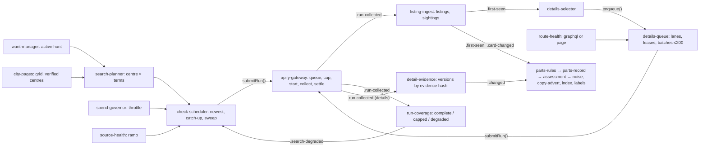

# Facebook actor integration plan

Status: proposal, 2026-09-24. This is Nabvy's own plan for operating the private Apify actor `YfdUav3sZ2BgEf8rh`. It replaces the `docs/APP_INTEGRATION_GUIDE.md` that the actor brief promised ("the contracts, the Supabase schema and how to call the Actor", `fb-scrap-engine/docs/HANDOFF.md:118-119`) and that the actor repo will not write (`nabvy/docs/decisions.md:46`). It is written as the atomic modules of `modules.md` and keeps their names; section 8 lists every change it makes to that catalogue and why, and the audit of 2026-09-24 applied them there. The copy-advert design is `copy-advert.md`; this plan only feeds it.

**Sources.** Only the owner's listed actor files (`nabvy/docs/decisions.md:48-54`) and Nabvy's own records. Actor files are cited as `fb-scrap-engine/<path>:<line>`, Nabvy files as `nabvy/<path>:<line>`, and the catalogue as `modules.md:<line>`. Claims that rest only on `nabvy/docs/fb-actor-reference.md` or on actor files outside the list are not used. Figures keep their conditions: the actor's analysis covers about two days of mostly "3090" and "gaming pc" searches around Chichester (`fb-scrap-engine/docs/design/PARTS_INTELLIGENCE.md:281-282`), and Nabvy has one recorded run (`nabvy/fixtures/listings/facebook/runs/2026-09-24-VkryjpwS6U2GBDh3k/README.md:1-11`). "Starting value" marks a threshold to calibrate, with its basis. "Calc." marks arithmetic on cited figures. The actor's live tests are written "actor test T2" and so on, never T2 alone, so they are not confused with Nabvy's T2 timestamp (`nabvy/docs/architecture.md:88`). Lines in `nabvy/docs/decisions.md` are cited as of commit `7debf5d` (re-cited by the audit of 2026-09-24).

## 0. Owner decisions this plan follows

Several decisions landed on 2026-09-24 after `modules.md` was drafted. Where they differ from the brief or the catalogue, they win.

| Decision | What it means for the integration | Source |
| --- | --- | --- |
| The actor is a plain fetch tool; Nabvy owns all interpretation | The actor runs searches and fetches details. Every judgement is a Nabvy module | `nabvy/docs/decisions.md:46` |
| Atomic modules | One job each, own schema, `v_` views, thin events, a switch, batches of 100–500, idempotency key `source + sourceListingId + contentHash`, T-stamps | `nabvy/docs/decisions.md:60-68` |
| Keep all actor data | Each row is kept whole and unredacted as `jsonb`; users never see seller identity; user-facing views are allowlists | `nabvy/docs/decisions.md:30-38` |
| The brief wins over the build pack | Except where "keep all data" overrides the brief's minimisation | `nabvy/docs/decisions.md:7,36` |
| Labels as suspicions only | "Suspected …:" with facts, documented rules, calibrated thresholds, report route; scam labels in shadow first; no unexplained scores; never price history across listing IDs | `nabvy/docs/decisions.md:13-14` |
| Facebook only through Apify runs | No module fetches Facebook, photo URLs included | `nabvy/CLAUDE.md:9`; `nabvy/docs/decisions.md:23,176` |
| Cost | Rules and SQL first. Parts AI runs at most once per listing (`nabvy/docs/decisions.md:42`). The brief versions the parts record by evidence hash (`fb-scrap-engine/docs/design/PARTS_INTELLIGENCE.md:233,249`), so whether an edited description may re-run AI is an owner question (question 20). Pickup-location AI runs at most once per listing version (`nabvy/docs/decisions.md:153`). AI is shared, never per user; scan recognition is the exception (`nabvy/docs/decisions.md:95`) | `nabvy/docs/decisions.md:21,42,95,153`; `fb-scrap-engine/docs/HANDOFF.md:167` |
| **Nothing runs unless a user asks** | Collection is driven only by active hunts. A hunt maps to the nearest centre; one shared search per centre and term runs while at least one hunt needs it | `nabvy/docs/decisions.md:131-135` |
| **The rtx3090 test hunt** | The team's hunt for "rtx3090" at Chichester is the first end-to-end acceptance test: search, ingest, parts and noise filtering, copy-advert detection, asking-price position, an alert delivered | `nabvy/docs/decisions.md:136` |
| **National UK grid; Ireland skipped for the beta** | Centres are city pages about 80–100 km apart over Great Britain and Northern Ireland, from the seed; a centre is verified by a cheap run the first time a hunt needs it. GBP only. EUR code paths stay, but no Irish centre runs | `nabvy/docs/decisions.md:19,132,137` |
| **$150 a month Apify cap** | The gateway's lifetime $5.50 cap becomes a monthly cap reset each calendar month, with the same worst-case reservations. The account's recorded plan caps, $85 a month and 10 GB of residential proxy, bind first (2.12; question 19) | `nabvy/docs/decisions.md:138`; `fb-scrap-engine/docs/EVIDENCE_LEDGER.md:321-322` |
| **Cadence within the budget** | The spend governor shares the month's budget among the centres and terms that active hunts need, favouring paying subscribers. About $3.20 a month per term per centre buys a newest-first check every 30 minutes (estimate) | `nabvy/docs/decisions.md:139` |
| **Legal gates lifted** | Collection no longer waits for an LIA and a DPIA; alerts from this data go to every user, paying or not | `nabvy/docs/decisions.md:175-180` |
| **Pipeline runtime: Trigger.dev** | Pipeline modules run on Trigger.dev; Apify is still called only by the `apify-gateway` Edge Function; tasks queue gateway jobs in the database and read collected rows back | `nabvy/docs/decisions.md:189` |
| Photos off in the web app | Cards show a placeholder and an "Open on Facebook" link | `nabvy/docs/decisions.md:94` |
| Asking prices | Never sale prices or "worth"; position only at n≥10 | `nabvy/docs/decisions.md:15`; `nabvy/docs/questions.md:8` |
| Product decisions are the owner's | Pricing, tiers, categories and user-facing wording go to questions with a conservative option | `nabvy/CLAUDE.md:30` |

The task brief that commissioned this plan said "UK and Ireland". For the beta the owner has since said UK only (`nabvy/docs/decisions.md:19,132`), so this plan runs no Irish centre.

## 1. Division of labour

### 1.1 What the actor does, and never does

| The actor does | Source |
| --- | --- |
| Runs the searches the app specifies (up to 20 terms in one numeric `cityId`) and returns every listing found, with coverage reporting | `fb-scrap-engine/README.md:3,39-43`; `fb-scrap-engine/.actor/input_schema.json:3,18` |
| Fetches details for up to 1,000 listing IDs per run, on the `graphql` route (no gallery) or the `page` route (with gallery links) | `fb-scrap-engine/.actor/input_schema.json:77,119` |
| Reports per search: pages, stop reason, route, binding and Facebook's own search controls | `fb-scrap-engine/README.md:99-108,120-123` |
| Reports detail-route health (`RUN_SUMMARY.detailRoute`: replays, `circuitOpen`, operation IDs) | `fb-scrap-engine/README.md:53-61` |
| Stops at a hard request cap it never exceeds; reports unfetched IDs as not attempted | `fb-scrap-engine/README.md:75-83` |

| The actor never does | Source |
| --- | --- |
| Filter by price, keyword, product, date or distance | `fb-scrap-engine/.actor/input_schema.json:3`; `fb-scrap-engine/README.md:92-96,134` |
| Judge, match, value, score, alert or run AI or OCR | `fb-scrap-engine/docs/HANDOFF.md:84-86,155`; `fb-scrap-engine/docs/design/CONTAINER_LISTINGS.md:113` |
| Download or read photos (capture is proposed, not built) | `fb-scrap-engine/docs/EVIDENCE_LEDGER.md:288-289`; `fb-scrap-engine/docs/design/CONTAINER_LISTINGS.md:3-4,97-107` |
| Keep a high-water mark or report which listings are new | `nabvy/services/source-adapters/README.md:70,121` |
| Keep the durable copy (Nabvy runs it with the detail cache off) | `fb-scrap-engine/docs/HANDOFF.md:135-136,220-221`; `fb-scrap-engine/.actor/input_schema.json:145` |
| Log in, message sellers or buy | `fb-scrap-engine/README.md:486` |

### 1.2 App-side duties from the listed files, and their owner

Every duty the listed files give the app has one owner in the catalogue. The full list, with sources, is `modules.md:2124-2197`. The duties that operate the actor are:

| Duty | Owner | Source |
| --- | --- | --- |
| Plan searches per region: a verified centre × a few terms, never per user | `search-planner` | `fb-scrap-engine/docs/HANDOFF.md:140-141`; `fb-scrap-engine/docs/design/CONTAINER_LISTINGS.md:62` |
| City pages, verified centres, the grid, each centre's reported centre point | `city-pages` | `fb-scrap-engine/docs/HANDOFF.md:243-244`; `fb-scrap-engine/docs/EVIDENCE_LEDGER.md:39-65` |
| Newest-first checks, default-order catch-up, daily sweeps; a region's terms in one run | `check-scheduler` | `fb-scrap-engine/docs/HANDOFF.md:141-145`; `fb-scrap-engine/docs/design/CONTAINER_LISTINGS.md:63-65,217` |
| Run settings: cache off, browser fallback off, explicit memory and GB residential proxy, caps, build pin | `apify-gateway` | `fb-scrap-engine/docs/design/SCALE_PLAN.md:74-79`; `nabvy/docs/questions.md:14` |
| One durable copy of every row; seller data internal; shortest Apify retention | `apify-gateway` | `fb-scrap-engine/docs/HANDOFF.md:135-136,151-152`; `fb-scrap-engine/docs/design/SELLER_DATA.md:316-317` |
| Ingest every card once: city page, price, "was" price, one observation per sighting, new-ID detection | `listing-ingest` | `fb-scrap-engine/docs/HANDOFF.md:146-147` |
| Honest coverage: gap check, degraded searches rerun, never read as "nothing new" | `run-coverage` | `fb-scrap-engine/docs/design/CONTAINER_LISTINGS.md:66,189-193` |
| Choose which new IDs get details | `details-selector` | `fb-scrap-engine/docs/HANDOFF.md:148-150`; `fb-scrap-engine/docs/design/CONTAINER_LISTINGS.md:67,164-166` |
| One global, deduplicated details queue in priority order | `details-queue` | `fb-scrap-engine/docs/design/CONTAINER_LISTINGS.md:68,172-173,194-196` |
| Detail route per region, probing, alerts on new operation IDs | `route-health` | `fb-scrap-engine/docs/design/CONTAINER_LISTINGS.md:197-201`; `fb-scrap-engine/app/route-health.js:1-4` |
| Spend governor on settled costs | `spend-governor` | `fb-scrap-engine/docs/design/CONTAINER_LISTINGS.md:146,202-203` |
| 302s, fallbacks, seller-block presence, stepped ramp | `source-health` | `fb-scrap-engine/docs/design/SCALE_PLAN.md:111-115`; `fb-scrap-engine/docs/design/SELLER_DATA.md:176-180` |
| Detail versions keyed by evidence hash, description status, photo-link expiry | `detail-evidence` | `fb-scrap-engine/docs/design/CONTAINER_LISTINGS.md:122-131` |
| Availability without reading a disappearance as a sale; rechecks | `listing-lifecycle` | `fb-scrap-engine/docs/design/PARTS_INTELLIGENCE.md:278-280` |
| Pasted links join the shared queue | `pasted-link-lookup` | `fb-scrap-engine/docs/design/PARTS_INTELLIGENCE.md:228-229` |
| Embedded cards and related-search terms (next actor build) | `side-discovery` | `fb-scrap-engine/docs/HANDOFF.md:153-154` |
| Internal seller key | `seller-key` (gated) | `fb-scrap-engine/docs/design/SELLER_DATA.md:109-129` |
| Distance, "near me", town-level display | `location` | `fb-scrap-engine/docs/HANDOFF.md:84-86`; `fb-scrap-engine/docs/design/SELLER_DATA.md:301` |

Interpretation and serving duties (parts record, noise filter, copy-advert flag, suspected labels, warning signs, asking-price index and position, price-drop watch, spec search, alerts, rights) belong to the modules in `modules.md:2149-2197`. Copy-advert detection is designed in `copy-advert.md`.

### 1.3 Duties from the owner's newest decisions

These came after the catalogue; section 8 gives them owners, now in `modules.md`. The integration only has to feed them. The dedicated drafts (listing-location, too-good-to-be-true, search-map-routes; `nabvy/docs/handoff.md:94-96`) may rename or refine these modules.

| Duty | Proposed owner | Source |
| --- | --- | --- |
| Resolve each listing's real pickup location from the location field, place names and postcodes in the text, and their conflicts; rules first, AI once per version; users see town or area, marked approximate when uncertain. Distance filters, the map and the worth-the-trip hints use the resolved location (`nabvy/docs/decisions.md:153`). Only the town or area reaches a `v_` view; the point reaches distance code through the exported `pointsFor()` | New module `pickup-location` | `nabvy/docs/decisions.md:144-153` |
| "Too good to be true" mark from listing signals (price far below comparable asks at n≥10, location conflicts, "postage only" on a collection listing, risky payment requests, copies across distant places) and user reports of what the seller said. Users see it as a suspected label, "Suspected too good to be true:" followed by the facts, as recorded (`nabvy/docs/decisions.md:158`); the owner confirms the final text (question 18). It runs in shadow during the test hunt. It is shown only after legal review of the wording (`fb-scrap-engine/docs/HANDOFF.md:104-106`; `nabvy/docs/legal-review.md:39`) | A label type in `suspected-labels`, fed by `warning-signs`, `pickup-location`, `copy-advert` and a new module `seller-reply-reports` (the one-tap reports) | `nabvy/docs/decisions.md:154-166` |
| eBay-style filters and sorts, "worth the trip" hints. Hints wait for question 16 | `spec-match` (search) | `nabvy/docs/decisions.md:141,143` |
| Map with approximate, clustered price markers at town or area level | A web view over `listing-card` and `pickup-location` town-level output; no listing's own point; one area reference point per town or area (section 8, change 9) | `nabvy/docs/decisions.md:142` |
| Pickup route planning from addresses the user enters | New module `pickup-routes` (user rows only, never listing data, no `v_` view) | `nabvy/docs/decisions.md:174` |
| Every listing reused: one shared pool, every listing matched against every hunt, and gem candidates far below their own product's comparable asks, which may get a confirming detail fetch. No search runs for by-catch alone | Pool and matching: `listing-ingest` and `spec-match` as they stand. Gems and alternatives: no owner yet (`modules.md` question 41; the listing-reuse draft proposes `gem-finder` and `similar-picks`). A confirming fetch goes through `details-queue.enqueue()` like any other; `search-planner` adds no pair for by-catch | `nabvy/docs/decisions.md:167-173` |

## 2. The run lifecycle, module by module

### 2.1 Region search plan (`search-planner`, `city-pages`, `want-manager`)

1. **A want activates a pair.** `want-manager` maps each active want to the nearest grid centre, verified or not (`nabvy/docs/decisions.md:132`; `modules.md:854`). An unverified centre is verified the first time a want needs it (step 4). `search-planner` derives the terms that want needs and adds each (centre, term) pair to the plan. A pair stays active while at least one active want needs it; when none does, it leaves the plan and nothing runs for it (`nabvy/docs/decisions.md:133-135`). No user ID reaches a plan (`fb-scrap-engine/docs/HANDOFF.md:140-141`).
2. **Terms per want.** A GPU or CPU want yields its family term (for example "3090") plus the broad container terms "gaming pc" and "pc", because wanted parts often sit only in PC descriptions: 34–35% of PC-like listings name the GPU only in the description (`fb-scrap-engine/docs/design/CONTAINER_LISTINGS.md:25-29,62`), no single term covers everything (`fb-scrap-engine/docs/EVIDENCE_LEDGER.md:373-380`), and fast alerts for "Pc"-style listings depend on sweeping broad terms (`fb-scrap-engine/docs/design/SCALE_PLAN.md:50-53`). Terms come from `product-catalogue` families, never from listing text (`fb-scrap-engine/docs/design/CONTAINER_LISTINGS.md:186-188`). Each term carries a class, narrow or broad, for the scheduler (`fb-scrap-engine/docs/design/SCALE_PLAN.md:54-56`). Which terms the rtx3090 test hunt uses is question 2.
3. **The grid** (`city-pages`). The seed holds 771 city pages; 5 are verified centres (Belfast, Chichester, Dublin, Edinburgh, Glasgow), all without coordinates; 635 entries carry town-level coordinates that the seed says to verify before use (`fb-scrap-engine/docs/data/city-pages.seed.json:2-3,630,1601,2430,2606,3113`; counts by this session). The grid starts from the centres whose Facebook centre point is recorded: Chichester 50.836, −0.775 (`nabvy/fixtures/listings/facebook/runs/2026-09-24-VkryjpwS6U2GBDh3k/run-summary.json:15-20`); Edinburgh 55.955, −3.209 and Belfast 54.597, −5.930 (`fb-scrap-engine/docs/EVIDENCE_LEDGER.md:55-56`); Rotherham 53.434, −1.355 (`fb-scrap-engine/docs/EVIDENCE_LEDGER.md:45-47`). Dublin 53.348, −6.259 (`fb-scrap-engine/docs/EVIDENCE_LEDGER.md:57`) stays in the table, inactive (`nabvy/docs/decisions.md:132`). Glasgow is verified but has no recorded point, so it is placed once a run reports its search controls. Further centres come from seed entries with coordinates, about 80–100 km from every existing centre (starting value), over Great Britain and Northern Ireland (`nabvy/docs/decisions.md:137`; `fb-scrap-engine/docs/design/SCALE_PLAN.md:71-73`). The spacing stays a starting value until actor test T7 settles it (`fb-scrap-engine/docs/design/SCALE_PLAN.md:137`). Selection uses coordinates only, never `listingsSeen`, which reflects Chichester-centred sampling (`fb-scrap-engine/docs/data/city-pages.seed.json:2`). Keys are numeric city-page IDs as text; names and town slugs are never parsed, because slugs redirected to a generic page (`fb-scrap-engine/docs/EVIDENCE_LEDGER.md:32-38`).
4. **Verification on first need.** The first time a hunt needs an unverified centre, `search-planner` records a one-off verification run: one narrow term, newest first, page 1, listings only. Rotherham, never searched before, bound on the fast route for $0.0018 (the run's shape is not recorded; `fb-scrap-engine/docs/EVIDENCE_LEDGER.md:45-47`). `city-pages` marks the centre verified when the search's route is `http`, its binding `verified`, the route retained, and Facebook reports its search controls; it stores Facebook's reported centre point (`nabvy/fixtures/listings/facebook/runs/2026-09-24-VkryjpwS6U2GBDh3k/run-summary.json:9-20,79-93`; the reported centre is how the ledger records verified centres, `fb-scrap-engine/docs/EVIDENCE_LEDGER.md:50-57`). The owner allowed these runs in general (`nabvy/docs/decisions.md:137`), so they need no approval each. Other one-off runs, such as the part-price gap-fill run (`fb-scrap-engine/docs/design/PARTS_INTELLIGENCE.md:139-145`) and any actor test, still need the owner's approval, because no hunt asks for them.
5. **Hunts beyond the seed.** The seed's coordinates stop at 55.3299° N, Girvan (this session's count), so Scotland north of Edinburgh and Glasgow has no candidate centre yet (no seed coordinates above 55.33° N apart from those two verified centres). Card city pages seen in runs extend the table (`fb-scrap-engine/docs/EVIDENCE_LEDGER.md:39-43`). A hunt with no candidate centre within 100 km (starting value: the upper grid spacing, `fb-scrap-engine/docs/design/SCALE_PLAN.md:71-73`) waits, marked "not covered yet" (question 7).

### 2.2 Schedules (`check-scheduler`)

Three check kinds per active centre, all listings only (`fb-scrap-engine/docs/design/CONTAINER_LISTINGS.md:63-65`; `fb-scrap-engine/README.md:136-139`). All due terms of a centre go in one run: batching three terms cost $0.0046, or $0.0015 per term against $0.0022 for one (`fb-scrap-engine/docs/EVIDENCE_LEDGER.md:331-332`), within the 20-term limit (`fb-scrap-engine/.actor/input_schema.json:18`). Actor test T2 sets cadence per term class (`fb-scrap-engine/docs/HANDOFF.md:145`; `fb-scrap-engine/docs/design/SCALE_PLAN.md:54-56`); its results were due after about 21:00 UTC on 2026-09-24 and reach Nabvy only through an update to the listed files (`fb-scrap-engine/docs/EVIDENCE_LEDGER.md:476-478`). Until then every cadence below is a starting value.

| Check | Shape | Starting cadence | Basis | Status |
| --- | --- | --- | --- | --- |
| Newest | `sort: newest`, page 1 | Every 30 min, 07:00–23:00 UK time (starting value: the brief's 16 h a day, placed by Nabvy) | The brief's 30–60 min in the daytime and its standard plan's 16 h a day (`fb-scrap-engine/docs/design/CONTAINER_LISTINGS.md:63,210`); the owner's 30-minute estimate (`nabvy/docs/decisions.md:139`) | On |
| Catch-up | `sort: default`, pages 1–4 | Every 3 h | `fb-scrap-engine/docs/design/CONTAINER_LISTINGS.md:64,209` | **Off** until actor test T2 shows it earns its cost (`fb-scrap-engine/docs/design/CONTAINER_LISTINGS.md:87-88`) |
| Sweep | `sort: default`, full depth | Daily per active term, at night (starting value; Nabvy's choice) | `fb-scrap-engine/docs/design/CONTAINER_LISTINGS.md:65` | On |

- Newest first is cheap but incomplete: it missed 11% of related listings within 65 km and 24% within 100 km, and lagged by hours (`fb-scrap-engine/docs/design/CONTAINER_LISTINGS.md:79-81`). Sweeps therefore stay, and a listing first seen by a sweep counts as new like any other (`fb-scrap-engine/docs/EVIDENCE_LEDGER.md:160-165`).
- For broad terms, newest-first checks are expected to find little (`fb-scrap-engine/docs/design/SCALE_PLAN.md:50-53`).
- A full read of a busy term goes stale within days (`fb-scrap-engine/docs/EVIDENCE_LEDGER.md:124-127`), and full sweeps every 30 minutes would cost about $45 a month per term, so they stay rare (`fb-scrap-engine/docs/EVIDENCE_LEDGER.md:430-432`).
- `check-scheduler` obeys `spend-governor`'s throttle and `source-health`'s ramp stage, reruns degraded searches (2.9), and never promises a cadence to users (`nabvy/docs/decisions.md:18`).

### 2.3 Run shapes (`apify-gateway`)

The earlier presets in `facebook-actor-input.ts` were withdrawn on review because their rules and request formula came from an actor file outside the list (`nabvy/services/source-adapters/README.md:185-192`; `nabvy/docs/progress.md:15`). They return re-derived as task 1.1a. The shapes below use only listed evidence and Nabvy's own rules.

**Every run.** `inputVersion: 3`; `useDetailCache: false`, so no second durable copy sits in Apify (`fb-scrap-engine/docs/design/SCALE_PLAN.md:76-77`); `browserFallback: false`, so a failed search reports `route: failed` for a rerun instead of paying about 9 times as much (`fb-scrap-engine/.actor/input_schema.json:140`); `sourceDiagnostics: true` (`fb-scrap-engine/.actor/input_schema.json:164`); proxy `RESIDENTIAL` with `apifyProxyCountry: "GB"`, the only tested setting (`fb-scrap-engine/docs/EVIDENCE_LEDGER.md:77-80`); no `startUrls` (`nabvy/supabase/README.md:17-20`); no `radiusKm`, because it is not a filter and did not change results (`fb-scrap-engine/.actor/input_schema.json:34`); `maxListings`, `maxRequests` and `maxRunSeconds` always explicit; a run holds searches or `listingIds`, never both (Nabvy's rule; `maxListings` is shared run-wide, `fb-scrap-engine/.actor/input_schema.json:61`). Every search run sends `includeDetails: false`, because the actor's default is on (`fb-scrap-engine/.actor/input_schema.json:56`), and an explicit `sort` (`newest` or `default`). Details are fetched only by `listingIds` runs (`fb-scrap-engine/README.md:136-139`). The build is pinned at 1.0.82, the build of the recorded run (`nabvy/fixtures/listings/facebook/runs/2026-09-24-VkryjpwS6U2GBDh3k/run.json:12,16`; `nabvy/docs/questions.md:14`).

**Nabvy's request budget** (owned by Nabvy, never called the actor's default; `nabvy/docs/fb-actor-scope-report.md:400-403`):
- per search: 1 bootstrap + pages + 1 spare. The recorded page-1 search used 2 requests (`nabvy/fixtures/listings/facebook/runs/2026-09-24-VkryjpwS6U2GBDh3k/run-summary.json:80-82`), and the deployed bootstrap retry needs a spare (`fb-scrap-engine/docs/design/CONTAINER_LISTINGS.md:92-94`; `fb-scrap-engine/docs/EVIDENCE_LEDGER.md:107-110`);
- per detail: 2 requests on `graphql` (a failed replay is followed by its page), 1 on `page`, over `ceil(1.1 × IDs)` for one retry (`fb-scrap-engine/.actor/input_schema.json:91`), plus one session page per 40 listings on `graphql` (`fb-scrap-engine/.actor/input_schema.json:133`; 2 bootstraps for 50 IDs, `fb-scrap-engine/docs/EVIDENCE_LEDGER.md:241-243`);
- oversizing only raises the reservation, since the cap is never exceeded; undersizing shows as not-attempted IDs, which `details-queue` requeues (`fb-scrap-engine/README.md:78,81`). The gateway accepts 1–1,000 (`nabvy/supabase/migrations/20260924020000_apify_gateway.sql:96-97`).

| Shape | Sort, pages | `maxListings` | `maxRequests` | `maxRunSeconds` / timeout | Memory | Basis (all starting values) |
| --- | --- | --- | --- | --- | --- | --- |
| Verification | newest, 1; one term | 30 | 3 | 120 / 180 | 1,024 | `fb-scrap-engine/docs/EVIDENCE_LEDGER.md:45-47` |
| Newest check | newest, 1 | 30 × terms | 3 × terms | 120 / 180 | 1,024 | About 22 listings a page (`fb-scrap-engine/.actor/input_schema.json:69`); 24 a term, 3 terms in 26 s (`fb-scrap-engine/docs/EVIDENCE_LEDGER.md:239`) |
| Catch-up | default, 4 | 100 × terms | 6 × terms | 300 / 360 | 1,024 | A short feed is about 90 listings over 4 pages (`fb-scrap-engine/docs/EVIDENCE_LEDGER.md:132-133`) |
| Sweep, narrow term | default, 60 | 1,300 × terms, at most 3 terms | 62 × terms | 900 / 960 | 1,024 | A full feed needs 60 pages and about 1,300 listings (`fb-scrap-engine/docs/EVIDENCE_LEDGER.md:303-304`); cap 5,000 (`fb-scrap-engine/.actor/input_schema.json:61`) |
| Sweep, broad term | default, 100 | 2,400 × terms, at most 2 terms | 102 × terms | 900 / 960 | 1,024 | A "gaming pc" sweep hit the 100-page cap at 2,400 listings (`fb-scrap-engine/docs/EVIDENCE_LEDGER.md:246-249`) |
| Details, text lane | `listingIds` ≤ 200, `graphql` or the route-health route | = IDs | `2 × ceil(1.1 n) + ceil(n/40) + 1` (446 for 200) | 900 / 960 | 1,024 | Batches of up to 200 (`fb-scrap-engine/docs/design/CONTAINER_LISTINGS.md:68,108-109`); 200 IDs took 340 s one at a time (`fb-scrap-engine/docs/EVIDENCE_LEDGER.md:229`); keep 1 GB for detail runs (`fb-scrap-engine/README.md:71-72`) |
| Details, photo lane | `listingIds` 10–20, `page` | = IDs | `ceil(1.1 n) + 1` | 900 / 960 | 1,024 | Waits for actor photo capture (`fb-scrap-engine/docs/design/CONTAINER_LISTINGS.md:71,97-107`) |

- Timeouts sit 60 s above `maxRunSeconds` (starting value; Nabvy's margin), because rows and `RUN_SUMMARY` are written only at the end and an aborted run yields nothing (`fb-scrap-engine/docs/EVIDENCE_LEDGER.md:309-310`). The gateway today allows the timeout to equal `maxRunSeconds` (`nabvy/supabase/migrations/20260924020000_apify_gateway.sql:99-100`); 1.1b makes it strict.
- Memory is 1,024 MB everywhere for now. The listed files disagree on whether 512 MB is honoured (`fb-scrap-engine/README.md:86-87` against `fb-scrap-engine/docs/EVIDENCE_LEDGER.md:337-338`), and the gateway reserves on the requested size (`nabvy/supabase/migrations/20260924020000_apify_gateway.sql:112-117`). 512 MB checks start once a recorded Nabvy run shows `memoryMbytes` 512 in its run object.
- `detailSessionSize` (40) and `detailConcurrency` (4) stay at the actor's defaults until measured (`fb-scrap-engine/.actor/input_schema.json:112,133`; `fb-scrap-engine/docs/EVIDENCE_LEDGER.md:482`).
- Worst-case reservations (calc. from `nabvy/supabase/migrations/20260924020000_apify_gateway.sql:112-117`): a 2-term newest check $0.06; a 2-term narrow sweep $0.72; a 200-ID details batch $2.29. Against the current $5.50 lifetime cap a details batch can be refused, so the monthly cap (1.1b) comes first.

### 2.4 Gateway job submission (`apify-gateway`)

1. `check-scheduler` and `details-queue` call the gateway's exported `submitRun(shape, input, tags)`. It is the only code that writes a gateway job. Tags carry the requesting module, the region and the purpose (`modules.md:388`). Inside `apify-gateway`'s own repo code it runs `select apify_gateway.enqueue_run(...)`, which validates the input and reserves its worst-case cost (`nabvy/supabase/README.md:17-20`), then `select apify_gateway.invoke()` so the Edge Function starts at once (`nabvy/supabase/README.md:21-22`).
2. The Edge Function claims jobs one at a time under a lock and refuses any run whose reservation would take committed spend past the cap (`nabvy/supabase/README.md:24-25`; `nabvy/supabase/migrations/20260924020000_apify_gateway.sql:131-160`). A refused job is visible in `v_jobs`: `check-scheduler` backs off and `details-queue` keeps its items queued, never dropped (`fb-scrap-engine/docs/design/CONTAINER_LISTINGS.md:202-203`).
3. Runs start asynchronously (`nabvy/supabase/README.md:26-29`) with the run's memory, timeout and pinned build (`nabvy/docs/questions.md:14`). The Edge Function passes only memory and timeout today (`nabvy/supabase/functions/apify-gateway/index.ts:151-158`), so passing the build is part of 1.1b.
4. No other module holds the token or calls Apify (`nabvy/CLAUDE.md:9`; `nabvy/docs/decisions.md:26`). Trigger.dev tasks only queue jobs and read results (`nabvy/docs/decisions.md:189`).

### 2.5 Collection (`apify-gateway`)

1. Later invocations collect finished runs: every dataset page, without Apify's `clean` filter, response text straight to Postgres so numbers keep their digits; the whole run object with `itemCount` and `RUN_SUMMARY` goes to the job; the job finishes only when stored rows match `itemCount`, and rows are keyed `(job_id, seq)`, so a repeat adds nothing (`nabvy/supabase/README.md:26-38`). A free `collect` job re-read the recorded run and matched all 21 rows (`nabvy/supabase/README.md:40-43`).
2. Cost settles on a pass at least 10 minutes after the run ends; until then a run counts at the larger of its provisional cost and its reservation. The recorded run read $0.0003 at finish and settled at $0.0177 (`nabvy/supabase/README.md:45-49`), and displayed costs have been up to 45% low (`fb-scrap-engine/docs/EVIDENCE_LEDGER.md:17-18`).
3. A gateway watcher (section 4) emits `apify-gateway.run-collected` (job ID, Apify run ID, kind `search | details`) once per job, and `apify-gateway.run-settled` once cost settles. `cost-meter` records the reservation, then the settled cost (`modules.md:322-335`).
4. After collection the run's storage in Apify should be kept as short as possible, because it holds raw seller fields (`fb-scrap-engine/docs/design/SELLER_DATA.md:316-317`). Meanwhile the gateway deletes it after a grace period once collection and settlement are complete (question 9).

### 2.6 Ingest by `recordType`

| Run kind | Row | Reader | What it does |
| --- | --- | --- | --- |
| search | `recordType: "listing"` | `listing-ingest` | Listing identity, one sighting (term, rank, card hash), `first-seen` and `card-changed` events |
| search | `recordType: "sourceOutcome"` | `run-coverage` | Per-source status, stop reason, binding (`fb-scrap-engine/README.md:97-98`) |
| any | `RUN_SUMMARY.searches[]` | `run-coverage` | Route, stop reason, pages, search controls (`fb-scrap-engine/README.md:99-108,120-123`) |
| any | `RUN_SUMMARY.detailRoute` | `route-health` | One history entry per run, tagged with its Apify run ID (`fb-scrap-engine/app/route-health.js:22-29`) |
| any | seller presence per row (true or false only) | `source-health` | Seller-block rate per search page, pages inferred from row order (`fb-scrap-engine/docs/design/SELLER_DATA.md:38-41,176-180`) |
| details | `recordType: "listing"` | `detail-evidence` | A new version when the evidence hash changes; `unresolved` for a removed ID |
| details | `recordType: "listing"` | `listing-ingest` | Identity for listings not yet known (pasted links), and a `detail` observation of price and availability (section 8, change 5) |
| details | `recordType: "sourceOutcome"` and `RUN_SUMMARY` detail counts | `details-queue` | Closes the batch and requeues per 2.10 (`fb-scrap-engine/README.md:106-111`) |
| any | any other `recordType` or field | none yet | Kept whole in the gateway; `run-coverage` counts it as `unknown` (`nabvy/docs/questions.md:20`) |
| details, page route | embedded cards, related terms | `side-discovery` | Later, once an actor build returns them (`fb-scrap-engine/docs/EVIDENCE_LEDGER.md:276-280`) |

A handler takes all rows of one collected run as one batch, up to 500 by `seq`, so a 5,000-row sweep is ten batches. A run with fewer than 100 rows (a 2-term newest check returns about 48, calc. from 24 listings a term, `fb-scrap-engine/docs/EVIDENCE_LEDGER.md:239`; a photo-lane batch is 10–20 IDs, `fb-scrap-engine/docs/design/CONTAINER_LISTINGS.md:71`) is processed at once rather than held, because holding it delays alerts. No handler ever takes one listing per invocation. This reading of `nabvy/CLAUDE.md:24` goes to `docs/questions.md` for the owner to confirm. Readers use `v_rows`, which drops `seller` and every `marketplace_listing_seller`; only the seller-data allowlist reads whole rows (`modules.md:52-64,389`).

### 2.7 Deduplication and observations (`listing-ingest`)

- **Identity.** One listing per `(source, source_listing_id)`, with the listing ID stored as text: recorded IDs reach 17 digits, beyond JavaScript's safe integers (`nabvy/services/source-adapters/README.md:88`). The actor keeps no high-water mark, so Nabvy detects new IDs itself (`nabvy/services/source-adapters/README.md:70,121`). Nabvy's own row ID (UUID v7) is what events carry (`nabvy/packages/contracts/README.md:30`).
- **Many centres, one listing.** The Romford worked example turned up five times through Chichester searches, at ranks 387–853 (`fb-scrap-engine/docs/EVIDENCE_LEDGER.md:396-398`). A listing is placed by its own city page, never by the centre that found it.
- **City page.** Read from `sourceFields.search.location.reverse_geocode.city_page.id` first, then `locationDetails`: after details, `locationDetails` holds only coordinates, and the card's city page survives in `sourceFields` and `conflicts` (`nabvy/fixtures/listings/facebook/runs/2026-09-24-VkryjpwS6U2GBDh3k/dataset.json:66-77,369-377,433-436`). The input schema names `locationDetails` as the place (`fb-scrap-engine/.actor/input_schema.json:27`), so both are tested.
- **Money.** `money.amountMinor` and `money.currency`, never the display string: the same previous price arrives as "£499" and "499.00" (`nabvy/fixtures/listings/facebook/runs/2026-09-24-VkryjpwS6U2GBDh3k/dataset.json:1466-1480`). Nabvy's own rule: a listing has a price only when `money.kind` is "fixed" and the currency is GBP or EUR. Any other or unknown kind or currency keeps `price: null`, and the whole row is kept. The kind vocabulary is not in the listed files (`nabvy/docs/questions.md:20`); the recorded run holds only "fixed". Feeds can carry £0 prices and foreign currencies (`fb-scrap-engine/docs/EVIDENCE_LEDGER.md:194-195`). £0 asks never enter an index.
- **Observations.** One light sighting per card per run, with term, rank (row order) and card hash (`fb-scrap-engine/docs/HANDOFF.md:146-147`). The scale plan's "store only changes" (`fb-scrap-engine/docs/design/SCALE_PLAN.md:83`) is question 4 of `modules.md:2243`; one per sighting is kept meanwhile. Price changes within one listing ID are published in `v_price_changes`; the seller's displayed previous price is stored as a raw fact, never a reference (`fb-scrap-engine/docs/design/PARTS_INTELLIGENCE.md:85-88`; `fb-scrap-engine/README.md:412`).
- **Fresh card fields win** over saved detail fields for price, availability, title and location. This is Nabvy's own rule, adopted from the deprecated v2 section (`fb-scrap-engine/README.md:143-147,272-274`).
- **Missed is not gone.** Two full-depth repeats overlap only 87–95%, so a missed sweep never ends a listing, and a disappearance is never a sale (`fb-scrap-engine/docs/design/PARTS_INTELLIGENCE.md:278-280`; `nabvy/docs/decisions.md:16`).
- **Idempotency.** The card hash covers normalised title, `priceMinor`, currency, availability and primary photo ID, not the signed thumbnail URL (`modules.md:72`; question 3 of `modules.md:2242`).

### 2.8 Details selection and queue (`details-selector`, `details-queue`, `route-health`)

1. **Select** (`details-selector`, on `listing-ingest.first-seen`): every new ID whose city page is inside an active centre's area, whatever its price or title. Of bare "Pc" or "Gaming pc" titles, 107 of 135 name a GPU only in the description (`fb-scrap-engine/docs/design/CONTAINER_LISTINGS.md:164-166`). Categories: electronics, containers, GPUs or unknown; Facebook's category is unreliable (full PCs filed as "Computer cases"), so unknown counts as in (`nabvy/fixtures/listings/facebook/runs/2026-09-24-VkryjpwS6U2GBDh3k/dataset.json:540-541`). Shipped listings from outside the area are selected only when an active want at that centre accepts delivery (starting rule; basis: the brief selects shipped listings, `fb-scrap-engine/docs/design/CONTAINER_LISTINGS.md:67`, and the owner runs only what hunts need, `nabvy/docs/decisions.md:131-135`). "In area" means the listing's city page lies within the radius of at least one active want mapped to that centre. The distance is measured from the want's point, plus the worth-the-trip margin (starting value 0 km until question 16 sets a travel cost; basis: hints may reach slightly further, `nabvy/docs/decisions.md:143`, but no listed file gives a travel cost). 100 km from the centre applies only when no want at that centre sets a radius (starting value; basis: a short local feed holds listings within about 100 km and newest first reaches about 115 km, `fb-scrap-engine/README.md:125-130`). Users see only items within the distance they choose, and hints may reach slightly further (`nabvy/docs/decisions.md:143`); wants hold a point and `radius_km` (`modules.md:857`). `details-selector` reads `want-manager`'s `v_want_areas` (centre, point rounded to the postcode district, radius), with no user IDs. The largest radius a user may choose is question 17. Never selected to find sellers (`fb-scrap-engine/docs/design/SELLER_DATA.md:200-204`). Stamps T2.
2. **Enqueue** (`details-queue.enqueue(ids, priority, lane, reason, region)`), also called by `listing-lifecycle`, `pasted-link-lookup`, `copy-advert`, `parts-ai` and `photo-review` (`modules.md:535`). Deduplicated by source listing ID; a per-listing lease stops two runs fetching the same ID (`fb-scrap-engine/docs/design/SCALE_PLAN.md:80-82`). Every ID sent forces a paid fetch (`fb-scrap-engine/docs/EVIDENCE_LEDGER.md:250-253`), so a described listing is sent again only on a caller's refresh request.
3. **Priority:** new-listing follow-ups from newest checks, shortlisted refreshes (alerted and watched listings, pasted links), photo captures, then sweep follow-ups (`fb-scrap-engine/docs/design/CONTAINER_LISTINGS.md:194-196`).
4. **One details run at a time** until the owner decides on parallel runs with the lease (`fb-scrap-engine/docs/design/CONTAINER_LISTINGS.md:194-196` against `fb-scrap-engine/docs/design/SCALE_PLAN.md:80-82`; question 5 of `modules.md:2244`). At most 200 IDs per run, grouped by region so each batch has one route.
5. **Route:** before each text-lane batch `details-queue` calls `route-health.recommendRoute(region)`; the photo lane always uses `page`, because `graphql` returns no gallery (`fb-scrap-engine/.actor/input_schema.json:119`).
6. **Past the daily cap** work is deferred with a visible status; nothing ages out silently (`fb-scrap-engine/docs/design/CONTAINER_LISTINGS.md:172-173`).
7. **Refreshes of watched listings** go in daily batches of 20 or more, about $0.028 per watched listing per month (calc. in `fb-scrap-engine/docs/design/PARTS_INTELLIGENCE.md:190-191`).

### 2.9 Coverage and degraded searches (`run-coverage`)

| Search result | Status | Action | Source |
| --- | --- | --- | --- |
| `route: http`, stop `source-no-new-listings` | complete | Records the scope's first complete scan (the alert baseline; Nabvy's own rule, adopted from the deprecated Monitor section) | `fb-scrap-engine/README.md:101-102`; Monitor: `fb-scrap-engine/README.md:418-421,451` |
| `route: http`, stop `page-cap` or `results-limit` | capped (our cap) | Healthy; not "complete" | `fb-scrap-engine/README.md:101`; recorded run `nabvy/fixtures/listings/facebook/runs/2026-09-24-VkryjpwS6U2GBDh3k/run-summary.json:9-14` |
| `route: browser-fallback` or `failed`, or the run failed | degraded | Rerun once (starting value; Nabvy rule) at the next tick; never read as "nothing new" | `fb-scrap-engine/README.md:103-105`; `fb-scrap-engine/docs/design/CONTAINER_LISTINGS.md:189-192` |
| No page-1 overlap with the previous check of the same centre, term and kind | degraded (the gap check) | Rerun once (starting value; Nabvy rule) | `fb-scrap-engine/docs/design/CONTAINER_LISTINGS.md:66,190-191` |
| `truncated` with stop `time-limit` | capped | Capped. A sweep reruns its unfinished terms once at the next tick. A newest check waits for its next scheduled check. Not a failure | `fb-scrap-engine/README.md:106-108` |
| Default-order sweep ending at ≤ 6 pages or < 150 listings | short feed | Complete for local wants; rerun only when a want at that centre accepts delivery and needs nationwide coverage | Starting value: short feeds are about 90 listings over 4 pages, long ones 750–1,330 over 32–56 (`fb-scrap-engine/docs/EVIDENCE_LEDGER.md:112,132-134,144-145`); about 3 of 14 full reads were short (`fb-scrap-engine/docs/EVIDENCE_LEDGER.md:139`) |
| Empty search; unknown route or stop reason | degraded (`unknown`) | Rerun once (starting value; Nabvy rule); counted in `source-health` | The listed files do not give the full vocabulary (`nabvy/docs/questions.md:20`) |

A scope whose reads always stop at a cap (every newest check, and any sweep that stops at `page-cap`) records its first healthy capped read as a bounded baseline. This is a Nabvy starting rule, adopted from the old Monitor's `bounded-window` policy (`fb-scrap-engine/README.md:451`). `alert-router` alerts on a listing from a bounded scope only if its `listedAt` (T0, exact, `fb-scrap-engine/docs/EVIDENCE_LEDGER.md:174-175`) is later than both the want's creation and the scope's bounded baseline. The recorded newest check stopped at `results-limit` (`nabvy/fixtures/listings/facebook/runs/2026-09-24-VkryjpwS6U2GBDh3k/run-summary.json:9-14`), and a "gaming pc" sweep hit the 100-page cap (`fb-scrap-engine/docs/EVIDENCE_LEDGER.md:246-249`).

- A browser fallback reads about one page yet still reports `sourceBinding: verified` (`fb-scrap-engine/docs/EVIDENCE_LEDGER.md:98-106`), so status comes from route and pages, never from binding alone.
- Rows whose bindings are all unverified are stored but never feed baselines, price groups or alerts. This is Nabvy's own rule, adopted from the deprecated v2 and Monitor sections (`fb-scrap-engine/README.md:143-147,410,418-421,451`).
- A degraded search reruns once (starting value; Nabvy rule). If the rerun is degraded too, the scope stays degraded until its next scheduled check, and `source-health` counts it.

### 2.10 Requeue rules by detail outcome (`details-queue`)

The listed files define no v3 detail-outcome vocabulary (`nabvy/docs/questions.md:20`). Nabvy's recorded run shows only `collected` (`nabvy/fixtures/listings/facebook/runs/2026-09-24-VkryjpwS6U2GBDh3k/run-summary.json:65-67`), so the rules key on facts the files do define.

| What the batch shows for an ID | Queue action | Source |
| --- | --- | --- |
| Row with `descriptionStatus: full_verified` | Done | `fb-scrap-engine/README.md:233-238` |
| Row with `partial` | Requeue once (starting value; Nabvy rule) for a refresh; then leave, with parts not stated | `fb-scrap-engine/docs/design/CONTAINER_LISTINGS.md:167-168` |
| Row with `missing` | Requeue once; then leave (starting value) | 1–2% stay missing for unknown reasons (`fb-scrap-engine/docs/EVIDENCE_LEDGER.md:189-190`) |
| Reported not attempted, or `truncated` by `time-limit` | Requeue with no failure counted | `fb-scrap-engine/README.md:81,106-108` |
| `sourceOutcome` with `resolvedByDetailPass: true` | Done | `fb-scrap-engine/README.md:109-111` |
| Removed ID (`directItemUnresolved`) | Done; `listing-lifecycle` marks it unresolved, never sold | Verified on v2 only (`fb-scrap-engine/docs/EVIDENCE_LEDGER.md:254-255`) |
| Sent but no row at all | Count one failed attempt; requeue; `failed` after 2 (starting value) | Nabvy rule |
| Any other outcome value | Treat as a failed attempt, flag it, retry once | `nabvy/docs/questions.md:20` |
| `stale-fallback` | Not expected with the cache off; treat as `partial` | Nabvy's own rule; the marker is described in the deprecated v2 section (`fb-scrap-engine/README.md:143-147,272-274`) |

About 1% of fetches fail because the listing no longer exists (198 of 200, `fb-scrap-engine/docs/EVIDENCE_LEDGER.md:222-224`); descriptions do change, so an edited listing gives a new evidence version (`fb-scrap-engine/docs/EVIDENCE_LEDGER.md:225-226`).

### 2.11 Route health (`route-health`)

- The rule is the actor's helper, ported line for line: stay on `graphql` while at least 95% of 50 or more replays in the last 10 runs succeed; switch to `page`, with an alert, on a tripped breaker, failing bootstraps or low success; probe every tenth run; return after at least 20 probe replays with at most 5% failed (`fb-scrap-engine/app/route-health.js:6-7,47-96`; port at `nabvy/services/source-adapters/src/domain/route-health.ts:1-6`). The thresholds are the actor's defaults, kept as starting values.
- History: one entry per run, tagged with its Apify run ID, so a retried tick cannot count a run twice; at least 11 entries per region (`fb-scrap-engine/app/route-health.js:22-41`; `fb-scrap-engine/test/route-health.test.js:131`). A page-route run is stored as `{ runId, route: 'page' }`.
- New Facebook operation IDs are read from `newQueryIds` directly, because the helper's `alert` is false on the page-route branches (`fb-scrap-engine/app/route-health.js:52-53,61-89`). The recorded run's operation ID is `28897280379855964` (`nabvy/fixtures/listings/facebook/runs/2026-09-24-VkryjpwS6U2GBDh3k/run-summary.json:29`).
- Caveat: a reply for a listing with no description counts as a failed replay, which can switch a region on a batch of listings that lack descriptions (`fb-scrap-engine/docs/EVIDENCE_LEDGER.md:241-243`; `fb-scrap-engine/app/route-health.js:13-14,54`). The owner's decision is pending (`nabvy/docs/questions.md:12`).
- The port moves from `source-adapters` into its own module (task 1.1e), and its one known divergence from the JS (`successRate !== null`, reachable only with `minAttempts` ≤ 0) is documented there (`nabvy/docs/fb-actor-scope-report.md:405-410`).

### 2.12 Spend governor (`spend-governor`)

- **Settled costs only**, with unsettled runs at their reservation (`fb-scrap-engine/docs/design/CONTAINER_LISTINGS.md:202`; `nabvy/supabase/README.md:45-49`).
- **Two layers.** The gateway enforces the hard cap: $150 a month from 1.1b (`nabvy/docs/decisions.md:138`). `spend-governor` holds the owner's budgets, forecasts the month and throttles before the cap bites.
- **Account limits.** The account's own limits bind before the $150 cap. The ledger records plan caps of $85 a month and 10 GB of residential proxy (`fb-scrap-engine/docs/EVIDENCE_LEDGER.md:321-322`); residential proxy is 75–86% of a large details run (`fb-scrap-engine/docs/EVIDENCE_LEDGER.md:320`). `spend-governor` also sums `PROXY_RESIDENTIAL_TRANSFER_GBYTES` from each settled run object in `apify-gateway.v_jobs` (the field is in the recorded run, `nabvy/fixtures/listings/facebook/runs/2026-09-24-VkryjpwS6U2GBDh3k/run.json:54`) and throttles at 80% of 10 GB (starting value: the brief's 80%). The gateway refuses a run whose reservation would take spend past either limit. Raising the limits is question 19.
- **Throttle levels.** `spend-governor` publishes only a throttle level per budget in `v_throttle` (`none | slow-free | slow-paid | slow-sweeps | hold-new`). `check-scheduler` applies the order. It reads `v_plan` (want_count, paid_want_count) and its own yield per pair: new listings per check, from `v_check_runs` joined to `listing-ingest.v_sightings`. So `spend-governor` needs no plan or yield data, and no dependency cycle arises (`check-scheduler` depends on `spend-governor`, `modules.md:481`).
- **Throttle order** at 80% of the month's budget (the brief's starting value, `fb-scrap-engine/docs/design/CONTAINER_LISTINGS.md:202-203`), combined with the owner's "favouring paying subscribers" (`nabvy/docs/decisions.md:139`), applied by `check-scheduler` as the level rises:
  1. `slow-free`: lengthen the newest-check interval for pairs no paying user's want needs, lowest yield first (yield: new listings found per check, `fb-scrap-engine/docs/design/SCALE_PLAN.md:97-98`);
  2. `slow-paid`: the same for pairs paying users need;
  3. `slow-sweeps`: sweeps every other day;
  4. `hold-new`: no new pairs; queued work is never dropped (`fb-scrap-engine/docs/design/CONTAINER_LISTINGS.md:203`).
- **Plan triggers:** it reports when an Apify plan change would pay (Starter at $19 plus usage; Scale above about $199 a month or 32 concurrent runs), for the owner to decide (`fb-scrap-engine/docs/design/SCALE_PLAN.md:84-86`).
- **Missing cost lines** are measured per run kind (newest, catch-up, sweep, rerun, details, verification), because reruns of degraded checks and short feeds are not in the brief's model (`fb-scrap-engine/docs/design/SCALE_PLAN.md:41-44`).

### 2.13 Source health and ramp (`source-health`)

- Per day: searches on `browser-fallback` or `failed`, breaker trips, new operation IDs, and seller-block presence per search page as true or false only (`fb-scrap-engine/docs/design/SELLER_DATA.md:176-180`). It stores no seller data.
- Alert at more than 10% of a day's searches degraded (starting value; basis: 9 of 10 search bootstraps succeeded on build 1.0.79, `fb-scrap-engine/docs/EVIDENCE_LEDGER.md:91`).
- The ramp: volume rises in steps of 24–48 hours, and only while 302s and fallbacks do not rise (`fb-scrap-engine/docs/design/SCALE_PLAN.md:111-113`). A single source breaks every user at once, so this is the early warning (`fb-scrap-engine/docs/design/SCALE_PLAN.md:114-115`). Block rate at frequent cadence is unknown (`fb-scrap-engine/docs/EVIDENCE_LEDGER.md:491`).

### 2.14 After ingest: interpretation and the test hunt

`detail-evidence.changed` starts `parts-rules`, then `parts-ai` (off until an AI processor agreement), `parts-record`, `listing-assessment`, `noise-filter`, `asking-price-index`, `asking-price-position`, `warning-signs` and `suspected-labels`; `listing-ingest.first-seen` and `.card-changed` also feed `copy-advert` and `relist-merge` (`modules.md:212-225`). Copy-advert detection asks `details-queue` for descriptions of collision candidates only (`fb-scrap-engine/docs/design/SELLER_DATA.md:156-157`); its design and tasks are in `copy-advert.md`.

The rtx3090 test hunt is the first live pass through all of it (`nabvy/docs/decisions.md:136`). Chichester is already a verified centre (`fb-scrap-engine/docs/data/city-pages.seed.json:1601`) and the recorded run bound it with Facebook's centre at 50.836, −0.775 (`nabvy/fixtures/listings/facebook/runs/2026-09-24-VkryjpwS6U2GBDh3k/run-summary.json:15-20`), so the hunt needs no verification run. The brief's acceptance listings are not in Nabvy's recorded run (question 32 of `modules.md:2271`), so fixtures for them stay synthetic.

### 2.15 T-stamps along the path

| Stamp | Where it is set here | Source |
| --- | --- | --- |
| T0 listed | `listing-ingest`, from `listedAt` (exact Unix seconds) | `fb-scrap-engine/docs/EVIDENCE_LEDGER.md:174-175` |
| T1 fetched | `listing-ingest`, from `RUN_SUMMARY.collectedAt` of the first run that returned the listing; the gateway's store time is kept beside it, so collection lag can be measured | `nabvy/fixtures/listings/facebook/runs/2026-09-24-VkryjpwS6U2GBDh3k/run-summary.json:24` |
| T2 candidate | `details-selector` | `modules.md:87` |
| T3–T7 | Downstream modules, per `modules.md:83-92` | `nabvy/docs/architecture.md:84-95` |

Pipeline delay T6 − T1 is meant to stay in seconds (`nabvy/docs/architecture.md:95`). Gateway polling adds up to about two minutes (section 4), which is why the push option is kept open.

### 2.16 What it costs

| Item | Figure | Source and status |
| --- | --- | --- |
| Newest check | $0.0022 a single-term run; $0.0046 for 3 terms batched ($0.0015 a term) | Settled (`fb-scrap-engine/docs/EVIDENCE_LEDGER.md:319,331-332`) |
| Newest check at 512 MB | About $0.0016 a term | Read about a minute after the run, before settling (`fb-scrap-engine/docs/EVIDENCE_LEDGER.md:232,239`; `fb-scrap-engine/docs/HANDOFF.md:142`) |
| Catch-up | About $0.005 a term | Estimate (`fb-scrap-engine/docs/design/CONTAINER_LISTINGS.md:64`) |
| Sweep | $0.01 (short feed) to $0.031 (long) a term | `fb-scrap-engine/docs/design/CONTAINER_LISTINGS.md:65`; $0.031 settled for a full "3090" read (`fb-scrap-engine/docs/EVIDENCE_LEDGER.md:316-317`); whether $0.01 is settled is open (`nabvy/docs/fb-actor-scope-report.md:514`) |
| Details, `graphql` | $0.00092 a listing | Settled on 20 listings (`fb-scrap-engine/docs/EVIDENCE_LEDGER.md:214-216`) |
| Details, `page` | $0.00166 a listing | Settled on 20 listings (`fb-scrap-engine/docs/EVIDENCE_LEDGER.md:214-216`) |
| Nabvy's recorded run | $0.0177 for the whole run: one page-1 search plus 20 details | Settled (`nabvy/fixtures/listings/facebook/runs/2026-09-24-VkryjpwS6U2GBDh3k/run.json:5`) |
| Verification run (Rotherham; the run's shape is not recorded) | $0.0018 | As recorded (`fb-scrap-engine/docs/EVIDENCE_LEDGER.md:45-47`) |

**Worked example, the test hunt** (estimate; calc. from the rows above). Two terms, "3090" and "gaming pc", at Chichester: newest checks every 30 minutes for 16 hours is 960 runs a month; at $0.0015–0.0022 a term (the 2-term batch rate is unmeasured), about $2.90–4.20. Daily sweeps of both at $0.031 are about $1.90, and a broad sweep that reads 100 pages may cost more, which is unmeasured. Details are about $2 a month per region (the brief's lean-plan estimate, `fb-scrap-engine/docs/design/CONTAINER_LISTINGS.md:209`). Total: about $7–8 a month before reruns and AI. At that rate $150 would cover roughly 20 such centres, but the $85 plan cap (`fb-scrap-engine/docs/EVIDENCE_LEDGER.md:321-322`) covers about 11–12 (calc.), and proxy GB may bind first (2.12). Real volume is unknown until actor test T2 reports new-listing volume (`fb-scrap-engine/docs/design/SCALE_PLAN.md:43-44`). The owner's own figure, about $3.20 a term for a 30-minute check (`nabvy/docs/decisions.md:139`), matches round-the-clock single-term runs (1,440 × $0.0022, calc.).

## 3. Storage

### 3.1 Principles

- **One durable copy, whole.** Every actor row is stored once, unparsed and unredacted, as `jsonb` in `apify_gateway.items`, keyed `(job_id, seq)`; the run object and `RUN_SUMMARY` sit on the job (`nabvy/supabase/README.md:26-38,58-60`; `nabvy/docs/decisions.md:30,38`; `fb-scrap-engine/docs/HANDOFF.md:135-136`). No module copies the raw row again; each points at it with `item_job_id, item_seq`. A column named `raw_…` would fail the foundation's column check in any `v_` view of a module schema (`nabvy/packages/db/migrations/core/20260924110000_core_hardening.sql:27-30,61-63`).
- **Promoted columns** live in the module that owns their meaning. The owner's list (`nabvy/docs/decisions.md:38`) splits like this: listing ID, price, currency, title, listed time, town, availability and category in `listing-ingest`; coordinates and description status in `detail-evidence`, because they exist only after a detail fetch (`nabvy/services/source-adapters/README.md:94,103`).
- **Retention is unset;** everything is kept until the owner decides, except photo bytes, deleted after review (`nabvy/docs/decisions.md:23,36`).
- **No table in `public`;** one Postgres schema per module (`nabvy/packages/db/README.md:32-44`).

### 3.2 Who owns what

| Module | Schema | Tables (key columns) | Published views |
| --- | --- | --- | --- |
| `apify-gateway` | `apify_gateway` (existing) | `jobs` (id, kind, status, input, run_options, apify_run_id, reserve_usd, cost_usd, settled_at, result; new: tags, announced_at), `items` (job_id, seq, item), `settings`; view `spend` (`nabvy/supabase/migrations/20260924020000_apify_gateway.sql:32-71`) | `v_jobs`, `v_run_summaries`, `v_rows` (no seller objects), `v_seller_presence`; restricted `restricted_rows` (3.3) |
| `cost-meter` | `cost_meter` | `provider_calls` (module, provider, kind, ref_id, reserved_minor, settled_minor, currency, settled_at; unique provider + ref_id) | `v_costs` |
| `city-pages` | `city_pages` | `city_pages` (city_page_id text, name, towns, lat, lng, coord_source), `centres` (city_page_id, active, verified, verified_by_job, country, currency, reported_lat, reported_lng, area_km) | `v_city_pages`, `v_centres`, `v_area_membership` |
| `search-planner` | `search_planner` | `plans` (centre_id, active), `plan_terms` (centre_id, term, class, origin `wants | pivot | admin-test`, want_count, paid_want_count), `one_off_runs` (id, purpose, input, approved_by, status) | `v_plan`, `v_one_off_runs` |
| `check-scheduler` | `check_scheduler` | `schedule` (centre_id, term_class, kind, cadence_s, next_due_at), `check_runs` (job_id, centre_id, kind, terms, reason `scheduled | rerun | one-off | verification`) | `v_check_runs` |
| `listing-ingest` | `listing_ingest` | `listings` (id, source, source_listing_id text unique with source, card_hash, price_minor, currency, money_kind, title, listed_at, first_fetched_at, last_seen_at, city_page_id, town_label, availability, category_id, delivery_types, primary_photo_id, displayed_previous_minor, binding, item_job_id, item_seq), `sightings` (listing_id, job_id, seq, kind `search | detail`, term, rank, card_hash, seen_at) | `v_listings`, `v_sightings`, `v_price_changes`, `v_city_pages_seen`, `v_fingerprints` |
| `run-coverage` | `run_coverage` | `search_outcomes` (job_id, search_index, centre_id, term, kind, route, stop_reason, pages, listings, feed_type, status), `scope_baselines` (centre_id, term, kind, basis `complete | bounded`, first_complete_at) | `v_search_coverage`, `v_scope_baselines`, `v_search_controls` |
| `detail-evidence` | `detail_evidence` | `evidence` (source_listing_id, evidence_hash unique with it, item_job_id, item_seq, description, description_status, attributes, condition, category_path, inventory_type, lat, lng, gallery_total, gallery_complete, photo_ids, links_expire_at, detail_outcome, stale_fallback) | `v_current`, `v_text`, `v_outcomes`, `v_fingerprints` |
| `details-selector` | `details_selector` | `selections` (source_listing_id, card_hash, reason, selected_at = T2) | `v_selections` |
| `details-queue` | `details_queue` | `items` (source_listing_id, lane, priority, status, reason, requested_by, attempts), `leases` (source_listing_id, job_id, expires_at), `batches` (job_id, lane, region_id, size) | `v_queue` |
| `route-health` | `route_health` | `route_state` (region_id, state), `route_runs` (region_id, apify_run_id not null unique, detail_route) | `v_decisions` |
| `spend-governor` | `spend_governor` | `budgets` (name, limit_minor, currency, period), `throttle` (budget, level `none | slow-free | slow-paid | slow-sweeps | hold-new`, since) | `v_budgets`, `v_throttle` |
| `source-health` | `source_health` | `health_daily`, `ramp` | `v_health`, `v_ramp_stage` |
| `listing-lifecycle` | `listing_lifecycle` | `status` (listing_id, status, basis, last_seen_at), `rechecks` (listing_id, due_at, reason, requested_by) | `v_status` |

All views of the acquisition modules are internal: they run before `listing-suppression` in the graph, so they publish nothing to users (`modules.md:50`).

### 3.3 Views users can reach

Users read only through the app's API and `app.` views that select an explicit column list (`nabvy/docs/decisions.md:30-34`; `modules.md:44-48`). The listing facts users may see come from one view, `app.v_listing_card`: the listing link, the title through `quote-redaction`, asking price and currency, listed time, town label, condition, availability as the seller marks it, description status, and "possibly outdated" for a stale fallback (`modules.md:884`; `fb-scrap-engine/docs/design/CONTAINER_LISTINGS.md:193`). It never carries seller fields, coordinates, cluster or relist IDs, a raw row or a photo while the photo flag is off (`nabvy/docs/decisions.md:20,94`; `fb-scrap-engine/docs/design/SELLER_DATA.md:287-290`). The procedure or `notifier` adds the distance beside the card, rounded. It reads the listing's resolved point through `pickup-location`'s exported `pointsFor(listingIds)`, never a view, because only the town or area may reach a `v_` view (`nabvy/docs/decisions.md:153`), and calls `location.distanceKm(userPoint, listingPoint)`, a pure function over two points. When `pickup-location` is off or has no row, the point falls back to the coarse detail coordinates, then to the city page, and the card says "approximate". `location` never reads `pickup-location`, so the graph has no cycle. `pickup-location` uses `location.pointForPostcode()` (`modules.md:445`; `nabvy/docs/decisions.md:153`). Every `app.` view anti-joins the suppression list (`fb-scrap-engine/docs/design/SELLER_DATA.md:139`).

The foundation's view check (`nabvy/packages/db/migrations/core/20260924110000_core_hardening.sql:24-64`) covers only module schemas in the ledger. Inside them, a view carrying seller fields is allowed when it is not named `v_`/`mv_` and is not granted to `nabvy_app` (`nabvy/packages/db/README.md:191-192`). Restricted views are therefore named `restricted_<name>`: `apify_gateway.restricted_rows` and `seller_key.restricted_listing_keys`. No change to the check is needed. The gateway's views in `apify_gateway`, which the check does not cover, are owner-rights views. `nabvy_pipeline` gets SELECT on `v_jobs`, `v_run_summaries`, `v_rows` and `v_seller_presence`, and no grant on `items`. Until per-module roles exist (`nabvy/docs/questions.md:23`), grants cannot limit `restricted_rows` to the allowlist. It is granted to `nabvy_pipeline` only, and a conventions test fails any package outside `modules.md:54-62` that references it. A SQL test checks that `nabvy_app`, `anon` and `authenticated` hold no privilege in `apify_gateway`. Module views over their own tables follow the foundation pattern: security_invoker, grants, and `allow_pipeline` policies (`nabvy/packages/db/README.md:103-119`).

### 3.4 The build pack's tables

| Build-pack table (`nabvy/docs/contracts.md:163-186`) | Becomes | Why |
| --- | --- | --- |
| `listings` | `listing_ingest.listings`; raw row in `apify_gateway.items` | Card identity and promoted columns; `sellerHash` and the H3 `cellId` are dropped (`nabvy/docs/decisions.md:11,22,30`) |
| `listing_details` | `detail_evidence.evidence` | Versions keyed by evidence hash (`fb-scrap-engine/docs/design/CONTAINER_LISTINGS.md:122-131`); photo fingerprints and embeddings wait for photos (`nabvy/docs/questions.md:15`) |
| `price_observations` | For Facebook asks: `listing_ingest.sightings` (+ `v_price_changes`) and `asking_price_index.members`. The partitioned table stays for sold, ended and CeX observations in `sold-price-book`, after the MVP | Asks are never presented as value, and vanished listings are not sale signals (`nabvy/docs/decisions.md:15-16`) |
| `provider_calls` | `cost_meter.provider_calls` | One cost ledger for every paid call (`modules.md:322-335`) |
| `crawl_units` | `search_planner.plan_terms` (centre × term) + `check_scheduler.schedule` (kind, cadence) | Per region, never per user, only while a hunt needs it (`nabvy/docs/decisions.md:22,131-135`) |
| `crawl_runs` | `check_scheduler.check_runs` + `apify_gateway.jobs` | The job row holds cost and outcome |
| `cells`, `cell_provider_locations` | `city_pages.city_pages` and `centres` | Verified city-page centres replace H3 cells for Facebook (`nabvy/docs/questions.md:11`; `nabvy/packages/db/README.md:198-200`) |
| `snapshots` | None: `apify_gateway.items` and `jobs.result` are the durable copy, with no 30-day expiry | `nabvy/docs/decisions.md:36,213` |
| `recheck_schedule` | `listing_lifecycle.rechecks` | `modules.md:578-591` |
| `listing_links`, `listing_embeddings` | `cross-post-links` (after the MVP) and `photo-review` | `modules.md:2099` |

### 3.5 Changes to the `apify_gateway` schema

New migrations only; applied migrations are never edited (`nabvy/packages/db/README.md:84`).
- **Monthly cap:** `settings.cap_usd` becomes $150 per calendar month; the `spend` view counts only the current month's runs (`nabvy/docs/decisions.md:138`). Reservation bounds unchanged. A run counts in the calendar month (Europe/London, `nabvy/docs/operations.md:11`) of its job's `created_at`. A run still unsettled at the month change keeps counting at its reservation (or its provisional cost, if larger) in the month it started, and its settled cost later lands in that same month (committed spend counts all run jobs today, `nabvy/supabase/migrations/20260924022000_apify_gateway_settle_cost.sql:7-24`). SQL tests cover a run that starts on the last day of the month.
- **Tags:** `jobs.tags jsonb`, set through a new `enqueue_run(input, memory, timeout, note, tags)` (`modules.md:388`).
- **Stricter input checks** (scope report question 9, all conservative): `proxyConfiguration` must be `RESIDENTIAL` with country `GB`; `useDetailCache: true` refused; integers must be JSON numbers; timeout strictly above `maxRunSeconds`; searches and `listingIds` never together (`nabvy/docs/fb-actor-scope-report.md:464-469,516-522`).
- **Build pin:** `settings.actor_build` (1.0.82), passed by the Edge Function as the run's build option (`nabvy/docs/questions.md:14`).
- **Announcing:** `jobs.announced_at`, set by the watcher when it emits `run-collected`, so each job is announced once.
- **Grants:** `EXECUTE` on `enqueue_run` and `SELECT` on the gateway's published views (`v_jobs`, `v_run_summaries`, `v_rows`, `v_seller_presence`) go to `nabvy_pipeline`, because the foundation created no per-module roles (`nabvy/docs/questions.md:23`); no grant on `items`; `restricted_rows` as in 3.3. A conventions test allows only `apify-gateway`'s package to call `enqueue_run`. Today every gateway object is revoked from other roles (`nabvy/supabase/migrations/20260924020000_apify_gateway.sql:174-177`).
- **Photo captures:** a restricted Storage bucket, created only when an actor build captures photos (`fb-scrap-engine/docs/design/CONTAINER_LISTINGS.md:97-107`).

## 4. Runtime

**Decided by the owner:** Trigger.dev runs the pipeline modules; Apify is called only through the `apify-gateway` Edge Function, which holds the token; tasks queue gateway jobs in the database and read the collected rows back (`nabvy/docs/decisions.md:189,208`; `nabvy/docs/questions.md:5`). Supabase provides Postgres, Storage, Queues and pg_cron (`nabvy/docs/decisions.md:207`). Three joints remain open.

| Joint | Option | For | Against |
| --- | --- | --- | --- |
| **A. Who invokes the gateway** | A1. pg_cron calls `apify_gateway.invoke()` every minute | In the database; runs even if Trigger.dev is down; no new secret | Up to a minute before a finished run is collected |
| | A2. `submitRun()` calls `invoke()` right after `enqueue_run` | New runs start at once | Collection still needs a later invocation |
| | A3. Apify tells the Edge Function when a run ends | Collection at once | Needs Apify's run-completion notification set up by the Edge Function; not described in the listed files; to check against Apify's documentation |
| **B. How Trigger.dev learns a run is collected** | B1. A Trigger.dev scheduled task (`apify-gateway-watch`, every minute) reads new finished jobs, emits `run-collected`, sets `announced_at` | No new secret; idempotent by job ID | Up to a minute more |
| | B2. The Edge Function, or a database trigger through `pg_net`, triggers the Trigger.dev task when a job finishes | Seconds, not minutes | A Trigger.dev key must live beside the Apify token (Edge Function secret or Vault) |
| | B3. A Supabase Queues message on finish, read by a Trigger.dev task | Durable hand-over | Still polled; a second transport the build pack reserves as a fallback (`nabvy/docs/engineering.md:42`) |
| **C. Where schedules live** | C1. Trigger.dev schedules (`check-scheduler` tick every minute; daily jobs) | Matches the build pack (`nabvy/docs/engineering.md:43`) | — |
| | C2. pg_cron | In the database | Splits scheduling across two places |

**Recommendation.** A1 + A2, B1 and C1 for the MVP: no new secret, every hand-over idempotent, and the pipeline keeps running with Trigger.dev down (jobs queue and wait). Measure collection lag (store time − `collectedAt`) on the test hunt. If median T6 − T1 misses the build pack's "seconds" (`nabvy/docs/architecture.md:95`), move to B2 and consider A3 before launch. The newest-first feed itself lags 0.7 h for `3090` and 12 h for `gaming pc` (one snapshot; `fb-scrap-engine/docs/design/SCALE_PLAN.md:48-49`), so a minute or two of polling does not change what users see. The choice between B1 and B2 is the owner's (question 8), because B2 adds a secret. An always-on worker is needed only if checks run every 10 minutes or less at volume (`fb-scrap-engine/docs/design/SCALE_PLAN.md:104-105`).

## 5. Build-pack documents to change

The pending rewrite (`nabvy/docs/questions.md:6`) waits for this plan. Checklist, with what changes:

- [ ] **`CLAUDE.md`.** `:10`: Facebook is reached only through the `apify-gateway` Edge Function and module, not "the Apify client and the provider adapter contract". `:12`: fold the supersession into the rule (raw rows kept whole in `apify_gateway`, retention unset). `:24`: add the actor's batch limits (at most 200 IDs per details run).
- [ ] **`docs/decisions.md`.** No edit by an agent: only a recorded human decision changes it (`nabvy/docs/decisions.md:3`). Owner question: restate the cadence rule (`:221`) in centres × terms under the $150 monthly cap? Meanwhile the rule stands, read through the Precedence row "Cadence and tiers" (`:18`). The owner records this plan's adoption there (question 1).
- [ ] **`docs/architecture.md`.** `:3,7`: "one watch per marketplace, category and cell" becomes hunt-driven centres × terms. `:34-53`: module table from the catalogue. `:59-72`: alert flow per section 2 (no 30-day snapshots, no cheap title gate, detail batches up to 200 not 20–50, no vanished-means-sold loop at `:72`). `:78`: no per-scan Facebook fetch. `:86-88`: T0 is exact for Facebook; T1 is the run's `collectedAt`; T2 is "selected for details". `:100-101`: no fail-over actor, no snapshots, no seller hashing, go-live gate lifted.
- [ ] **`docs/backlog.md`.** Add the tasks in section 6. Mark 1.2, 1.3, 1.4 and 4.4 as split into them. The definition of done of 1.1 (`:22`: snapshots, seller hashing, "a live smoke test on one cell") is replaced by 1.1a–1.1f.
- [ ] **`docs/compliance.md`.** `:7` and `:9`: keep everything, retention unset, photo bytes deleted after review. `:26`: gate lifted (`nabvy/docs/decisions.md:175-180`); points listed in `nabvy/docs/legal-review.md`.
- [ ] **`docs/contracts.md`.** `:3,31`: no `cellId`. `:25`: currency `GBP | EUR` (already in the core `Money`). `:28`: no `sellerHash`. `:32`: card hash and evidence hash replace `contentHash`. `:101-106`: `CrawlUnit` replaced by plan terms and schedule. `:141-161`: events renamed per the catalogue. `:163-186`: tables by owner from section 3.2. `:192`: no snapshot retention job. `:198-212`: for Facebook the adapter is `apify-gateway` (submit, then collect later); no secondary adapter.
- [ ] **`docs/dashboards.md`.** `:10`: map markers at town or area level, clustered (`nabvy/docs/decisions.md:142`). `:25`: the "cell map" becomes centres, active pairs, coverage and route state.
- [ ] **`docs/engineering.md`.** `:25-26`: note per-module roles are not built (`nabvy/docs/questions.md:23`). `:34`: city-page centres, not H3. `:35-36`: card and evidence hashes; seller key only after the DPIA. `:37-38`: photo fingerprints and embeddings wait for photo capture. `:43`: schedule names (`check-scheduler` tick, `apify-gateway-watch`, `recheck-tick`). `:44`: Facebook calls go through the gateway; one details run at a time. `:56`: settled cost read at least 10 minutes after a run, not `usageTotalUsd` at finish (`nabvy/supabase/README.md:45-49`). `:63`: no `snapshots` bucket for actor data.
- [ ] **`docs/modules.md`.** Replaced by the catalogue once approved (`modules.md:2240`).
- [ ] **`docs/operations.md`.** `:11`: GBP only for the beta, EUR paths kept. `:15`: the merge smoke test uses a free `collect` job, not a paid run (`nabvy/supabase/README.md:40-43`). `:21`: founder alerts add route switches, the degraded rate and 80% of the monthly cap. `:26`: no fallback actor; pause and show "delayed".
- [ ] **`docs/packs/gpu-pc.md`.** `:12`: wanted and box-only become `noise-filter` labels, not gate excludes. `:14`: `detailFetchAll` replaced by the selector's rule. `:42-43,45`: the seller-derived rules (`stock_photo`, `reused_photos`, `new_seller`) removed (`nabvy/docs/decisions.md:12`).
- [ ] **`docs/providers.md`.** `:7-11,22-24`: the Facebook section is rewritten: gateway only, asynchronous runs, no Standby, v3 inputs from `.actor/input_schema.json`, exact `listedAt`, up to 100 pages, no fallback actor, monthly cap (`nabvy/services/source-adapters/README.md:140-143`).
- [ ] **`docs/scan-mode.md`.** `:13`: the on-demand fetch never includes Facebook; scans read shared data (`nabvy/docs/decisions.md:21,95`).
- [ ] **`docs/secrets.md`.** `:12`: `APIFY_TOKEN` is an Edge Function secret read only by the gateway. `:14`: remove `APIFY_FB_ACTOR_FALLBACK_ID`. `:15`: `APIFY_GUMTREE_ACTOR_ID` parked. `:32`: `SELLER_HASH_SALT` becomes the seller-key HMAC secret, when built. `:37`: `USD_GBP_RATE` read by `cost-meter`. `:44`: `FB_DAILY_CAP_MINOR` becomes the spend governor's monthly budget. Add a Trigger.dev key for the Edge Function only if B2 is chosen.
- [ ] **`docs/valuation.md`.** `:17`: `ask_based` replaced by asking-price position. `:32`: no lifecycle fallback from Facebook disappearances.
- [ ] **`docs/web-app.md`.** `:30`: the card shows asking-price position, not a fair-value range. `:46`: no "Facebook …" line in the scan progress.
- [ ] **`supabase/README.md`.** `:9-13`: the gateway is now the `apify-gateway` module. `:45-52`: monthly cap. Add a note re-sourcing the redaction v2 migration's comment (`nabvy/docs/fb-actor-scope-report.md:464`).
- [ ] **`services/source-adapters/README.md`.** Split: the input and output mapping moves to the `apify-gateway`, `listing-ingest` and `detail-evidence` READMEs, and claims resting on the old reference are re-sourced (task 1.1a).
- [ ] **`docs/fb-actor-sources.md`.** `:20-22,32-34`: the integration guide and copy-advert design are Nabvy's own documents once adopted.
- [ ] **`docs/progress.md`.** `:14`: 1.0's blockers are answered (`nabvy/docs/decisions.md:132-137`). `:15`: 1.1 split into 1.1a–1.1f. `:69`: this plan's row.

## 6. Backlog

IDs extend the build-pack task each piece comes from, with letter suffixes; nothing is renumbered. This plan uses 1.0a, 1.1a–1.1f, 1.2a–1.2c, 1.2e, 1.3a–1.3d, 1.4a–1.4c, 1.9a–1.9c and 1.10 (1.10 is the acceptance test, placed after 1.9 like the build pack's check-in at `nabvy/docs/backlog.md:33`; 1.2d is unused). The copy-advert tasks are defined in `copy-advert.md` and are not repeated here; they depend on 1.9a, 1.9b, 1.3a, 1.3c, 1.2a and 1.4a, plus `listing-suppression` and `account`, whose tasks the audit's consolidated backlog assigns. The downstream interpretation and delivery modules get their tasks with the catalogue (`modules.md:155-285`).

Every task's definition of done also includes the standing items: types in `packages/contracts/src/modules/<module>.ts`, schema in `packages/db`, fixture tests on the recorded run, lint and typecheck clean, a README in the template, `pnpm db:dry-run` green, a switch that defaults to `off` (`nabvy/CLAUDE.md:22`; the switch, `modules.md:96-104`; `modules.md:114-153`).

Dependency order. Modules whose dependencies are merged start together in waves (`nabvy/docs/decisions.md:76`).

| Order | ID | Task | Depends on | Definition of done (beyond the standing items) |
| --- | --- | --- | --- | --- |
| 1 | 1.9b | `audit-log` | 0.3 | Append-only; one row per call; no update or delete grant |
| 2 | 1.9a | `switches` | 1.9b | Module, provider, gate and flag switches; SQL `is_on()` usable in views; every change audited; unknown names read `off` (`modules.md:300`) |
| 3 | 1.9c | `incidents` | 0.3 | Dead letters after 3 attempts; retry re-emits the same envelope |
| 4 | 1.1d | `cost-meter` | 0.3 (the catalogue gives `cost-meter` no dependency, `modules.md:330`) | Reserve then settle, once, keyed on provider and ref; the recorded run's $0.0003 at finish and $0.0177 settled as a fixture |
| 5 | 1.1a | `apify-gateway`: actor input contract and run shapes | 0.2 | `ApifyGatewayActorInput` from `.actor/input_schema.json` ranges plus Nabvy's rules only, each rule cited; the shapes of 2.3 as functions with Nabvy's own request budget; tests on the 200-ID cap, never both searches and IDs, timeout above `maxRunSeconds`; nothing cites an unlisted actor file |
| 6 | 1.1b | `apify-gateway`: gateway migration and Edge Function | 1.1a | Changes of 3.5 in new migrations in `supabase/migrations/`, applied before the module runner, as the dry-run already orders them (`nabvy/packages/db/README.md:131-132,231`); the Edge Function passes the pinned build and runs the delete-after-collect step of question 9 behind its flag; SQL tests for the monthly reset, tags, each new refusal and `announced_at`; applied by the coordinator after merge (`nabvy/docs/decisions.md:76-77`) |
| 7 | 1.1c | `apify-gateway`: module package | 1.1b, 1.1d, 1.9a | `submitRun()`; views of 3.2 (`v_rows` never has a `seller` key); the watcher task emitting `run-collected` and `run-settled` once per job; costs recorded in `cost-meter`; replaying the recorded run through a free `collect` job gives one `run-collected`. A `collect` job over a run of at least 2,400 rows (the broad sweep from 1.0a) finishes within one invocation. If it cannot, the download resumes from the highest stored seq (today each invocation restarts from offset 0 under a 120 s `pg_net` timeout, and lossless collection is tested on 21 rows only: `nabvy/supabase/functions/apify-gateway/index.ts:179-198`; `nabvy/supabase/migrations/20260924020000_apify_gateway.sql:170`; `nabvy/supabase/README.md:40-43`) |
| 8 | 1.3a | `listing-ingest` | 1.1c | The recorded run gives 20 listings and 20 sightings and skips the `sourceOutcome` row; a second run of the same rows gives no `first-seen`; a price change gives `card-changed`; city page read from `sourceFields` first; IDs as text; detail rows give `detail` observations only |
| 9 | 1.3b | `run-coverage` | 1.1c, 1.3a | The recorded run is `capped`; synthetic summaries for fallback, failed, short feed, empty search, no page-1 overlap and unknown values each give their status; `search-degraded` emitted once |
| 10 | 1.3c | `detail-evidence` | 1.1c, 1.3a | 20 versions, all `full_verified`; a price change leaves the evidence hash unchanged; trailing whitespace does not change it; unresolved IDs recorded, never sold |
| 11 | 1.1e | `route-health` module | 1.1c | The port moved with its 8 + 2 tests; state and history tables; `recommendRoute(region)`; a retried tick changes nothing; `newQueryIds` published |
| 12 | 1.2a | `city-pages` | 1.3a, 1.3b, 1.9b | Seed loads 771 rows, 5 verified; Dublin inactive; grid selection over GB and NI at 80–100 km, deterministic; the recorded run's two unseeded city pages added; a centre verified only from a qualifying run |
| 13 | 1.2c | `spend-governor` | 1.1d, 1.9a, 1.1c | $150 monthly budget, with the $85 and 10 GB working ceilings of 2.12; throttle levels of 2.12 on synthetic spend and synthetic proxy GB; unsettled runs at their reservation; forecast view |
| 14 | 1.1f | `source-health` | 1.1c, 1.1e, 1.3b | Daily counts; alert on a synthetic fallback spike and a new operation ID; ramp does not advance after a rise |
| 15 | 1.2b | `search-planner` | 1.2a, 1.9b; `want-manager` (soft until built) | Pairs from active wants only; no user ID in a plan; the rtx3090 test hunt entered by an audited admin action until `want-manager` exists; verification runs recorded; other one-offs refused without an approval entry. The admin pair carries origin `admin-test` and is audited. It is removed once `want-manager` is on and the team's rtx3090 want exists. A test fails if an admin pair remains then |
| 16 | 1.4a | `details-queue` | 1.1c, 1.1e, 1.2c | Deduplication, leases, priority, lanes, batches ≤ 200 grouped by region; requeue table of 2.10 on synthetic batch results; deferred status visible; closing a batch twice changes nothing |
| 17 | 1.2e | `check-scheduler` | 1.1c, 1.2b, 1.2c, 1.1f, 1.3a, 1.3b | One run per centre per tick with all due terms; every search run sends `includeDetails: false` and an explicit `sort`; catch-up off; a degraded search reruns once; the throttle order of 2.12 applied from `v_throttle`, `v_plan` and its own yield per pair; ramp obeyed; a retried tick submits once |
| 18 | 1.4b | `details-selector` | 1.3a, 1.2a, 1.4a; `want-manager` (soft: the 100 km default until built) | "In area" follows the wants' radii of 2.8; a bare "Gaming pc" title in area is selected; out of area and not shipped is not; unknown category is selected; T2 stamped; replay writes nothing |
| 19 | 1.3d | `listing-lifecycle` | 1.3a, 1.3c, 1.4a | A missed sweep is not gone; unresolved stays unresolved; rechecks batched (20 or more for watches) |
| 20 | 1.0a | Record fixture runs (owner-approved one-offs) | 1.1c | A second run of the Chichester "gaming pc" page (card-hash question), one details batch of up to 200 IDs, one narrow and one broad sweep; each saved under `fixtures/listings/facebook/runs/` redacted in the database, as in `nabvy/services/source-adapters/README.md:147-156` |
| 21 | 1.4c | `pasted-link-lookup` | 1.4a; `listing-card`, `listing-suppression`, `auth`, `account` | Only `facebook.com/marketplace/item/<digits>/` accepted; the same link twice makes one queue item; rate limit per user |
| 22 | 1.10 | rtx3090 end-to-end acceptance | 1.2e, 1.4b, 1.3d; the copy-advert tasks of `copy-advert.md`; `parts-rules`, `parts-record`, `listing-assessment`, `noise-filter`, `asking-price-index`, `asking-price-position`, `spec-match`, `alert-router`, `notifier`; `switches`, `audit-log`, `want-manager`, `product-catalogue`, `location`, `quote-redaction`, `listing-card`, `listing-suppression` (on, with an empty list), `relist-merge`, and the other hard dependencies of `alert-router` and `notifier`: `price-drop-watch`, `warning-signs`, `suspected-labels`, `prepared-message`, `account` (`modules.md:104,106,753,875,944,950`). `parts-ai`, `photo-review` and `subscriptions` are soft for these readers, so the test runs with them off | The test hunt runs for a week on live checks: search, ingest, parts and noise filtering, copy-advert detection (shadow), asking-price position (n≥10 or hidden) and one alert delivered (`nabvy/docs/decisions.md:136`). `listing-suppression` is on during the run, and the delivered alert renders from `app.v_listing_card`. Recorded: cost per new listing, collection lag, T6 − T0, degraded rate, route decisions, share of PCs with the GPU only in the description (`nabvy/docs/backlog.md:33`) |

**[CHECK-IN]** after 1.10: the owner reviews the week's figures (`nabvy/docs/backlog.md:5,33`).

`side-discovery` and the photo lane wait for actor builds; `seller-key` waits for question 9 of `modules.md:2248`.

## 7. Open questions for the owner

Each has the option taken meanwhile. Questions already open in `nabvy/docs/questions.md` or `modules.md` are referenced, not repeated.

1. **Adopt this plan** as `docs/actor-integration.md`, replacing the integration guide the actor repo will not write? *Meanwhile:* it guides the tasks above; no build-pack document changes until the owner agrees (`nabvy/docs/questions.md:6`).
2. **The test hunt's terms.** The brief's pattern for one GPU family is its family term plus "gaming pc" and "pc" (`fb-scrap-engine/docs/design/CONTAINER_LISTINGS.md:62`). *Meanwhile:* "3090" and "gaming pc", the pair actor test T2 measures (`fb-scrap-engine/docs/design/CONTAINER_LISTINGS.md:254`). Conservative because it is the least traffic with measured behaviour.
3. **Cadence before actor test T2 reports.** The owner's estimate assumes a 30-minute check (`nabvy/docs/decisions.md:139`). *Meanwhile:* every 30 minutes from 07:00 to 23:00 UK time and a nightly sweep, as the brief's standard plan (`fb-scrap-engine/docs/design/CONTAINER_LISTINGS.md:210`); catch-up off. Conservative because it sends less overnight traffic. Also open: whether broad terms keep 30-minute newest checks or move that spend to more frequent default-order sweeps once actor test T2 reports (`fb-scrap-engine/docs/design/SCALE_PLAN.md:50-53`).
4. **How to favour paying subscribers** within the $150 (`nabvy/docs/decisions.md:139`). *Meanwhile:* the throttle order in 2.12, where pairs needed only by free users slow first. No user loses a pair outright. At step 4 (`hold-new`), new pairs wait. A new hunt at a new centre or term gets no search until spend falls below 80%. What those users are told is the owner's wording.
5. **Receiving actor test results.** T2 (cadence), T6 (shared sweeps), T7 (grid spacing), T3 (photos) and T5 (block rate) (`fb-scrap-engine/docs/design/SCALE_PLAN.md:131-141`), and T4 (photos; `fb-scrap-engine/docs/design/CONTAINER_LISTINGS.md:256`), reach Nabvy only through updates to the listed files. *Meanwhile:* every cadence and the 80–100 km spacing stay starting values, and Nabvy runs none of these tests without approval.
6. **Shipped listings from outside the area.** *Meanwhile:* selected for details only when an active want at that centre accepts delivery (2.8). Conservative because it pays for fewer details.
7. **Hunts where the seed has no centre** (Scotland north of Edinburgh and Glasgow: no seed coordinates above 55.33° N apart from those two verified centres). *Meanwhile:* the hunt waits, marked "not covered yet", until card city pages or the owner supply a candidate within 100 km (starting value: the upper grid spacing, `fb-scrap-engine/docs/design/SCALE_PLAN.md:71-73`). User-facing wording is the owner's.
8. **Run completion: poll or push** (section 4, B1 against B2). *Meanwhile:* poll every minute, no new secret. Conservative because it adds no secret beside the Apify token.
9. **Apify run storage.** The brief asks for the shortest retention (`fb-scrap-engine/docs/design/SELLER_DATA.md:316-317`); the listed files do not say how. The catalogue already says the gateway asks Apify for the shortest retention (`modules.md:385`, `:2062`); run storage otherwise only expires on its own (`fb-scrap-engine/docs/design/CONTAINER_LISTINGS.md:51`). *Meanwhile:* the gateway waits until three things hold: a job's stored rows match `itemCount`, its `RUN_SUMMARY` is stored, and its cost has settled. After a 24-hour grace period (starting value, so a free `collect` job can still re-read the run), it deletes the run's default dataset and key-value store through the Apify API. Nabvy keeps the whole rows (`nabvy/docs/decisions.md:30`). The flag `apify-gateway.delete-after-collect` lets the owner stop this. The API call is checked against Apify's documentation, which the listed files do not cover. Conservative because raw seller fields then sit in one place, not two.
10. **Moving the build pin.** *Meanwhile:* 1.0.82 stays until a recorded run on a new build passes the fixtures and the owner approves the move. Conservative because no untested build runs.
11. **Adopt the gateway rules** in 3.5 as Nabvy policy (`nabvy/docs/fb-actor-scope-report.md:516-522`). *Meanwhile:* built in 1.1b. All of them refuse more, never less.
12. **Actor builds Nabvy would use:** photo capture (`fb-scrap-engine/docs/design/CONTAINER_LISTINGS.md:97-107`), embedded cards and related terms (`fb-scrap-engine/docs/HANDOFF.md:153-154`), and the input and output vocabularies the listed files lack (`nabvy/docs/questions.md:20`). *Meanwhile:* planned without them; `photo-review` and `side-discovery` stay off.
13. **Fixture capture runs** (task 1.0a) cost money and are not asked for by a hunt. *Meanwhile:* not run until approved; under a dollar in total at the rates of 2.16 (estimate; the broad sweep is unmeasured).
14. **`seller-key` after the gates were lifted.** The owner lifted the gates on collection, sharing and alerts (`nabvy/docs/decisions.md:175-178`), but not the brief's "build only after the DPIA" for the seller key (`nabvy/docs/decisions.md:11`). *Meanwhile:* off, as in question 9 of `modules.md:2248`.
15. Still open elsewhere and unchanged: the description-missing caveat (`nabvy/docs/questions.md:12`); one details run at a time (`modules.md:2244`); one observation per sighting (`modules.md:2243`); the card hash (`modules.md:2242`); retention (`modules.md:2262`).
16. **Worth-the-trip hints.** A hint compares a listing's ask with same-spec, same-condition asks nearer the user, only when there are at least 10 comparable asks, against a travel cost. Which travel cost per km, which margin, and what wording, given the word "worth" is barred for asking prices (`nabvy/docs/decisions.md:15`; `fb-scrap-engine/docs/HANDOFF.md:222-223`)? No listed file gives a travel cost, so any figure would be invented (`nabvy/CLAUDE.md:13`). *Meanwhile:* no hint is shown. `spec-match` computes the difference between asks in shadow only.
17. **The largest radius a user may choose** (2.8). *Meanwhile:* the want form's default.
18. **The "too good to be true" label text.** The recorded wording is "Suspected too good to be true:" followed by the facts, and the owner confirms the final text (`nabvy/docs/decisions.md:158`). *Meanwhile:* that wording, in shadow only, and shown only after legal review (`nabvy/docs/legal-review.md:39`).
19. **Apify account limits.** Raise the Apify account's usage and residential-proxy limits to cover $150 a month (`fb-scrap-engine/docs/EVIDENCE_LEDGER.md:321-322`)? *Meanwhile:* $85 and 10 GB are the working ceilings (2.12).
20. **Parts AI on an edited description.** The owner says AI runs once per listing (`nabvy/docs/decisions.md:42`); the brief versions the parts record by evidence hash (`fb-scrap-engine/docs/design/PARTS_INTELLIGENCE.md:233,249`). May a new evidence version re-run AI? *Meanwhile:* once per listing; a later version gets rules only. Conservative because it spends less on AI.

Reviser's notes on corrections not applied as written:
- Correction on 1.3 row 2 and `seller-reply-reports`: its proposed user-facing wording, "Suspected scam:" with "too good to be true" kept as an internal name, was not applied. `nabvy/docs/decisions.md:158` records the label as "Suspected too good to be true:" followed by the facts, with the owner confirming the final text. The rest of that correction was applied, and question 18 carries the wording.

## 8. Changes to `modules.md`

The audit of 2026-09-24 applied every change below to `modules.md`, and re-cited `nabvy/docs/decisions.md` there as of commit `7debf5d`.

| # | Change | Why |
| --- | --- | --- |
| 1 | `check-scheduler`, `details-selector` and `pasted-link-lookup` are no longer gated on the LIA and DPIA. They run when a hunt needs them, under the switches and the monthly cap. Questions 8 and 33 of `modules.md:2247,2272` are answered | `nabvy/docs/decisions.md:131-138,175-176` |
| 2 | `search-planner` has no base terms without a hunt; a pair lives only while a want needs it; verification runs need no per-run approval | `nabvy/docs/decisions.md:133-137` |
| 3 | `city-pages`: grid over Great Britain and Northern Ireland; Dublin inactive; question 6's IE proxy test is moot for the beta | `nabvy/docs/decisions.md:19,132,137` |
| 4 | `apify-gateway`: monthly $150 cap, `announced_at` and the watcher task; grants to `nabvy_pipeline`, with a conventions test, until per-module roles exist; restricted views are renamed `restricted_<name>`, following the foundation's existing rule (3.3) | `nabvy/docs/decisions.md:138`; `nabvy/docs/questions.md:23`; `nabvy/packages/db/migrations/core/20260924110000_core_hardening.sql:24-64`; `nabvy/packages/db/README.md:191-192` |
| 5 | `listing-ingest`: a details-run row creates a `detail` observation (price and availability), not a feed sighting. Otherwise a watched listing refreshed through the queue never shows a price change, which `price-drop-watch` relies on (`modules.md:899`) | `fb-scrap-engine/docs/design/PARTS_INTELLIGENCE.md:190-191` |
| 6 | `alert-router`: the Facebook gate allows every user; question 25 is answered. On a bounded scope it alerts only when `listedAt` is later than both the want's creation and the scope's bounded baseline (2.9) | `nabvy/docs/decisions.md:178`; `modules.md:914`; `fb-scrap-engine/README.md:451` |
| 7 | `spend-governor`: the $150 monthly budget and the throttle levels, plus the $85 and 10 GB working ceilings, reading `apify-gateway.v_jobs` for proxy GB. `check-scheduler`: the paying-subscriber order (2.12) | `nabvy/docs/decisions.md:138-139`; `fb-scrap-engine/docs/EVIDENCE_LEDGER.md:321-322` |
| 8 | `details-selector`: shipped listings from outside the area only when a want at that centre accepts delivery; "in area" follows the wants' radii, read from a new `want-manager` view with no user IDs | Section 2.8 |
| 9 | New modules for the owner's latest features: `pickup-location`, `seller-reply-reports` and `pickup-routes`; "too good to be true" as a `suspected-labels` type; the map as a web view at town or area level (question 39 answered). `pickup-location` owns resolved points (listing, evidence_hash, point, basis `field | text | ai | fallback`, confidence, conflict) in its tables; its `v_` views carry only the town or area, and distance code gets the point through its exported `pointsFor()` (`nabvy/docs/decisions.md:153`). Its AI step sends only the `quote-redaction` copy of the text. It stays off under the same gate as `parts-ai` (question 12 of `modules.md:2251`) unless the owner lifts that gate. When it is off, readers use the fallback and there is no location-conflict signal. `location.distanceKm()` takes two points (3.3). The map gets one reference point per town or area: the city page's seed point, never a listing's detail coordinates or resolved postcode point. Points are clustered. This is a named exception to `modules.md:445`, limited to one user-facing view whose only coordinates are area reference points; it matches the later rule that a marker sits at the town or area's centroid, never at a listing's own coordinates (`nabvy/docs/decisions.md:142`). `seller-reply-reports`: one job, recording one-tap reports of what a seller said. Fixed codes only (collection elsewhere, postage only, bank transfer or deposit asked); no free text. It owns `reports` (listing, reporter user_id, code, at), unique on listing, reporter and code, with RLS on user_id. The reporter is never shown. It publishes internal counts of distinct reporters per listing and code. `suspected-labels` counts a code only at a starting threshold of distinct reporters, from established accounts (`nabvy/docs/decisions.md:158`), calibrated in shadow. Reports are rate-limited per user, purged on `account.deleted`, and removed by `erase()` for `seller-rights`. When it is off, the label rests on listing signals alone | `nabvy/docs/decisions.md:140-174`; `fb-scrap-engine/docs/design/SELLER_DATA.md:194-198,296-299`; `nabvy/docs/legal-review.md:30,39` |
| 10 | Contract files live at `packages/contracts/src/modules/<module>.ts`, the foundation's layout, which rule 2 says wins | `nabvy/packages/contracts/README.md:15-17`; `modules.md:7` |
| 11 | Re-cite `nabvy/docs/decisions.md` line numbers: the catalogue cited earlier numberings (for example `:138`, `:151`, `:153`, `:161` and `:166` for decisions now at `:189`, `:202`, `:189`, `:212` and `:202` or `:217`) | `nabvy/docs/decisions.md` as of commit `7debf5d` |
| 12 | `modules.md:162`, `:179` and `:2136`: collection gates removed. P1 modules run when a hunt needs them, under the switches and the monthly cap | `nabvy/docs/decisions.md:131-138,175-176` |
| 13 | `modules.md:385`: per-run owner approval applies only until task 1.1a lands, and to one-off runs | `nabvy/docs/decisions.md:131-138` |
| 14 | `modules.md:430`: a centre is verified by a qualifying verification run, with no per-run approval | `nabvy/docs/decisions.md:137` |
| 15 | `search-planner`: `plan_terms` holds (centre_id, term, class, want_count, paid_want_count); `base` terms dropped; want-manager becomes a soft dependency until built, with the admin test pair (1.2b) | `modules.md:463,466`; `nabvy/docs/decisions.md:133-136` |
| 16 | `apify-gateway`: `submitRun(shape, input, tags)` | `modules.md:386-387`; section 2.4 |
| 17 | `city-pages`: `centres` adds `active` and renames `verified_by_run` to `verified_by_job` | `modules.md:433`; section 3.2 |
| 18 | `want-manager`: `v_want_terms_by_centre` adds paid_want_count, the wants whose owner has a paid entitlement in `subscriptions.v_entitlements`. It carries counts only, no user IDs. A new internal view gives (centre, point rounded to the postcode district, radius) for `details-selector` (2.8) | `modules.md:858`; section 2.12 |
| 19 | `apify-gateway`: shortest retention is met by delete-after-collect (question 9) | `modules.md:385`, `:2062` |
