# Nabvy atomic modules

**Owner's decision, 2026-09-24:** every function of the app is a stand-alone atomic module, starting with copy-advert spam detection; the other functions are treated the same way, and the build pack's larger modules are split to match (`nabvy/docs/decisions.md:60-68`). The actor is a plain fetch tool, so every piece of interpretation (copy-advert spam and scam detection, the parts record, noise filtering, suspected-behaviour labels, asking-price position, the price-drop watch, alerts and the rest) is a Nabvy module (`nabvy/docs/decisions.md:46`). This catalogue lists those modules: one job each, the tables each owns, the views and events each publishes, and what each reads. It is a proposal. Once the owner approves it, it replaces the module list in `nabvy/docs/modules.md` (and the module table in `nabvy/docs/architecture.md:34-53` and "Tables by owner" in `nabvy/docs/contracts.md:163-186`, which follow it). Until then `nabvy/docs/modules.md` stands and no module code moves (question 1). The foundation session (tasks 0.2 and 0.3) already builds the shared machinery, which does not depend on the module list: per-module contract files and schema namespaces, an event registry with one file per module, and a scaffold script (`nabvy/docs/decisions.md:71-75`; `nabvy/docs/progress.md:8-9`). For this push the owner's MVP is a public beta with full functionality on one source, Facebook Marketplace, with billing live at launch (`nabvy/docs/decisions.md:85,93`); the catalogue marks which modules that needs ("Scope of this push"). Only the owner's listed actor files and Nabvy's own records are used as sources (`nabvy/docs/decisions.md:48-56`). The detailed design of `copy-advert` follows in `copy-advert.md`, and the plan for the modules that operate the actor follows in `actor-integration.md`.

## Rules every module follows

These rules make the working definition in `nabvy/docs/decisions.md:62-66` concrete for this repository. Where a rule changes the build pack, the change is listed under "Open questions for the owner". Where the foundation session fixes a different path or helper name, its layout wins; what the rules fix is ownership: a module session touches only its own per-module files (rule 2), the concrete form of "its own folder, contract file and migration file" (`nabvy/docs/decisions.md:75`).

**1. Name and package.** A module is named in kebab case after its one job (`copy-advert`, `listing-ingest`). It lives in `services/<module>/` and is the package `@nabvy/<module>` (`nabvy/docs/engineering.md:17`, `nabvy/services/README.md:3-5`). Its `package.json` exports only `"."` (as `services/source-adapters/package.json` already does), so no other package can import a file below `src/`. Its `dependencies` list only the modules this catalogue says it depends on through hard edges; a CI script compares them with the catalogue and fails on a module import that is not listed, on a deep import, or on a cycle.

**Soft dependencies.** When a reader uses another module only as optional evidence (its "When off" says it carries on without it), or the other module is outside this push, the dependency is soft. The reader imports only `@nabvy/contracts/<module>`. The foundation session scaffolds that module's schema, contract file and published views as empty stubs: each view is `select ... where false` and its switch is `off`. Readers therefore compile and migrate, and the full module later replaces the stub without changing view columns. Soft edges are drawn dashed and left out of the round order and the wave gate. Cards mark them "(soft)" on their "Depends on" line.

**2. Folder shape.** The shape in `nabvy/CLAUDE.md:33`, nothing more:

```
services/<module>/
  README.md        the template in rule 15
  src/index.ts     the public surface: exported functions and handler registrations
  src/handlers/    event handlers (thin: parse, call domain and repo, stamp, return)
  src/domain/      pure logic, no I/O
  src/repo/        database access to this module's own schema, and reads of other modules' v_ views
  test/            the tests in rule 16
```

Trigger.dev task files in `trigger/` stay thin (`nabvy/CLAUDE.md:36`). The module's Drizzle schema is `packages/db/src/schema/<module>.ts`, one file per module (`nabvy/docs/engineering.md:14`). Its hand-written SQL (views, grants, RLS, pg_cron jobs) goes in the shared migrations folder as `<sequence>_<module>_<what>.sql` (`nabvy/docs/engineering.md:29`).

The foundation's scaffold creates each module's file set, and a module session edits only these files: `services/<module>/`; `packages/contracts/src/<module>/`, including `errors.ts`; `packages/config/src/modules/<module>.ts`; `packages/db/src/schema/<module>.ts`; `packages/db/tests/<module>.test.sql`; and its own migration files. None of them is shared, so parallel branches do not conflict (`nabvy/docs/decisions.md:75`).

**3. Contracts.** Everything the module shows to another module lives in `packages/contracts/src/<module>/`, exported as `@nabvy/contracts/<module>` (`nabvy/docs/decisions.md:64`). Names start with the module's name in PascalCase: `CopyAdvertFlag`, `CopyAdvertClusteredEvent`. Events, API input and output and model output are Zod schemas written there. The row types of published views are derived from the Drizzle view definitions with `drizzle-zod` and re-exported there, never typed twice (`nabvy/CLAUDE.md:3`, `nabvy/docs/engineering.md:21`). Error codes live in the module's contract folder (`packages/contracts/src/<module>/errors.ts`), prefixed with the module's name. This replaces the one shared enum of `nabvy/docs/engineering.md:50`, which every module session would otherwise edit.

**4. Tables: one Postgres schema per module (recommended).** Each module owns one schema named after it in snake case (`copy_advert`, `listing_ingest`), created with Drizzle's `pgSchema`. The schema is owned by a database role for that module (`nabvy_mod_copy_advert`, no login). Pipeline code writes only inside `withModule('<module>', fn)`, a helper in `@nabvy/db` that opens a transaction and runs `SET LOCAL ROLE` for that module, the same way `withUser` sets the user (`nabvy/docs/engineering.md:26`). Other modules' roles get `SELECT` on this module's published views and nothing else. Tables never carry a foreign key into another module's schema; they hold the other module's ID as a plain value.

| | One schema per module (recommended) | Table prefix in `public` |
| --- | --- | --- |
| "No other module writes them" (`nabvy/docs/decisions.md:63`) | Enforced by Postgres: only the owning role can write | A naming convention only |
| Least-privilege role per module (`nabvy/docs/architecture.md:102`, `nabvy/docs/security.md:33`) | One `GRANT` per schema | One `GRANT` per table, easy to miss |
| Kept away from the Data API (`nabvy/docs/decisions.md:11`, `fb-scrap-engine/docs/design/SELLER_DATA.md:285-286`) | Custom schemas are not exposed; `apify_gateway` already works this way (`nabvy/supabase/README.md:54-56`) | Relies on PostgREST being off for `public` (`nabvy/docs/backlog.md:11`) |
| Replace or drop a module (`nabvy/docs/decisions.md:65`) | Drop or rename one schema | Find every prefixed table |

Two exceptions: Better Auth's generated tables stay where its CLI puts them and are never edited by hand (`nabvy/CLAUDE.md:34`), and the existing `apify_gateway` schema keeps its name, because the `apify-gateway` module owns it. The deprecated `marketplace_monitor` schema is left alone (`nabvy/CLAUDE.md:9`). Tables that carry a `userId` keep the row-level security in `nabvy/docs/engineering.md:26`. This rule changes the two-role model of `nabvy/docs/engineering.md:25-26` (question 2).

**5. Views.** A module's output is read only through its `v_` views or its exported functions (`nabvy/docs/decisions.md:63`). There are three classes.

| Class | Where | Who can read | What it may hold |
| --- | --- | --- | --- |
| Internal | `<module_schema>.v_<name>` | The roles of modules that declare this module as a dependency | Anything except seller fields and seller-derived keys |
| Restricted internal | `<module_schema>.v_restricted_<name>` | Only the modules in the seller-data allowlist (rule 6), and the developers' read-all role | Seller fields (names, IDs, pictures), seller keys, and anything derived from them |
| User-facing | `app.v_<module_snake>_<name>` | `nabvy_app`, plus the roles of modules that build user-facing output outside the web app and declare the owning module as a dependency (today: `notifier`, `daily-brief`, `pasted-link-lookup`, `inventory`, `similar-items`, `spec-match`) | An explicit column list (`select *` is refused by the CI check). Never seller fields, seller keys, copy-cluster or relist-group IDs (`fb-scrap-engine/docs/design/SELLER_DATA.md:287-290`), full descriptions (question 13) or locations finer than town or distance (`nabvy/docs/decisions.md:20`). A view that shows listings anti-joins `listing_suppression.v_suppressed` and requires `switches.is_on('listing-suppression')` (`fb-scrap-engine/docs/design/SELLER_DATA.md:139`; rule 11). Aggregates appear only at n≥10 (`nabvy/docs/decisions.md:15`). Quotes pass through `quote-redaction` (`fb-scrap-engine/docs/design/SELLER_DATA.md:296-299`). Rows appear only while the module's switch is `on` (rule 11). User-scoped views use `security_invoker` so row-level security applies |

Users read only through the app's API and these `app` views (`nabvy/docs/decisions.md:30-34`). Modules that run before `listing-suppression` in the graph (the acquisition modules) publish internal views only, so every user-facing view can apply the suppression list without a cycle.

**6. Seller data.** Every row the actor returns is kept whole and unredacted, and developers see all of it (`nabvy/docs/decisions.md:30`). Inside the app, seller fields are read by the modules below only, each for the use the brief names. The owner keeps seller data because it is needed for scam detection and other internal analysis (`nabvy/docs/decisions.md:30`). The brief's narrower list of uses (`fb-scrap-engine/docs/design/SELLER_DATA.md:208-213`) is minimisation, which `nabvy/docs/decisions.md:36` replaces. What stays binding is that no user-facing output holds a seller key or anything derived from one (`nabvy/docs/decisions.md:12`; `fb-scrap-engine/docs/design/SELLER_DATA.md:289-290`).

| Module | Reads | Use | Source |
| --- | --- | --- | --- |
| `seller-key` | Raw seller fields in `apify-gateway`'s restricted view | Computes the internal HMAC key | `fb-scrap-engine/docs/design/SELLER_DATA.md:109-114` |
| `copy-advert` | `seller-key` | Confirms internally, within one run, that a cluster spans several accounts | `fb-scrap-engine/docs/design/SELLER_DATA.md:106-107` |
| `relist-merge` | `seller-key` | Tie-break only | `fb-scrap-engine/docs/design/SELLER_DATA.md:147-152` |
| `asking-price-index` | `seller-key` | One ask per key; "thin" band when one key dominates | `fb-scrap-engine/docs/design/SELLER_DATA.md:162-165` |
| `listing-suppression` | `seller-key` | Hides future listings with a suppressed numeric seller ID | `fb-scrap-engine/docs/design/SELLER_DATA.md:134` |
| `seller-rights` | `seller-key`, raw rows | Erasure | `fb-scrap-engine/docs/design/SELLER_DATA.md:140-142` |
| `output-guard` | Seller names (CI only) | Fails a build whose user-facing text contains a stored seller name | `fb-scrap-engine/docs/design/SELLER_DATA.md:326-327` |

This table is the starting allowlist. Other internal uses may be added by an owner decision (question 38), for example seller-level scam analysis in shadow, or listing counts per seller key as a trade-seller input (`fb-scrap-engine/docs/design/SELLER_DATA.md:166-170`). Anything such a module derives stays in restricted views. Fraud facts shown to users stay listing-level (`fb-scrap-engine/docs/design/SELLER_DATA.md:190-191`). The parts record has no seller fields (`fb-scrap-engine/docs/design/PARTS_INTELLIGENCE.md:250`), and no model prompt carries seller fields (`fb-scrap-engine/README.md:247-254`).

**7. Events.** An event's type is `<module>.<what happened>` in the past tense, named after the module that emits it: `listing-ingest.first-seen`, `copy-advert.clustered`. Only that module emits it. The Trigger.dev task id replaces the dot with a hyphen (`nabvy/docs/engineering.md:42`). The envelope is `{ id, type, at, key, payload }` (`nabvy/docs/contracts.md:139`). The payload carries identifiers and times only: listing IDs (at most 500), run or job IDs, user or want IDs. It never carries text, prices or seller data (`nabvy/CLAUDE.md:26`). The receiver loads what it needs through the sender's views. This renames the build pack's events (`nabvy/docs/contracts.md:141-161`), which are not built yet (question 1).

**8. Idempotency.** The key is `source + sourceListingId + contentHash` (`nabvy/CLAUDE.md:25`). `contentHash` is the hash of the input the stage reads (question 3):

| Stage | `contentHash` | Why |
| --- | --- | --- |
| Card stages (`listing-ingest`, `details-selector`, card-level rules) | `cardHash`: sha256 of normalised title, `priceMinor`, currency, availability and primary photo ID | The build pack's hash includes the thumbnail URL (`nabvy/docs/engineering.md:35`). In the recorded run, photo ID 1393542966276599 appears under two different URLs in one row (`nabvy/fixtures/listings/facebook/runs/2026-09-24-VkryjpwS6U2GBDh3k/dataset.json:16-18,398-400`; the fixture replaces each URL with a hash of it, `…/README.md:32-34`), so a URL-based hash may change when nothing else does. To verify on a second recorded run |
| Detail and interpretation stages (parts, assessment, noise, labels) | `evidenceHash`: title, full description, attributes, detail sections, custom titles and subtitles, condition, category | The brief's allowlist. Price, availability, status, location and cache status stay out, or 88% of repeat sightings would re-run AI (`fb-scrap-engine/docs/design/CONTAINER_LISTINGS.md:127-131`, `fb-scrap-engine/docs/design/PARTS_INTELLIGENCE.md:249`) |
| Price stages (index, position, price facts, price-drop watch) | `cardHash` and `evidenceHash` together | They depend on both |
| Cross-listing stages (`copy-advert`, `relist-merge`, `asking-price-index`, `asking-price-position`, `warning-signs` price facts, `noise-filter` mention-only, `suspected-labels`) | The listing's own hashes plus the version of the shared input read: cluster ID and member-set hash, relist group ID and member-set hash, or index group key and stats `as_of` | Their output changes when other listings join or leave |

A handler writes its output with an upsert on `(source, sourceListingId, contentHash, ruleVersion)`, so a replayed event writes nothing new. Events about runs, jobs, users, clusters or groups use the natural ID plus its version (Apify run ID, job ID, request ID, cluster ID@member-set hash, group key@as_of) as the key.

**9. Batches.** Handlers take arrays of 100–500 listing IDs and never run once per listing (`nabvy/CLAUDE.md:24`). The limits of the actor come on top: at most about 200 listing IDs per details run (`fb-scrap-engine/docs/design/CONTAINER_LISTINGS.md:68,108-109`), photo captures in batches of 10–20 (`fb-scrap-engine/docs/design/CONTAINER_LISTINGS.md:71`), watch refreshes in batches of 20 or more (`fb-scrap-engine/docs/design/PARTS_INTELLIGENCE.md:190-191`). A model call handles one listing per request inside a batch task (`fb-scrap-engine/docs/design/CONTAINER_LISTINGS.md:70`).

**10. T-timestamps.** Each stamp is written by one module, in its own table, and published in its internal view; `ops-metrics` reads them all (`nabvy/docs/architecture.md:82-95`).

| Stamp | Written by | Meaning here |
| --- | --- | --- |
| T0 listed | `listing-ingest` | The card's `listedAt`, exact Unix seconds (`fb-scrap-engine/docs/EVIDENCE_LEDGER.md:174-175`) |
| T1 fetched | `listing-ingest` | Collection time of the run that first returned the listing |
| T2 candidate | `details-selector` | Selected for details |
| T3 extracted | `listing-assessment` | Assessment written for the listing version |
| T4 valued | `asking-price-position` (Facebook asks); `valuation` (sold-based, later) | Position computed, or recorded as not shown |
| T5 matched | `spec-match` | Verdict written for a want |
| T6 delivered | `notifier` | Provider acknowledged the send |
| T7 opened | `notifier` | Signed link opened |

Modules outside this chain (for example `copy-advert`, `noise-filter`, `suspected-labels`) store the T1 of the input they processed and their own `doneAt`, so their lag can be measured too. The actor's live tests are called "actor test T2" and so on in Nabvy documents, never T2 alone, so they are not confused with these stamps.

**11. One switch per module.** `switches` holds one entry per module (`nabvy/docs/decisions.md:65`, `nabvy/docs/security.md:43`).

| State | Handlers | Internal views | User-facing views |
| --- | --- | --- | --- |
| `off` (default for a new module) | Acknowledge events and write nothing (exceptions below) | No rows (exceptions below) | No rows |
| `shadow` | Run and write | Rows | No rows |
| `on` | Run and write | Rows | Rows |

Views filter on `switches.is_on('<module>')` or `switches.state('<module>')`. When a module is off, its readers carry on: they left-join its views and read a missing row as "no data" (unknown), never as "no". For example, with `noise-filter` off, `spec-match` shows every listing; with `copy-advert` off, `asking-price-index` counts each listing on its own. Scam labels start in `shadow` (`nabvy/docs/decisions.md:13`). A few modules protect people or money, so they fail closed instead: if `switches` or `audit-log` is off or unreachable, their callers stop; if `quote-redaction` is off, callers show no quote and send no listing text to a model, and other facts still show; if `cost-meter` or `spend-governor` is off, paid work pauses; if `listing-suppression` is off, every user-facing view of listings returns no rows; if `auth` is off, nobody signs in; if `account` is off, suspensions and bans already recorded still apply.

The switch filter does not apply to `listing_suppression.v_suppressed`, `account.v_standing`, `account.v_channels` or `subscriptions.v_entitlements`. These views always return their rows, and "off" stops only their writes. Every user-facing view of listings also adds `and switches.is_on('listing-suppression')`, so an off or unreachable suppression module hides every listing instead of showing suppressed ones again. A db test switches `listing-suppression` off and checks that `app.v_listing_card` returns no rows. The exported write functions of `details-queue` (`enqueue`), `listing-lifecycle` (`requestRecheck`) and `listing-suppression` (`add`) keep recording while their module is off; only batch submission and processing stop.

**12. Boundaries.** A module never imports another module's internals and never calls another module over HTTP (`nabvy/docs/decisions.md:64`, `nabvy/CLAUDE.md:15`). It reads another module's views, consumes its events, or calls its exported functions; a function that writes (for example `detailsQueue.enqueue`) writes the callee's own tables. When a screen needs several modules, the oRPC procedure calls each module's function and returns the results side by side. It adds no logic (`nabvy/CLAUDE.md:14`). Every module that holds listing rows exports `erase(listingIds)` for `seller-rights`; every module that holds user rows purges them on `account.deleted` within 24 hours (`nabvy/docs/security.md:11`). Every signed-in procedure and every job that acts for a user first checks the account's standing (active, suspended until a date, or banned) through `account` (`nabvy/docs/decisions.md:132-137`). Outbound HTTP to outside services (postcodes.io, eBay, Telegram) is allowed only inside the module that owns that job. Facebook is reached only through Apify runs of `YfdUav3sZ2BgEf8rh`, only from `apify-gateway` (`nabvy/CLAUDE.md:9`).

**13. Cost and AI.** Rules and SQL run first. Text AI runs at most once per listing version. Photo AI runs at most once per listing version, and only when the text leaves a wanted part unstated (`fb-scrap-engine/docs/HANDOFF.md:166-167,197-198`). Both are shared by every user and never run per user (`nabvy/docs/decisions.md:21,42`, `fb-scrap-engine/docs/HANDOFF.md:220-221`). The one exception is `scan-recognition`: the owner allows one vision call per scan, capped per user by `SCAN_SPEND_CAP_MINOR` (`nabvy/docs/decisions.md:95`). Facebook is never fetched per user; pasted links join the shared details queue. A module that pays for anything reads `spend-governor`'s throttle before it spends and records the spend through `cost-meter`. Listing text is untrusted: model calls follow `nabvy/docs/contracts.md:249-251`, every returned quote is checked against the source text (`fb-scrap-engine/docs/design/PARTS_INTELLIGENCE.md:374-376`), and listing text never chooses IDs, URLs, runs or messages (`fb-scrap-engine/docs/design/CONTAINER_LISTINGS.md:186-188`).

**14. Thresholds.** Every threshold lives in `packages/config/src/modules/<module>.ts`, one file per module, exported through `@nabvy/config` (`nabvy/docs/engineering.md:15`). It carries a comment with its basis (a cited measurement or rule) and is labelled a starting value until the module's fixtures calibrate it. Figures from the actor's analysis keep their conditions: they come from about two days of mostly "3090" and "gaming pc" searches around Chichester (`fb-scrap-engine/docs/design/PARTS_INTELLIGENCE.md:281-282`, `fb-scrap-engine/docs/design/SELLER_DATA.md:5-12`).

**15. README template.** Every module's `README.md` has these sections, in this order.

| Section | Contents |
| --- | --- |
| Title | `# @nabvy/<module>` and one sentence: the job |
| Switch and priority | The default switch state, what users lose when it is off, and the priority with its source |
| Inputs | Events consumed; views and functions read, each with its module |
| Outputs | Events emitted; internal, restricted and user-facing views (user-facing ones with their column list); exported functions |
| Tables | Each table with its key columns and unique keys |
| Rules and thresholds | One row per rule: value, basis (a cited measurement or rule), status (starting value, or calibrated on which run or fixture set) |
| Fixtures and pass rate | The cases, the recorded runs used, synthetic cases and what they are built from, the latest pass rate |
| Decisions | Dated notes on anything decided in the module (`nabvy/CLAUDE.md:22`) |
| Open questions | Links to entries in `docs/questions.md` |
| Incidents | Summaries of incidents in the module (`nabvy/docs/security.md:45`) |

**16. Fixtures and tests.** Module fixture suites follow the fixtures harness of task 0.6, in review as PR #3 on `task/0.6-fixtures-harness` (`nabvy/docs/progress.md:13`). Its layout keeps every module's suites and baselines inside the module's own package, so parallel branches never edit a shared file:

```
services/<module>/test/fixtures/
  <stage>[.<suite>].fixtures.ts   one Vitest file per stage; the file name registers it; one it() per case
  pass-rates.json                 the recorded pass rate per stage; CI only reads it
  cases/<case-id>/input.json      { "run": "facebook/runs/<date>-<runId>", "listingIds": [...] } or synthetic rows
  cases/<case-id>/expected.json   output in the module's contract
  cases/<case-id>/notes.md        the evidence for the expected answer
```

`pnpm test:fixtures` runs every suite and fails when a stage falls below the module's recorded rate, fails to load, has no cases or has no recorded rate. The shared `fixtures/` tree keeps only the documented top-level folders, so module cases do not go there; they point at recorded runs under `fixtures/listings/facebook/runs/` (`nabvy/fixtures/README.md:6-11`) and listing IDs, or hold synthetic rows marked `"synthetic": true` with the source they are built from. The `cases/` folder is this catalogue's proposal; the harness leaves case data to each module. The recorded run holds no copied adverts and neither worked example from the brief (question 32).

Every module has these tests:

| Test | Checks |
| --- | --- |
| `test/domain.test.ts` | Pure rules, including boundary values of each threshold |
| `test/fixtures/<stage>.fixtures.ts` | Runs every case through `pnpm test:fixtures`; fails if the stage's pass rate falls below `test/fixtures/pass-rates.json` (`nabvy/CLAUDE.md:23`) |
| `test/idempotency.test.ts` | Runs a handler twice on the same batch; the second run writes nothing |
| `test/switch.test.ts` | Off: no writes and empty views. Shadow: no user-facing rows. At least one reader's fixtures still pass with this module off |
| `test/contracts.test.ts` | Events and view rows parse with `@nabvy/contracts/<module>` |
| `packages/db/tests/<module>.test.sql` | Run by `pnpm db:dry-run`: only the owning role can write; user-facing views have exactly the allowed columns, anti-join the suppression list and return no rows while `listing-suppression` is off (rule 11); `SELECT` on each `app.` view is granted to `nabvy_app` and to exactly the reader roles rule 5 names (`nabvy/supabase/README.md:78-82`) |

A module is done when its task's definition of done is met (`nabvy/CLAUDE.md:22`): contracts, schema, fixture test, lint and typecheck clean, a README note and a progress row. The progress row is written by the coordinator session, so module branches do not conflict over `docs/progress.md` (`nabvy/docs/decisions.md:77`). Each module is built on its own branch `task/<id>-<module>` with one pull request, which the reviewer session reviews, approves and merges (`nabvy/docs/decisions.md:76,78`). Commits touch one module where possible (`nabvy/CLAUDE.md:37`).

## Catalogue

86 modules in nine groups. Event names are shortened to `.<event>` after the module's own name (rule 7); views without a schema are the module's internal views, `app.` marks user-facing ones. Priority codes:

| Code | Meaning | Source |
| --- | --- | --- |
| P0 | Foundation, needed before the first feature module runs | `nabvy/docs/backlog.md:7-15` |
| P1 | Operating the actor: the brief's "How the app uses the Actor". Runs on recorded runs and owner-approved test runs only until the owner confirms the LIA and DPIA position | `fb-scrap-engine/docs/HANDOFF.md:138-155`; `nabvy/docs/questions.md:7` |
| First | The brief's "Build first" list | `fb-scrap-engine/docs/HANDOFF.md:159-192` |
| Also | The brief's "Also" list | `fb-scrap-engine/docs/HANDOFF.md:194-200` |
| Launch | Needed before launch | `fb-scrap-engine/docs/design/SELLER_DATA.md:131`; `nabvy/docs/decisions.md:42` |
| BP1–BP5 | The build pack's backlog phases, for work outside the brief | `nabvy/docs/backlog.md:19-89` |
| Later | The brief's "Later" list | `fb-scrap-engine/docs/HANDOFF.md:202-208`; `fb-scrap-engine/docs/design/PARTS_INTELLIGENCE.md:213-222` |
| Gated | Waits for a named approval (DPIA, legal advice, an owner decision) | cited per module |
| After MVP | Needs a source other than Facebook (eBay, CeX, Gumtree), so it follows the public-beta push | `nabvy/docs/decisions.md:85` |

**Scope of this push.** The owner's MVP is a public beta with full functionality and one source, Facebook Marketplace; eBay, CeX, Gumtree and the other sources come later, and features the build pack fed from them work from Facebook data alone. Price information is the asking-price position from Facebook asks (`nabvy/docs/decisions.md:85`). Billing is live at launch (`nabvy/docs/decisions.md:93`). So every module is in the MVP except these:

| Not in the MVP | Modules |
| --- | --- |
| After MVP: needs another source | `ebay-adapter`, `ebay-sold`, `cex-adapter`, `gumtree-adapter`, `cross-post-links`, `sold-price-book`, `valuation`, `similar-items`, `ebay-drafts`, `seo-price-pages` |
| Later (the brief) | `side-discovery`, `sold-reports`, `opening-offer`, `part-out-calculator`, `flip-radar`, `seller-price-report`, `retail-comparison`, `seller-accounts`, `seller-boosts`, `trade-in-leads` |
| Parked or gated on an owner decision | `boosts` (question 29), `seller-key` (question 9), `multi-quantity-filter` (question 22), `fake-door` (question 36) |

An MVP module still ships in the switch state its card gives (off, shadow or on), and still waits for its own gates: the LIA and DPIA before further collection (`nabvy/docs/decisions.md:93`; question 8), an AI processor agreement (question 12) and legal review of user-facing wording (question 35).

**Build waves** (`nabvy/docs/decisions.md:70-80`). The foundation session lays the shared machinery first (tasks 0.2 and 0.3, `nabvy/docs/progress.md:8-9`). Then every module whose inputs and owner decisions are ready starts in the same wave, each in its own session and pull request. The rounds under "Dependency graph" give a safe order for the waves; soft dependencies (rule 1) hold no wave back.

**The first feature module.** The owner named `copy-advert` first (`nabvy/docs/decisions.md:60`). It runs in shadow on recorded runs once these are merged: `audit-log`, `switches`, `cost-meter`, `apify-gateway` (the existing gateway, folded in), `listing-ingest`, `detail-evidence`, `run-coverage`, `city-pages`, `spend-governor`, `route-health`, `details-queue` and `listing-suppression` (the last three may stay off); `seller-key` and `photo-review` are soft stubs (rule 1). With those off or stubbed it skips the "spans accounts" check, photo evidence and extra detail fetches, and publishes nothing to users. It sits in round 6 of the dependency graph.

| Module | One job | Inputs (events, views) | Outputs (events, views) | Owns (tables) | Replaces or splits | Priority (source) |
| --- | --- | --- | --- | --- | --- | --- |
| **Foundation** | | | | | | |
| `switches` | Hold the state of every module, provider and gate | Admin actions | `.changed`; `v_state`; `is_on()` | `switches` | `ops-monitor` (`kill_switches`) | P0; kill switch from day one (`nabvy/docs/decisions.md:151`) |
| `audit-log` | Record every human and admin action | `record()` calls | `v_entries` | `entries` | `ops-monitor` (`audit_log`) | P0 (`nabvy/docs/security.md:26`) |
| `cost-meter` | Record the cost of every paid call | `record()` calls | `v_costs` | `provider_calls` | `source-adapters` (`provider_calls`) | P0 (`nabvy/docs/engineering.md:54-59`) |
| `incidents` | Keep events that failed every retry | `record()` from the task runner | `.dead-lettered`; `v_open` | `incidents` | `ops-monitor` (`incidents`) | P0 (`nabvy/docs/engineering.md:45`) |
| `quote-redaction` | Mask identifying text in any quote users see | `redact()` calls | Function only | None | New | Launch (`fb-scrap-engine/docs/design/SELLER_DATA.md:296-299`) |
| `product-catalogue` | Hold canonical parts and products with aliases and negative contexts | Pack seed; `part-patterns.json` | `.updated`; `v_items`, `v_aliases`, `v_negative_contexts`; `resolve()` | `items`, `aliases`, `negative_contexts`, `codes` | `price-book` (`products`, `product_aliases`); `extraction-enrichment` (key resolution) | First, needed by the parts record (`fb-scrap-engine/docs/design/CONTAINER_LISTINGS.md:136-137`) |
| **Facebook acquisition** | | | | | | |
| `apify-gateway` | Submit actor runs and collect their output losslessly | `submitRun()` from `check-scheduler`, `details-queue` | `.run-collected`, `.run-settled`; `v_jobs`, `v_run_summaries`, `v_rows`, `v_seller_presence`, `v_restricted_rows` | `jobs`, `items`, `settings`; `spend` (a view). Existing, plus `jobs.tags` from one new gateway migration | `source-adapters` (Facebook adapter; the withdrawn input validation and presets return here re-derived) | P1; exists (`nabvy/supabase/README.md:5-13`) |
| `listing-ingest` | Turn card rows into listings and sightings | `apify-gateway.run-collected` | `.first-seen`, `.card-changed`; `v_listings`, `v_sightings`, `v_price_changes`, `v_city_pages_seen`, `v_fingerprints` | `listings`, `sightings` | `listing-registry` (identity, new and changed) | P1, step 2 (`fb-scrap-engine/docs/HANDOFF.md:146-147`) |
| `run-coverage` | Judge each search complete or degraded, and ask for reruns | `apify-gateway.run-collected`; `v_sightings` | `.search-degraded`; `v_search_coverage`, `v_scope_baselines`, `v_search_controls` | `search_outcomes`, `scope_baselines` | New | P1 (`fb-scrap-engine/docs/design/CONTAINER_LISTINGS.md:189-193`) |
| `city-pages` | Know Facebook city pages, verified centres and their country | Seed file; `v_city_pages_seen`; `v_search_controls` | `.changed`; `v_city_pages`, `v_centres`, `v_area_membership` | `city_pages`, `centres` | `crawl-planner` (`cells`, `cell_provider_locations`) | P1 (`fb-scrap-engine/docs/HANDOFF.md:243-244`) |
| `location` | Turn postcodes into points; give distances and town labels | `v_city_pages`; postcodes.io | `distanceKm()`, `pointForPostcode()`, `townLabel()` | `postcode_cache` | `hunt-manager` and `extraction-enrichment` (geocoding) | P1 (`fb-scrap-engine/docs/HANDOFF.md:84-86`) |
| `search-planner` | Plan searches per region (verified centre × a few terms) and owner-approved one-off runs | `want-manager.changed`; `v_want_terms_by_centre`; `v_centres`; `v_pivot_terms` | `.plan-changed`; `v_plan`, `v_one_off_runs` | `plans`, `plan_terms`, `one_off_runs` | `crawl-planner` (crawl units) | P1, step 1 (`fb-scrap-engine/docs/HANDOFF.md:140-145`) |
| `check-scheduler` | Decide when each search check runs, and submit it | `run-coverage.search-degraded`; `v_plan`, `v_throttle`, `v_ramp_stage` | Runs through `submitRun()`; `v_check_runs` | `schedule`, `check_runs` | `crawl-planner` (cadence, ticks) | P1; Gated: off until the LIA and DPIA position (`nabvy/docs/questions.md:7`) |
| `route-health` | Choose each region's detail route | `v_run_summaries` | `.route-switched`; `v_decisions`; `recommendRoute()` | `route_state`, `route_runs` | `source-adapters` (`route-health.ts`) | P1 (`fb-scrap-engine/docs/design/CONTAINER_LISTINGS.md:197-201`) |
| `source-health` | Watch what Facebook serves and set the safe volume | `v_run_summaries`, `v_seller_presence`; `v_decisions`; `v_search_coverage` | `.alerted`; `v_health`, `v_ramp_stage` | `health_daily`, `ramp` | `source-adapters` (health) | P1 (`fb-scrap-engine/docs/design/SCALE_PLAN.md:111-115`) |
| `spend-governor` | Keep paid calls inside budget | `v_costs` | `.budget-alerted`; `v_throttle`, `v_budgets` | `budgets`, `throttle` | `crawl-planner` (unit budgets); `ops-monitor` (caps) | P1 (`fb-scrap-engine/docs/design/CONTAINER_LISTINGS.md:202-203`) |
| `details-queue` | Keep one shared, deduplicated queue of detail fetches | `enqueue()` calls; `v_decisions`; `v_throttle` | Runs through `submitRun()`; `.deferred`; `v_queue` | `items`, `leases`, `batches` | `extraction-enrichment` (`detail.requested`) | P1, step 3 (`fb-scrap-engine/docs/HANDOFF.md:148-150`) |
| `details-selector` | Choose which new listings get details | `listing-ingest.first-seen`; `v_area_membership` | `enqueue()`; `v_selections` (T2) | `selections` | `extraction-enrichment` (cheap gate) | P1 (`fb-scrap-engine/docs/design/CONTAINER_LISTINGS.md:67,164-166`) |
| `detail-evidence` | Keep each detail version, keyed by its evidence hash | `apify-gateway.run-collected` | `.changed`, `.unresolved`; `v_current`, `v_text`, `v_outcomes`, `v_fingerprints` | `evidence` | `listing-registry` (`listing_details`) | P1 (`fb-scrap-engine/docs/design/CONTAINER_LISTINGS.md:122-131`) |
| `listing-lifecycle` | Keep each listing's availability and schedule rechecks | `.card-changed`; `detail-evidence.unresolved`; `requestRecheck()` | `.status-changed`; `v_status` | `status`, `rechecks` | `listing-registry` (rechecks, gone) | P1 (`fb-scrap-engine/docs/design/PARTS_INTELLIGENCE.md:278-280`) |
| `seller-key` | Compute the internal HMAC seller key | `v_restricted_rows` | `v_restricted_listing_keys`; `linkTokens(purpose)` | `keys`, `listing_keys`, `token_links` | `source-adapters` (seller hashing) | Gated: DPIA first (`fb-scrap-engine/docs/design/SELLER_DATA.md:109`) |
| `side-discovery` | Take extra cards and related-search terms from item pages | `apify-gateway.run-collected` | `.found`; `v_side_cards`, `v_pivot_terms` | `side_cards`, `pivot_terms` | New | Later: next actor build (`fb-scrap-engine/docs/HANDOFF.md:153-154`) |
| **Listing intelligence** | | | | | | |
| `parts-rules` | Run the rule pass over listing text | `detail-evidence.changed` | `.ran`; `v_rule_parts`, `v_gaps`, `v_tag_blocks`, `v_kind_signals` | `rule_parts`, `runs` | `extraction-enrichment` (rules tier) | First (`fb-scrap-engine/docs/HANDOFF.md:166-167`) |
| `parts-ai` | Fill rule gaps with one model call per listing version | `parts-rules.ran`; `v_gaps` | `.extracted`; `v_ai_parts`, `v_quarantine` | `ai_parts`, `calls`, `quarantine` | `extraction-enrichment` (model tiers, quarantine) | First; Gated on an AI processor agreement (`fb-scrap-engine/docs/design/PARTS_INTELLIGENCE.md:245-248,357-358`) |
| `photo-review` | Read photos only when the text is silent | `parts-ai.extracted`; `v_gaps`; `v_want_parts`; `v_current` | `.reviewed`; `v_verdicts`, `v_photo_hashes` | `photo_assets`, `verdicts` | `listing-registry` (fingerprints, embeddings) | Also; Gated on actor photo capture (`fb-scrap-engine/docs/HANDOFF.md:197-198`) |
| `parts-record` | Keep one versioned parts record per listing | `parts-rules.ran`, `parts-ai.extracted`, `photo-review.reviewed` | `.recorded`; `v_records`, `v_parts` | `records`, `parts` | `extraction-enrichment` (`item_facts`) | First (`fb-scrap-engine/docs/HANDOFF.md:159-167`) |
| `listing-assessment` | Decide container, form, GPU state, confirmed parts and cautions | `parts-record.recorded` | `.assessed` (T3); `v_assessments`, `v_unknowns` | `assessments` | `extraction-enrichment` (bundles) | First (`fb-scrap-engine/docs/design/CONTAINER_LISTINGS.md:143-144,150-185`) |
| `noise-filter` | Mark wanted, swap, service, stuffing, laptop and mention-only hits | `listing-assessment.assessed` | `.classified`; `v_classifications`; `app.v_noise_filter_reasons` | `classifications` | `risk-screener` (`wantedPost`, `emptyBox`); pack excludes | First, free (`fb-scrap-engine/docs/HANDOFF.md:171-173`) |
| `copy-advert` | Find identical adverts mass-posted across city pages | `.first-seen`, `.card-changed`, `detail-evidence.changed` | `.clustered`; `v_members`, `v_cluster_facts`, `v_restricted_accounts`; `app.v_copy_advert_flags` | `clusters`, `members`, `flags` | `risk-screener` (`stockPhoto`, `reusedPhotos`) | First; the first module (`fb-scrap-engine/docs/HANDOFF.md:174-179`; `nabvy/docs/decisions.md:60`) |
| `relist-merge` | Merge relisted items internally | `.first-seen`, `detail-evidence.changed` | `.merged`; `v_groups` | `groups`, `members` | `listing-registry` (links, in part) | Build, internal (`fb-scrap-engine/docs/design/SELLER_DATA.md:144-160`) |
| `asking-price-index` | Group asks and compute their bands | `.assessed`, `.card-changed`, `.clustered`, `.merged` | `.updated`; `v_groups`, `v_members`, `v_implied`; `app.v_asking_price_index_bands` | `groups`, `members`, `stats` | `price-book` (ask statistics) | First, under position (`fb-scrap-engine/docs/design/PARTS_INTELLIGENCE.md:261-271`) |
| `asking-price-position` | Place each listing among same-spec, same-condition asks | `asking-price-index.updated` | `.positioned` (T4); `v_positions`; `app.v_asking_price_position` | `positions` | `valuation-engine` (`ask_based`) | First (`fb-scrap-engine/docs/HANDOFF.md:188-190`) |
| `warning-signs` | Compute listing-level warning facts with their evidence | `detail-evidence.changed`, `.assessed`, `asking-price-index.updated` | `.found`; `v_facts`; `app.v_warning_signs` | `facts` | `risk-screener` (deposit, mining, untested, parts-only, far-below-floor rules) | Also; scam use in shadow (`fb-scrap-engine/docs/HANDOFF.md:111-112,194-196`) |
| `suspected-labels` | Turn documented rules into "Suspected …:" labels with evidence | `warning-signs.found`, `copy-advert.clustered`, `noise-filter.classified` | `.changed`; `v_candidates`, `v_review_queue`; `app.v_suspected_labels` | `rules`, `candidates`, `labels`, `reports`, `corrections` | `risk-screener` (score and flags) | First; shadow first (`fb-scrap-engine/docs/HANDOFF.md:180-187`) |
| `demand-signals` | Publish weekly demand per centre from wants and wanted adverts | `v_want_terms_by_centre`; `v_assessments` | `.published`; `v_cells` | `cells` | New | Also or Later (`fb-scrap-engine/docs/HANDOFF.md:199-200`) |
| `multi-quantity-filter` | Offer "Hide multi-quantity listings" from Facebook's own field | `detail-evidence.changed` | `app.v_multi_quantity_filter_flags` | `flags` | New | Gated: owner decision (`fb-scrap-engine/docs/design/SELLER_DATA.md:232-237`) |
| **User features and delivery** | | | | | | |
| `want-manager` | Store each user's wants and preferences | Web forms; `account.deleted` | `.changed`; `v_wants`, `v_want_terms_by_centre`, `v_want_parts`; `app.v_want_manager_wants` | `wants`, `criteria`, `preferences` | `hunt-manager` | First, with spec search (`fb-scrap-engine/docs/design/CONTAINER_LISTINGS.md:145`) |
| `spec-match` | Match wants against listings, and run spec searches on demand | `want-manager.changed`, `.assessed`, `.classified`, `.clustered` | `.matched` (T5); `v_matches`; `app.v_spec_match_results`; `search()` | `matches` | `opportunity-router` (matching) | First (`fb-scrap-engine/docs/HANDOFF.md:168-170`) |
| `listing-card` | Publish the facts users may see about a listing | `v_listings`, `v_current`, `v_status`; `quote_redaction.redact()` | `app.v_listing_card` | None (views only) | `notification-dispatcher` and `web-app` (card data) | First (`fb-scrap-engine/docs/design/SELLER_DATA.md:284-301`) |
| `price-drop-watch` | Keep price history within one listing ID and alert on drops | `.card-changed`, `.merged`; `account.deleted` | `.dropped`; `app.v_price_drop_watch_history`, `app.v_price_drop_watch_watches` | `watches`, `drops` | New (build pack left it out; the brief wins) | First (`fb-scrap-engine/docs/HANDOFF.md:191-192`) |
| `alert-router` | Decide which alerts go out, when and how | `spec-match.matched`, `price-drop-watch.dropped` | `.requested`; `v_requests`, `v_digests` | `requests`, `digests`, `rate_counters` | `opportunity-router` (dedupe, quiet hours, limits, digest) | First (`fb-scrap-engine/docs/design/CONTAINER_LISTINGS.md:74,181-182`) |
| `prepared-message` | Build the copyable "ask the seller" message and checklist | `v_unknowns` | `build()` | None | `web-app` (prepared message) | First (`fb-scrap-engine/docs/design/CONTAINER_LISTINGS.md:75,186-188`) |
| `notifier` | Deliver alerts and digests, and record delivery | `alert-router.requested` | `.delivered` (T6), `.opened` (T7); `v_deliveries`; `app.v_notifier_alerts`; `sendToFounder()` | `alerts`, `delivery_log` | `notification-dispatcher` | First; founder's Telegram in P1 (`nabvy/docs/backlog.md:30`) |
| `pasted-link-lookup` | Put a pasted listing link into the shared queue | Web forms | `.ready`; `v_request_counts`, `app.v_pasted_link_lookup_requests` | `requests` | New | P1 (`fb-scrap-engine/docs/design/PARTS_INTELLIGENCE.md:228-229`) |
| `listing-feedback` | Record each user's verdict and state on a listing or alert | Web forms; `account.deleted` | `.recorded`; `v_verdict_counts`; `app.v_listing_feedback_mine` | `verdicts`, `listing_state` | `web-app` (feedback); `Alert.userVerdict` (`nabvy/docs/contracts.md:112`) | MVP; BP4 (`nabvy/docs/backlog.md:58`) |
| **Trust and rights** | | | | | | |
| `listing-suppression` | Keep the suppression list and resolve it to listings | `add()` calls; `v_listings`, `v_fingerprints`, `v_restricted_listing_keys` | `.changed`; `v_suppressed` | `entries` | New | Launch (`fb-scrap-engine/docs/design/SELLER_DATA.md:131-139`) |
| `seller-rights` | Take objection and erasure requests and carry them out | Request form or email, by listing link | `v_requests`; calls `erase()` and `add()` | `requests`, `actions` | New | Launch (`fb-scrap-engine/docs/design/SELLER_DATA.md:131-142`) |
| `output-guard` | Fail CI when user-facing output breaks the rules | Every `app.` view; fixtures | CI result | None | New | Launch (`nabvy/docs/decisions.md:34,42`) |
| **Operations** | | | | | | |
| `product-events` | Record first-party product events (`track()`) | `track()` calls | `v_events` | `product_events` | `ops-monitor` | BP1 (`nabvy/docs/backlog.md:31`) |
| `ops-metrics` | Roll up daily metrics and public freshness | Stamps and costs from many views | `v_daily`; `app.v_ops_metrics_freshness` | `metrics_daily`, dashboard views | `ops-monitor` | BP1 (`nabvy/docs/backlog.md:31`) |
| `ops-alerts` | Tell the founder when something needs a human | `.budget-alerted`, `.alerted`, `.route-switched`, `.dead-lettered`, `subscriptions.webhook-failed` | Messages through `sendToFounder()` | `sent` | `ops-monitor` (founder alerts) | P1 (`nabvy/docs/operations.md:21`) |
| `review-console` | Run the human loop: review, corrections, fixture export | Modules' review and quarantine views | `.corrected`; `v_corrections`; calls `applyCorrection()` | `corrections`, `fixtures_index` | `review-console` (kept, narrowed) | BP4 (`nabvy/docs/backlog.md:65`) |
| **Other sources, sold prices and scan** | | | | | | |
| `ebay-adapter` | Call eBay Browse: search, item and image search | Own schedule; product keys | `.collected`; `v_rows` | `rows`, `schedule` | `source-adapters` (`ebay-browse`) | After MVP; BP2 (`nabvy/docs/backlog.md:37`) |
| `ebay-sold` | Read eBay sold data (Marketplace Insights, flagged) | Own schedule | `v_sold` | `observations` | `source-adapters` (`ebay-insights`) | After MVP; BP2 (`nabvy/docs/backlog.md:39`) |
| `cex-adapter` | Look up CeX boxes and prices | `lookup()` calls | `v_prices` | `boxes`, `prices` | `source-adapters` (`cex-web`) | After MVP; BP1 (`nabvy/docs/backlog.md:28`) |
| `gumtree-adapter` | Collect Gumtree listings through Apify | Own schedule | `.collected`; `v_rows` | `rows` | `source-adapters` (`apify-gumtree`) | After MVP; BP5; blocked (`nabvy/supabase/README.md:54`; `nabvy/docs/progress.md:53`) |
| `cross-post-links` | Link one item posted on several sources | `v_listings`, `v_current` | `v_links` | `links` | `listing-registry` (`listing_links`) | After MVP; BP2 (`nabvy/docs/modules.md:31`) |
| `sold-reports` | Take opt-in sale prices from users | `inventory.outcome-recorded`; forms | `.reported`; `v_reports` | `reports`, `consents` | `inventory-resale` (outcome capture) | Later (`fb-scrap-engine/docs/HANDOFF.md:205`) |
| `sold-price-book` | Keep sold and CeX observations and sold bands per product | `v_sold`, `v_rows`, `v_prices`, `v_reports` | `.updated`; `v_bands`; `applyCorrection()` | `observations`, `bands` | `price-book` | After MVP; BP2 (`nabvy/docs/backlog.md:40`) |
| `valuation` | Compute margin and days-to-sell where real sold data exists | `sold-price-book.updated`, `.assessed` | `.valued`; `v_valuations` | `valuations` | `valuation-engine` | After MVP; BP2 (`nabvy/docs/decisions.md:15-17`) |
| `scan-recognition` | Identify a scanned item | Web scan form | `.identified`; `v_scans` | `scan_events` | `recognition` | MVP; one vision call per scan allowed (`nabvy/docs/decisions.md:95`); BP3 (`nabvy/docs/backlog.md:48`) |
| `scan-lookup` | Price a scanned item from shared data: Facebook asks in the MVP, eBay and CeX after it | `scan-recognition.identified` | `v_results` | `lookups` | On-demand path (`nabvy/docs/architecture.md:74-80`) | MVP, from Facebook asks only (`nabvy/docs/decisions.md:85`); BP3 (`nabvy/docs/backlog.md:49`) |
| `similar-items` | Find same and similar items for items with no barcode | `scan-recognition.identified` | `v_results` | `searches` | Scan similar search | After MVP; BP3 (`nabvy/docs/backlog.md:50`) |
| `inventory` | Record items bought and sold, with profit | Web forms | `.outcome-recorded`; `v_items`, `app.v_inventory_items` | `items` | `inventory-resale` | BP3 (`nabvy/docs/backlog.md:51`) |
| `ebay-drafts` | Create eBay drafts through the Sell APIs | `v_items` | `v_drafts` | `drafts`, `seller_tokens` | `inventory-resale` | After MVP; BP3 (`nabvy/docs/backlog.md:51`) |
| **Accounts, billing and marketing** | | | | | | |
| `auth` | Identity, sessions and roles | Better Auth | Sessions | Better Auth tables | `auth` (kept) | BP4 (`nabvy/docs/backlog.md:57`) |
| `account` | Profiles, channel links, export, deletion and the standing record | Web forms; `setStanding()` from `account-integrity` | `.deleted`, `.standing-changed`; `v_profiles`, `v_channels`, `v_standing`; `isActive()`, `setStanding()` | `user_profiles`, `telegram_links`, `push_subscriptions`, `deletion_requests`, `api_keys`, `standing` | `web-app` / Account (`nabvy/docs/contracts.md:183`) | MVP; BP4 (`nabvy/docs/backlog.md:62`); standing (`nabvy/docs/decisions.md:111-137`) |
| `subscriptions` | Turn Stripe subscriptions into entitlements, under the no-refunds rules | Stripe lifecycle hooks | `.entitlement-changed`, `.webhook-failed`; `v_entitlements`, `v_billing_signals`; `grant()` calls to `usage-ledger` | `entitlements`, `billing_events` | `billing-entitlements` | MVP: live at launch, the owner's override (`nabvy/docs/decisions.md:93,96-110`); BP4 |
| `usage-ledger` | Keep usage balances and `chargeUsage` | `chargeUsage()` and `grant()` calls | `v_balances` | `usage_ledger`, `usage_balances` | `billing-entitlements` | MVP: live at launch (`nabvy/docs/decisions.md:93`); BP4 (`nabvy/docs/backlog.md:61`) |
| `attribution` | Record who brought each user: UTM, partners, referrals | Sign-up; Stripe invoices and chargebacks | `v_attributions`; `grant()` calls to `usage-ledger` | `utm_attributions`, `referral_codes`, `referrals`, `partner_events` | `marketing`, `billing-entitlements` (`referrals`), Account (the referral and affiliate fields of `UserProfile`) | BP4 (`nabvy/docs/backlog.md:72`) |
| `account-integrity` | Enforce fair use automatically: throttle, limit, suspend or ban, and catch ban evasion; reasons stay internal | `v_billing_signals`, `v_balances`, `v_events`, `v_wants`, `v_requests`, `v_request_counts`, `v_profiles`; `override()` | `account.setStanding()`, `notifier.sendAccountNotice()`; `.action-taken`; `v_actions`, `v_contests` | `rules`, `actions`, `evasion_keys`, `contests` | New (owner, fair use) | MVP; ships in shadow (`nabvy/docs/decisions.md:111-137`) |
| `boosts` | Paid product boosts (parked) | `chargeUsage()` | `v_boosts` | `boosts` | `billing-entitlements` (`boosts`) | Parked (question 29) |
| `marketing-consent` | Keep marketing consent, preferences and email suppressions | Forms; Resend and PostHog webhooks | `canMarket()`; `v_consents` | `marketing_consents`, `email_suppressions`, `newsletter_subscribers` | `marketing` | BP4 (`nabvy/docs/backlog.md:70`) |
| `waitlist` | Take waitlist sign-ups before launch | Web form | `v_waitlist` | `waitlist` | `marketing` | BP0 (`nabvy/docs/backlog.md:14`) |
| `lifecycle-messaging` | Run behaviour-triggered messages | `v_events`; `canMarket()` | Sends through PostHog Workflows and Resend; `v_runs` | `programme_runs` | `marketing` | BP4 (`nabvy/docs/backlog.md:70`) |
| `daily-brief` | Send Nabvy Daily | `v_matches`, `v_positions`, `v_bands`, `v_prices` | Sends; public page; `v_briefs` | `daily_briefs`, `mv_market_daily` | `marketing` | MVP: the private brief only (question 30); BP4 (`nabvy/docs/backlog.md:71`) |
| `seo-price-pages` | Render public price pages from sold data and CeX | `v_bands`, `v_prices` | Public pages; `app.v_seo_price_pages_pages` | None | `marketing` | After MVP; BP4 (`nabvy/docs/backlog.md:68`) |
| **Later (brief)** | | | | | | |
| `opening-offer` | Suggest an opening offer from the lower quartile at n≥10 | `asking-price-index.updated` | `app.v_opening_offer_suggestions` | `suggestions` | New | Later, held back (`fb-scrap-engine/docs/design/PARTS_INTELLIGENCE.md:179-183`) |
| `part-out-calculator` | Compare a PC's ask with standalone part asks | `asking-price-index.updated` | `v_results` | `results` | `valuation-engine` (`partOut`) | Later (`fb-scrap-engine/docs/HANDOFF.md:203-204`) |
| `flip-radar` | Flag regional flip opportunities | `v_results` (part-out) | `v_radar` | `radar` | New | Later (`fb-scrap-engine/docs/design/PARTS_INTELLIGENCE.md:217`) |
| `seller-price-report` | Show sellers what similar PCs ask, aggregates only | `v_groups` | `app.v_seller_price_report_reports` | `reports` | New | Later (`fb-scrap-engine/docs/HANDOFF.md:206`) |
| `retail-comparison` | Show the new-retail equivalent through disclosed affiliate links | `v_items` | `app.v_retail_comparison_offers` | `offers` | New | Later (`fb-scrap-engine/docs/HANDOFF.md:207`) |
| `seller-accounts` | Let sellers claim a listing with a one-time code | Forms; `detail-evidence.changed` | `v_claims` | `claims`, `sellers` | New | Later; Gated (`fb-scrap-engine/docs/HANDOFF.md:208`) |
| `seller-boosts` | Run "Promoted" boosts for claimed listings | `v_claims` | `v_promoted` | `boosts` | New | Later (`fb-scrap-engine/docs/design/SELLER_DATA.md:223-225`) |
| `trade-in-leads` | Pass opted-in sellers' leads to shops | `v_profiles`; `canMarket()` | `v_leads` | `leads` | New | Later (`fb-scrap-engine/docs/design/PARTS_INTELLIGENCE.md:221`) |
| `fake-door` | Measure interest with pages that deliver no data | `track()` | Events | None | New | Gated: after legal advice (`fb-scrap-engine/docs/design/PARTS_INTELLIGENCE.md:329-331,394-395`) |

## Module cards

Each card uses the same fields. "Depends on" lists every module whose views, events or functions the module uses; it is the source of the dependency graph below. Tables sit in the module's own schema (rule 4), and only key columns are listed. Unless a card says otherwise, a module's views follow rule 5 and its switch follows rule 11. Views are named without their schema; each belongs to the module in "Depends on" that publishes it (for example, `v_items` is `product_catalogue.v_items` for `ebay-adapter` and `inventory.v_items` for `ebay-drafts`).

**Foundation**

### `switches`
- **Purpose:** hold the state of every module, provider and gate, so any one of them can be stopped on its own.
- **Does / does not:** stores `off | shadow | on` per module, `on | off` per provider, a global pipeline pause, named gates with allow-lists (the Facebook alert gate), and feature flags such as `listing-photos`, off by default (`nabvy/docs/decisions.md:94`). Every change goes through `audit-log`. Only an admin changes a switch; no module flips one automatically. It does not throttle spend (`spend-governor`) or judge the source (`source-health`); those alert a human.
- **Inputs:** admin actions through an oRPC procedure (admin role).
- **Outputs:** `switches.changed` (names); SQL functions `switches.state(name)`, `switches.is_on(name)`, `switches.gate_allows(gate, userId)` for views; exported `state()`.
- **Owns:** `switches` (name primary key, kind `module | provider | gate | flag | global`, state, allow_list, changed_at, changed_by).
- **Views:** internal `v_state`. User-facing: none.
- **Contracts:** `SwitchesState`, `SwitchesKind`, `SwitchesChangedEvent`.
- **Depends on:** `audit-log`.
- **When off:** cannot be switched off. If it is unreachable, callers treat every module as `off` and every gate as closed.
- **Tests and fixtures:** an unknown name reads `off`; one audit entry per change; gate allow-list; the SQL functions inside a sample view.
- **Priority and phase:** P0. A kill switch per provider exists from day one (`nabvy/docs/decisions.md:151`); one switch per module follows from `nabvy/docs/decisions.md:65`.
- **Sources:** `nabvy/docs/decisions.md:65,94,151`; `nabvy/docs/modules.md:116-121`; `nabvy/docs/security.md:43`.
- **Open questions:** 25.

### `audit-log`
- **Purpose:** record every human and admin action: who, what, when, before and after.
- **Does / does not:** append-only rows through an exported `record()`. It also records developers' read sessions of restricted views, with a reason (question 10). It does not decide permissions.
- **Inputs:** `record()` calls from modules and admin procedures.
- **Outputs:** `v_entries` (admin only).
- **Owns:** `entries` (id, actor_user_id, action, target, before, after, reason, at). No update or delete grant.
- **Views:** internal `v_entries`. User-facing: none.
- **Contracts:** `AuditLogEntry`.
- **Depends on:** none.
- **When off:** cannot be switched off; an action that needs an audit row is refused.
- **Tests and fixtures:** append-only grants; one row per call.
- **Priority and phase:** P0 (`nabvy/docs/security.md:26`).
- **Sources:** `nabvy/docs/security.md:26`; `nabvy/docs/dashboards.md:30`; `nabvy/docs/engineering.md:71`; `fb-scrap-engine/docs/design/SELLER_DATA.md:302-303`.
- **Open questions:** 10.

### `cost-meter`
- **Purpose:** record the cost of every paid call in one ledger.
- **Does / does not:** one row per Apify run (reserved, then settled), per model call (tokens × the price table in config) and per counted free call (eBay, CeX). Stores the original amount and currency and the GBP amount converted with `USD_GBP_RATE` (`nabvy/docs/engineering.md:56`). It does not decide whether to spend (`spend-governor`) and does not enforce the gateway's hard cap (`apify-gateway`).
- **Inputs:** `record()` and `settle()` calls from paying modules.
- **Outputs:** `v_costs` (module, provider, kind, reserved, settled, currency, at).
- **Owns:** `provider_calls` (id, module, provider, kind, ref_id, reserved_minor, settled_minor, currency, settled_at, latency_ms, status, at; unique on provider and ref_id).
- **Views:** internal `v_costs`. User-facing: none.
- **Contracts:** `CostMeterCall`.
- **Depends on:** none.
- **When off:** paid modules pause (fail closed). The gateway's hard cap applies regardless.
- **Tests and fixtures:** a settlement replaces the reservation once; idempotent on (provider, ref_id); the recorded run's reading at finish ($0.0003) and settled cost ($0.0177) as a fixture.
- **Priority and phase:** P0 (`nabvy/docs/architecture.md:99`).
- **Sources:** `nabvy/docs/engineering.md:54-59`; `nabvy/docs/contracts.md:171`; `nabvy/supabase/README.md:45-52`; `fb-scrap-engine/docs/EVIDENCE_LEDGER.md:17-18`.
- **Open questions:** none.

### `incidents`
- **Purpose:** keep every event that failed all its retries, so nothing is lost silently.
- **Does / does not:** after 3 attempts (5 s, 30 s, 2 min) the task wrapper records the event and its error (`nabvy/docs/engineering.md:45`). An admin can retry one (`retry()` re-emits the original event). It does not retry on its own.
- **Inputs:** `record()` from the task wrapper; admin retries.
- **Outputs:** `incidents.dead-lettered` (incident IDs); `v_open`.
- **Owns:** `incidents` (id, event_type, event_key, payload, error, attempts, first_failed_at, resolved_at; unique on event_key).
- **Views:** internal `v_open`. User-facing: none.
- **Contracts:** `IncidentsDeadLetteredEvent`.
- **Depends on:** none.
- **When off:** cannot be switched off; the task runner needs it.
- **Tests and fixtures:** one record per envelope key; a retry re-emits the same envelope.
- **Priority and phase:** P0.
- **Sources:** `nabvy/docs/engineering.md:45`; `nabvy/docs/architecture.md:100`; `nabvy/docs/operations.md:21`.
- **Open questions:** none.

### `quote-redaction`
- **Purpose:** mask identifying text in any quote shown to users.
- **Does / does not:** a pure function `redact(text)` that masks phone numbers, emails, social handles, links and the inward half of full postcodes, and reports what it masked. Every module that shows a quote calls it, and the copy of listing text sent to a model goes through it (question 11). It never changes stored text (`nabvy/docs/decisions.md:30-36`). It is published twice, as the TypeScript `redact()` and as the SQL function `quote_redaction.redact(text)` that `app.` views call (for example on listing titles), and both run the same test cases. It cannot find names, shop names, logos or faces, which the brief also lists (`fb-scrap-engine/docs/design/SELLER_DATA.md:296-298`), so quotes stay short (`fb-scrap-engine/docs/design/PARTS_INTELLIGENCE.md:343-344`).
- **Inputs:** calls. **Outputs:** the function only, in TypeScript and SQL.
- **Owns:** none.
- **Views:** none.
- **Contracts:** `QuoteRedactionResult`.
- **Depends on:** none.
- **When off:** callers show no quote at all and send no listing text to a model (fail closed); other facts still show.
- **Tests and fixtures:** the detectors already used by `nabvy/services/source-adapters/test/facebook-run-fixture.test.ts:110-135`; the recorded run's masked business postcode (`nabvy/fixtures/listings/facebook/runs/2026-09-24-VkryjpwS6U2GBDh3k/README.md:35-37`) as a synthetic unmasked case.
- **Priority and phase:** Launch.
- **Sources:** `fb-scrap-engine/docs/design/SELLER_DATA.md:296-301`; `nabvy/supabase/README.md:62-69`.
- **Open questions:** 11, 13.

### `product-catalogue`
- **Purpose:** hold the canonical parts and products (catalogue IDs) with aliases, negative contexts and codes, and resolve text to a catalogue ID.
- **Does / does not:** seeds GPUs and CPUs from `part-patterns.json` (19 canonical GPU models, `fb-scrap-engine/docs/data/part-patterns.json:22-99`) and the `gpu-pc` pack dictionary (`nabvy/docs/packs/gpu-pc.md:20-27`). Laptop parts get their own IDs, because a mobile RTX 5080 is a different chip (`fb-scrap-engine/docs/design/PARTS_INTELLIGENCE.md:286`). Negative contexts such as "OptiPlex 3090" (`fb-scrap-engine/docs/design/CONTAINER_LISTINGS.md:136-137`). EANs and CeX box IDs per item (`nabvy/docs/packs/gpu-pc.md:22`). `resolve(text)` tries the dictionary, then pg_trgm similarity (`nabvy/docs/modules.md:45`). It does not extract parts from listings (`parts-rules`) and prices nothing.
- **Inputs:** pack data in `@nabvy/packs`, including a dated copy of `part-patterns.json`; admin edits (audited).
- **Outputs:** `product-catalogue.updated` (catalogue IDs); `v_items`, `v_aliases`, `v_negative_contexts`; `resolve()`.
- **Owns:** `items` (catalogue_id such as `gpu:nvidia:rtx-5080:desktop`, kind, family, variant, is_mobile, pack_id), `aliases` (catalogue_id, alias, source), `negative_contexts` (pattern, blocked catalogue_id), `codes` (catalogue_id, kind `ean | cex_box`, code).
- **Views:** internal only; names reach users through other modules' views.
- **Contracts:** `ProductCatalogueId`, `ProductCatalogueItem`, `ProductCatalogueUpdatedEvent`.
- **Depends on:** `switches`, `audit-log`.
- **When off:** nothing new resolves; parts keep their raw quotes without a catalogue ID, and readers treat them as not stated.
- **Tests and fixtures:** every `part-patterns.json` regex compiles in Node with the `i` flag (`fb-scrap-engine/docs/data/part-patterns.json:2-3`); "OptiPlex 3090" never resolves to an RTX 3090; desktop and mobile 5080 differ; the pack's alias fixtures (`nabvy/docs/backlog.md:12`). The canonical list covers current high-end cards only, and the recorded run's GPUs are mostly older or mid-range (GTX 970, RTX 3070 and others; `nabvy/fixtures/listings/facebook/runs/2026-09-24-VkryjpwS6U2GBDh3k/dataset.json`), so the seed is extended from the pack dictionary (`nabvy/docs/packs/gpu-pc.md:24-26`).
- **Priority and phase:** First; the parts record needs it.
- **Sources:** `fb-scrap-engine/docs/design/CONTAINER_LISTINGS.md:136-137`; `fb-scrap-engine/docs/design/PARTS_INTELLIGENCE.md:244,286`; `fb-scrap-engine/docs/data/part-patterns.json:2-3,22-99`; `nabvy/docs/packs/gpu-pc.md:20-34`; `nabvy/docs/modules.md:45,58`.
- **Open questions:** none.

**Facebook acquisition**

### `apify-gateway`
- **Purpose:** the only module that talks to Apify: check a run, reserve its cost, start it, collect every row and settle its cost.
- **Does / does not:** owns the existing Edge Function and the `apify_gateway` schema (`nabvy/supabase/README.md:5-56`): the gateway's own input checks in `enqueue_run` (input version 3, `maxRequests` and `maxRunSeconds` required, `browserFallback` false, no `startUrls`, an explicit proxy; `nabvy/supabase/README.md:17-20`), the build pin, the hard spend cap, lossless collection, cost settlement at least 10 minutes after a run (`nabvy/supabase/README.md:45-49`) and the redacted fixture export. Each actor row is kept whole as `jsonb`: this is the one durable copy (`fb-scrap-engine/docs/HANDOFF.md:135-136`) and the restricted internal store of seller fields (`nabvy/docs/decisions.md:30,38`). Every run sends `useDetailCache: false` (the actor's default, because the app keeps the one durable copy; `fb-scrap-engine/.actor/input_schema.json:142-145`), `browserFallback: false` (`fb-scrap-engine/.actor/input_schema.json:137-140`) and an explicit GB residential proxy, Irish centres included. All gateway evidence used GB IPs, and GB and IE proxies gave identical Dublin results (`fb-scrap-engine/docs/EVIDENCE_LEDGER.md:61-62,77-80`); the recorded run used GB (`nabvy/fixtures/listings/facebook/runs/2026-09-24-VkryjpwS6U2GBDh3k/input.json:17-21`). The schema's suggestion of the city's country (`fb-scrap-engine/.actor/input_schema.json:174`) waits for an owner-approved test of IE proxies on Irish centres (`fb-scrap-engine/docs/EVIDENCE_LEDGER.md:492-493`; question 6). A typed actor-input schema and named run shapes are not part of it yet: the earlier validation and presets were withdrawn because they came from an actor file outside the reading list (`nabvy/services/source-adapters/README.md:184-191`). Now that the reference is rebuilt from the listed files, they return checking only what those files support plus Nabvy's own rules, with a request budget of Nabvy's own (`nabvy/docs/questions.md:20`). Until then each paid run's input is written out in full and approved by the owner. Each job carries tags: requesting module, region, purpose. It collects photo captures (`photoCaptures[]` bytes in the run's storage) into a restricted Storage bucket, because only the gateway calls Apify and the run's storage is transit only (`fb-scrap-engine/docs/design/CONTAINER_LISTINGS.md:46-51,97-107`; `nabvy/CLAUDE.md:9`); `photo-review` deletes them through the gateway's exported `deleteCaptures()` after its verdict. It asks Apify for the shortest run-storage retention available (`fb-scrap-engine/docs/design/SELLER_DATA.md:316-317`). It does not decide what to search, which IDs get details or which route to use, does not parse rows into listings, and never filters or judges (`fb-scrap-engine/docs/HANDOFF.md:155`).
- **Inputs:** `submitRun(input, tags)` from `check-scheduler` and `details-queue`, which queues a job row through `enqueue_run`; `invoke()` on a schedule. Trigger.dev tasks queue gateway jobs in the database and read the collected rows back; only the Edge Function calls Apify (`nabvy/docs/decisions.md:153`).
- **Outputs:** `apify-gateway.run-collected` (job ID, Apify run ID, kind `search | details`); `apify-gateway.run-settled` (job ID); `deleteCaptures(photoIds)` for `photo-review`.
- **Owns:** existing, plus one new gateway migration: `jobs.tags jsonb not null default '{}'` (requesting module, region, purpose), set through a new `enqueue_run(p_input, p_memory_mb, p_timeout_secs, p_note, p_tags)`. The run kind `search | details` is derived from the input (`searchTerms` or `listingIds`). EXECUTE on `enqueue_run` is granted only to the `check-scheduler` and `details-queue` roles; today every gateway object is revoked from other roles and its SQL runs only as the database owner (`nabvy/supabase/migrations/20260924020000_apify_gateway.sql:174-177`; `nabvy/supabase/README.md:17`). Tables: `jobs` (id, kind `env_check | actor_info | run | collect`, status, input, run_options, apify_run_id, reserve_usd, cost_usd, settled_at, and the new tags; `nabvy/supabase/migrations/20260924020000_apify_gateway.sql:32-48`; `nabvy/supabase/migrations/20260924025000_apify_gateway_collect.sql:8-10`), `items` (job_id, seq, item; primary key on job_id and seq; `nabvy/supabase/migrations/20260924020000_apify_gateway.sql:50-55`), `settings` (cap_usd, actor_id, download_page_size), `spend` (view; `nabvy/supabase/migrations/20260924020000_apify_gateway.sql:62`); a restricted Storage bucket for photo captures.
- **Views:** internal `v_jobs`, `v_run_summaries` (`RUN_SUMMARY` per job, including `detailRoute` and `searches[]`), `v_rows` (each row with `seller` and every `marketplace_listing_seller` removed), `v_seller_presence` (job, seq, seller present true or false; no seller data); restricted `v_restricted_rows` (whole rows). User-facing: none.
- **Contracts:** `ApifyGatewayRunKind`, `ApifyGatewayRunSummary`, `ApifyGatewayRow` (keeps unknown fields), `ApifyGatewayRunCollectedEvent`, `ApifyGatewayRunSettledEvent`; `ApifyGatewayActorInput` follows, re-derived from the listed files. The raw `RUN_SUMMARY` is internal data, never shown to users (`nabvy/docs/questions.md:20`).
- **Depends on:** `switches`, `cost-meter`.
- **When off:** no run starts and nothing is collected; every other module carries on with what it has. The provider kill switch for Facebook has the same effect (`nabvy/docs/decisions.md:166`).
- **Tests and fixtures:** the existing gateway SQL tests (input checks, reservations, cap, settlement, collect, redaction, privileges; `nabvy/supabase/README.md:78-82`); the existing recorded-run fixture test in `services/source-adapters/test/` (`nabvy/services/source-adapters/README.md:157-161`); `v_rows` never contains a `seller` key.
- **Priority and phase:** P1; exists as a bootstrap, version 9 live (`nabvy/supabase/README.md:102-103`; `nabvy/docs/progress.md:68`).
- **Sources:** `nabvy/supabase/README.md:5-69`; `nabvy/supabase/migrations/20260924020000_apify_gateway.sql:32-62,75-77,174-177`; `nabvy/supabase/migrations/20260924025000_apify_gateway_collect.sql:8-10`; `nabvy/CLAUDE.md:9`; `nabvy/docs/decisions.md:26,30,38,153`; `fb-scrap-engine/docs/HANDOFF.md:135-136,151-155`; `fb-scrap-engine/.actor/input_schema.json:3,137-145,171-174`; `fb-scrap-engine/docs/EVIDENCE_LEDGER.md:61-62,77-80,492-493`; `fb-scrap-engine/docs/design/CONTAINER_LISTINGS.md:46-51,97-107`; `nabvy/services/source-adapters/README.md:184-191`.
- **Open questions:** 6, 7; `nabvy/docs/questions.md:14` (the gateway passes the pinned build).

### `listing-ingest`
- **Purpose:** turn every card row into one listing identity and one sighting per appearance, and spot new listing IDs.
- **Does / does not:** reads rows of `recordType` "listing" from each collected run. Writes the listing with real columns (`nabvy/docs/decisions.md:38`): source listing ID as text, since IDs exceed JavaScript's safe integers (`nabvy/services/source-adapters/README.md:88`); asking price from `money.amountMinor` with its currency; title; `listedAt` (T0); collection time (T1); town label; city-page ID, read from `sourceFields.search.location.reverse_geocode.city_page.id` first and `locationDetails` second, because after details `locationDetails` holds coordinates only (`nabvy/fixtures/listings/facebook/runs/2026-09-24-VkryjpwS6U2GBDh3k/dataset.json:369-378,433-436`); availability; category ID; delivery types; the seller's displayed previous price as a raw fact, never a reference (`fb-scrap-engine/docs/design/PARTS_INTELLIGENCE.md:85-88`); source binding; found-by terms; row order. One sighting per card per run (question 4). Only rows from search runs create sightings. A row from a details run (input `listingIds`) creates or updates the listing identity, for pasted links and rechecks, but no sighting, because a detail fetch is a paid refresh, not an appearance in a feed (`fb-scrap-engine/docs/EVIDENCE_LEDGER.md:250-253`). Fresh card fields are the current price, title and availability (`fb-scrap-engine/README.md:272-274`). It also reads eBay and Gumtree adapter rows when those exist. It does not store the raw row again (`apify-gateway` keeps it), fetch details, mark a listing gone after a missed sweep (`fb-scrap-engine/docs/design/PARTS_INTELLIGENCE.md:278-280`) or treat a disappearance as a sale (`nabvy/docs/decisions.md:16`).
- **Inputs:** `apify-gateway.run-collected`; `v_rows`; `ebay-adapter.collected` and `gumtree-adapter.collected` (later).
- **Outputs:** `listing-ingest.first-seen` (listing IDs); `listing-ingest.card-changed` (listing IDs whose price, title or availability changed).
- **Owns:** `listings` (source, source_listing_id unique, card_hash, price_minor, currency, title, listed_at, first_fetched_at, last_seen_at, city_page_id, town_label, availability, category_id, binding, raw_ref), `sightings` (listing, job_id, seq, term, rank, card_hash, seen_at).
- **Views:** internal `v_listings`, `v_sightings`, `v_price_changes` (within one listing ID), `v_city_pages_seen`, `v_fingerprints` (hash of normalised title, price and city page; it serves only `listing-suppression`'s look-alike match, `fb-scrap-engine/docs/design/SELLER_DATA.md:137`). User-facing: none (rule 5).
- **Contracts:** `ListingIngestListing`, `ListingIngestSighting`, `ListingIngestCardHash`, `ListingIngestFirstSeenEvent`, `ListingIngestCardChangedEvent`.
- **Depends on:** `switches`, `apify-gateway`, `ebay-adapter` (soft), `gumtree-adapter` (soft).
- **When off:** no new listings; everything downstream carries on with stored data.
- **Tests and fixtures:** the recorded run gives 20 listings and 20 sightings and skips the `sourceOutcome` row; a second run of the same page gives zero `first-seen` (`nabvy/docs/backlog.md:24`); a price change gives `card-changed`; search and detail values compared on `amountMinor` and currency, not the raw text (`…/dataset.json:1464-1482`).
- **Priority and phase:** P1, step 2 (`fb-scrap-engine/docs/HANDOFF.md:146-147`).
- **Sources:** `fb-scrap-engine/docs/HANDOFF.md:146-147`; `fb-scrap-engine/docs/design/CONTAINER_LISTINGS.md:66,120-121`; `fb-scrap-engine/docs/EVIDENCE_LEDGER.md:174-177,194-195`; `fb-scrap-engine/README.md:97-98,272-274`; `nabvy/services/source-adapters/README.md:83-113`.
- **Open questions:** 3, 4.

### `run-coverage`
- **Purpose:** judge every search in every run as complete, capped or degraded, so "nothing new" is never read from a bad search.
- **Does / does not:** reads `RUN_SUMMARY.searches[]` (route, stop reason, pages, binding, Facebook's reported search controls) and `sourceOutcome` rows. A search is degraded when its route is `browser-fallback` or `failed`, when page 1 has no overlap with the previous check of the same scope, or when the run failed (`fb-scrap-engine/docs/design/CONTAINER_LISTINGS.md:189-192`); a short feed is degraded when nationwide coverage is needed (`fb-scrap-engine/docs/EVIDENCE_LEDGER.md:144-145`). `page-cap` and `results-limit` mean our own cap stopped the read (`fb-scrap-engine/README.md:101-107`; the recorded run stopped at `results-limit`, `…/run-summary.json:9-14`); an unknown stop reason or route is stored as `unknown` and counts as degraded, never as complete, because the listed files do not give the full vocabulary (`nabvy/docs/questions.md:20`). An empty search is degraded too: the listed files do not say how an empty search differs from a failed one. Starting value for a short feed: a default-order full read that ends at 6 pages or fewer, or under 150 listings (basis: short feeds hold about 90 listings over 4 pages, long ones 750–1,330 over 32–56; `fb-scrap-engine/docs/EVIDENCE_LEDGER.md:112,131-134`). Records the first complete scan of each scope (centre × term × check kind). It does not rerun anything itself.
- **Inputs:** `apify-gateway.run-collected`; `v_run_summaries`, `v_jobs`; `v_sightings` (page-1 overlap).
- **Outputs:** `run-coverage.search-degraded` (search IDs).
- **Owns:** `search_outcomes` (job, search index, scope, route, stop_reason, pages, listings, feed_type, status), `scope_baselines` (scope, first_complete_at).
- **Views:** internal `v_search_coverage`, `v_scope_baselines`, `v_search_controls` (Facebook's reported centre, radius and order). User-facing: none.
- **Contracts:** `RunCoverageStatus`, `RunCoverageStopReason` (accepts unknown values), `RunCoverageSearchDegradedEvent`.
- **Depends on:** `switches`, `apify-gateway`, `listing-ingest`.
- **When off:** no reruns; readers treat coverage as unknown, and `alert-router` falls back to each want's creation time as its baseline.
- **Tests and fixtures:** the recorded run is `capped`, not degraded; synthetic summaries for `browser-fallback`, `failed`, a short feed, an empty search and an unknown stop reason or route.
- **Priority and phase:** P1 (`fb-scrap-engine/docs/design/CONTAINER_LISTINGS.md:189-193`).
- **Sources:** `fb-scrap-engine/docs/design/CONTAINER_LISTINGS.md:66,189-193`; `fb-scrap-engine/README.md:97-111`; `fb-scrap-engine/docs/EVIDENCE_LEDGER.md:98-118,131-145`; `nabvy/fixtures/listings/facebook/runs/2026-09-24-VkryjpwS6U2GBDh3k/run-summary.json:4-21`.
- **Open questions:** none.

### `city-pages`
- **Purpose:** know Facebook's city pages (names, towns, rough coordinates), which of them are verified search centres, and each centre's country and currency.
- **Does / does not:** seeds from `city-pages.seed.json`: 771 city IDs, 5 verified centres (Belfast, Chichester, Dublin, Edinburgh, Glasgow), with coordinates that are town-level approximations and none on the verified centres (`fb-scrap-engine/docs/HANDOFF.md:243-244`; `fb-scrap-engine/docs/data/city-pages.seed.json:2`). Adds city pages seen on cards. Records Facebook's reported centre for each centre from its search controls. Country and currency per centre: Dublin is EUR (`fb-scrap-engine/docs/EVIDENCE_LEDGER.md:50-57`; `fb-scrap-engine/docs/design/SCALE_PLAN.md:127-129`). A centre's area: city pages within 100 km of it (starting value; basis: a short local feed holds listings within about 100 km, and newest-first reaches about 115 km; `fb-scrap-engine/README.md:125-130`). A new centre counts as verified only after an owner-approved newest-first page-1 run binds it (`fb-scrap-engine/docs/EVIDENCE_LEDGER.md:45-47`). Keys on the numeric city-page ID and never parses names or town slugs (`fb-scrap-engine/docs/EVIDENCE_LEDGER.md:32-38`). It does not choose which centres are searched (`search-planner`) or compute users' distances (`location`).
- **Inputs:** the seed; `v_city_pages_seen`; `v_search_controls`; admin verification (audited).
- **Outputs:** `city-pages.changed`.
- **Owns:** `city_pages` (city_page_id as text, name, towns, lat, lng, coord_source, first_seen_at), `centres` (city_page_id, verified, verified_by_run, country, currency, reported_lat, reported_lng, area_km).
- **Views:** internal `v_city_pages`, `v_centres`, `v_area_membership` (city page, nearest active centre, distance, in_area). User-facing: none.
- **Contracts:** `CityPagesCityPage`, `CityPagesCentre`, `CityPagesAreaMembership`, `CityPagesChangedEvent`.
- **Depends on:** `switches`, `listing-ingest`, `run-coverage`, `audit-log`.
- **When off:** no area membership, so `details-selector` selects only shipped listings, and new IDs wait.
- **Tests and fixtures:** the seed loads 771 rows with 5 verified; 2 of the 20 recorded card city pages (Chessington; Upton, Dorset) are not in the seed and get added (computed by this session against the seed); a card labelled "Poole" belongs to the city page "Upton, Dorset" (`…/dataset.json:3655,3671`).
- **Priority and phase:** P1.
- **Sources:** `fb-scrap-engine/docs/HANDOFF.md:140-141,243-244`; `fb-scrap-engine/docs/data/city-pages.seed.json:2`; `fb-scrap-engine/docs/EVIDENCE_LEDGER.md:32-65`; `fb-scrap-engine/docs/design/SCALE_PLAN.md:71-73,127-129`; `fb-scrap-engine/README.md:117-130`.
- **Open questions:** 33.

### `location`
- **Purpose:** turn postcodes and city pages into points, and give straight-line distances and town labels, never anything finer.
- **Does / does not:** `pointForPostcode()` through postcodes.io (`nabvy/docs/secrets.md:33`), cached. `distanceKm(point, listing)` uses the listing's coarse detail coordinates when present, otherwise its city page's point, and says which it used (`fb-scrap-engine/docs/EVIDENCE_LEDGER.md:425-428`). Distances are shown rounded to the nearest 5 km (starting value; basis: coordinates are only `coarse`, `…/dataset.json:447-451`). `townLabel()` uses the city page's name. `distanceKm()` is a TypeScript function, so no SQL view calls it: the procedure that shows a listing card, and `notifier`, add the rounded distance beside each card (rule 12). No coordinates enter an app view. It never uses Facebook for postcodes and never reads radius compliance from a place label (`fb-scrap-engine/README.md:412`).
- **Inputs:** calls; `v_city_pages`, `v_centres`.
- **Outputs:** `distanceKm()`, `pointForPostcode()`, `townLabel()`.
- **Owns:** `postcode_cache` (postcode, lat, lng, fetched_at).
- **Views:** none.
- **Contracts:** `LocationPoint`, `LocationDistance` (km, basis `coordinates | city_page`).
- **Depends on:** `switches`, `city-pages`.
- **When off:** distance is unknown; `spec-match` marks a distance criterion as not stated and `alert-router` does not alert on it (`fb-scrap-engine/README.md:447`).
- **Tests and fixtures:** on the recorded run, 14 of 20 listings sit more than 65 km from Facebook's reported centre (11.6–109.0 km; computed by this session from `…/dataset.json` and `…/run-summary.json:15-20`); the city-page fallback; rounding.
- **Priority and phase:** P1; distance belongs to the app (`fb-scrap-engine/docs/HANDOFF.md:84-86`).
- **Sources:** `fb-scrap-engine/docs/HANDOFF.md:84-86`; `fb-scrap-engine/docs/EVIDENCE_LEDGER.md:425-428`; `fb-scrap-engine/README.md:412,447`; `fb-scrap-engine/docs/design/SELLER_DATA.md:301`; `nabvy/docs/decisions.md:20`.
- **Open questions:** none.

### `search-planner`
- **Purpose:** decide what to search: for each active region, a verified centre and a few terms, never per user; and hold the owner's approved one-off runs.
- **Does / does not:** a region's terms are a few broad container terms ("gaming pc", "pc") plus one per GPU family that current wants ask for (`fb-scrap-engine/docs/design/CONTAINER_LISTINGS.md:62`), recomputed when want counts change. Several terms per spec, because no single term covers everything (`fb-scrap-engine/docs/EVIDENCE_LEDGER.md:373-380`). Each term has a class (narrow model term or broad container term) for the scheduler (`fb-scrap-engine/docs/design/SCALE_PLAN.md:54-56`). Only verified centres; the number of regions is bounded by the budget (`fb-scrap-engine/docs/design/CONTAINER_LISTINGS.md:212-213`) and set by the owner. One-off runs, each recorded with the owner's approval: the part-price gap-fill run (`fb-scrap-engine/docs/design/PARTS_INTELLIGENCE.md:139-151`) and any actor test Nabvy runs. Related-search terms from `side-discovery` are suggestions only. It does not schedule or submit runs.
- **Inputs:** `want-manager.changed`; `v_want_terms_by_centre`; `v_centres`; `v_pivot_terms` (later); owner approvals (audited).
- **Outputs:** `search-planner.plan-changed` (centre IDs).
- **Owns:** `plans` (centre_id, active, approved_by), `plan_terms` (centre_id, term, class, origin `base | wants | pivot`), `one_off_runs` (id, purpose, input, approved_by, status).
- **Views:** internal `v_plan`, `v_one_off_runs`. User-facing: none.
- **Contracts:** `SearchPlannerTermClass`, `SearchPlannerPlan`, `SearchPlannerOneOffRun`, `SearchPlannerPlanChangedEvent`.
- **Depends on:** `switches`, `city-pages`, `want-manager`, `side-discovery` (soft), `audit-log`.
- **When off:** no plan, so nothing is scheduled.
- **Tests and fixtures:** a plan from synthetic want counts; no user ID reaches a plan; a one-off run without an approval entry is refused.
- **Priority and phase:** P1, step 1 (`fb-scrap-engine/docs/HANDOFF.md:140-145`).
- **Sources:** `fb-scrap-engine/docs/HANDOFF.md:140-145,203-204`; `fb-scrap-engine/docs/design/CONTAINER_LISTINGS.md:62,212-213`; `fb-scrap-engine/docs/design/SCALE_PLAN.md:16-20,54-56,71-73,94-96`; `fb-scrap-engine/docs/design/PARTS_INTELLIGENCE.md:139-151,389-392`; `nabvy/docs/decisions.md:22`.
- **Open questions:** 8, 33.

### `check-scheduler`
- **Purpose:** decide when each search check runs for each region, and submit it as one batched run.
- **Does / does not:** three check kinds per region: newest-first page 1 (frequent, daytime), default-order pages 1–4 (kept only if actor test T2 shows it earns its cost) and a daily full sweep per active term (`fb-scrap-engine/docs/design/CONTAINER_LISTINGS.md:63-65,87-88`). All of a region's due terms go in one run, 31% cheaper per term, measured (`fb-scrap-engine/docs/design/CONTAINER_LISTINGS.md:217`). Searches run with details off (`fb-scrap-engine/README.md:136-139`). Cadence per term class is configuration; the starting values are the brief's (every 30–60 minutes in the daytime, every 2–4 hours, daily) until actor test T2 reports (`fb-scrap-engine/docs/HANDOFF.md:145`). Fast alerts for "Pc"-style listings depend on how often broad terms are swept, not on faster newest-first checks (`fb-scrap-engine/docs/design/SCALE_PLAN.md:50-53`). Reruns degraded searches. Obeys `spend-governor` (slow the lowest-yield terms first, then sweeps; never drop queued work) and `source-health`'s ramp. It never runs per user and never promises a cadence (`nabvy/docs/decisions.md:18`). It ships off: no scheduled checks until the owner confirms the LIA and DPIA position (`nabvy/docs/questions.md:7`).
- **Inputs:** `v_plan`, `v_one_off_runs`; `run-coverage.search-degraded`; `v_search_coverage`; `v_throttle`; `v_ramp_stage`.
- **Outputs:** runs through `apify-gateway.submitRun()`.
- **Owns:** `schedule` (centre, term class, kind, cadence_s, next_due_at), `check_runs` (job_id, centre, kind, terms, reason `scheduled | rerun | one-off`).
- **Views:** internal `v_check_runs`. User-facing: none.
- **Contracts:** `CheckSchedulerKind` (`newest | catch-up | sweep`), `CheckSchedulerRun`.
- **Depends on:** `switches`, `search-planner`, `run-coverage`, `spend-governor`, `source-health`, `apify-gateway`.
- **When off:** no scheduled checks (the state today).
- **Tests and fixtures:** one run per region per tick; a degraded search reruns once; the throttle order at 80%; the ramp cap; a retried tick submits once.
- **Priority and phase:** P1; Gated.
- **Sources:** `fb-scrap-engine/docs/HANDOFF.md:140-145`; `fb-scrap-engine/docs/design/CONTAINER_LISTINGS.md:63-65,77-88,202-203,217-229`; `fb-scrap-engine/docs/design/SCALE_PLAN.md:50-56,74-79,97-98`; `fb-scrap-engine/docs/EVIDENCE_LEDGER.md:430-432`; `nabvy/docs/questions.md:7`.
- **Open questions:** 8.

### `route-health`
- **Purpose:** choose each region's detail route (`graphql` or `page`) from recent runs.
- **Does / does not:** runs the rule ported line for line from `fb-scrap-engine/app/route-health.js`: stay on `graphql` while at least 95% of 50 or more replays in the last 10 runs succeed; switch to `page`, with an alert, on a tripped breaker, failing bootstraps or low success; probe `graphql` every tenth run; return after 20 good probe replays (`fb-scrap-engine/app/route-health.js:6-7,47-96`). One history entry per run, tagged with its Apify run ID, so a retried tick cannot count a run twice (`fb-scrap-engine/app/route-health.js:22-41`). New Facebook operation IDs are published for `source-health`; on the page route the helper's `alert` flag is false even when new IDs appear (`fb-scrap-engine/app/route-health.js:61-89`), so readers use `newQueryIds` directly. The thresholds are the actor's defaults, kept as starting values. It does not route photo captures: those always use `page`, because `graphql` returns no gallery (`fb-scrap-engine/.actor/input_schema.json:116-129`).
- **Inputs:** `apify-gateway.run-collected` (detail runs); `v_run_summaries`; `v_jobs` (the region in the new `jobs.tags` column, set by `details-queue` through `enqueue_run`).
- **Outputs:** `route-health.route-switched` (region ID); `recommendRoute(regionId)`.
- **Owns:** `route_state` (region_id, state), `route_runs` (region_id, apify_run_id not null and unique, detail_route, at); at least 11 entries kept per region (`fb-scrap-engine/test/route-health.test.js:131`).
- **Views:** internal `v_decisions` (region, route, reason, success rate, attempts, newQueryIds, alert). User-facing: none.
- **Contracts:** `RouteHealthDecision`, `RouteHealthRunEntry`, `RouteHealthRouteSwitchedEvent`.
- **Depends on:** `switches`, `apify-gateway`.
- **When off:** `details-queue` uses `graphql`, the actor's default.
- **Tests and fixtures:** the 8 ported actor tests and 2 Nabvy tests, including the recorded run (`insufficient-data`, 19 of 19) and the pinned caveat (`nabvy/services/source-adapters/README.md:172-179`).
- **Priority and phase:** P1 (`fb-scrap-engine/docs/design/CONTAINER_LISTINGS.md:197-201`).
- **Sources:** `fb-scrap-engine/app/route-health.js:1-97`; `fb-scrap-engine/test/route-health.test.js:25-135`; `fb-scrap-engine/docs/HANDOFF.md:245-246`; `nabvy/services/source-adapters/README.md:163-182`.
- **Open questions:** `nabvy/docs/questions.md:12` (missing descriptions counted as failed replays).

### `source-health`
- **Purpose:** watch what Facebook serves, and set how much volume is safe.
- **Does / does not:** tracks per day: searches on `browser-fallback` or `failed`, breaker trips, new Facebook operation IDs (from `route-health`), and whether seller blocks were present on each search page, as true or false only (`fb-scrap-engine/docs/design/SELLER_DATA.md:176-180`; rows carry no page field, so pages come from row order, `fb-scrap-engine/docs/design/SELLER_DATA.md:38-41`). Holds the ramp stage: volume rises in steps of 24–48 hours, and only while 302s and fallbacks do not rise (`fb-scrap-engine/docs/design/SCALE_PLAN.md:111-113`). Starting alert value: more than 10% of a day's searches degraded (basis: 9 of 10 search bootstraps succeeded on build 1.0.79; `fb-scrap-engine/docs/EVIDENCE_LEDGER.md:84-91`). It stores no seller data and never switches a provider off itself.
- **Inputs:** `apify-gateway.run-collected`; `v_run_summaries`, `v_seller_presence`; `v_decisions`; `v_search_coverage`.
- **Outputs:** `source-health.alerted` (signal).
- **Owns:** `health_daily` (day, metrics), `ramp` (stage, started_at, max_checks_per_day, advanced_by).
- **Views:** internal `v_health`, `v_ramp_stage`. User-facing: none.
- **Contracts:** `SourceHealthDay`, `SourceHealthRampStage`, `SourceHealthAlertedEvent`.
- **Depends on:** `switches`, `apify-gateway`, `route-health`, `run-coverage`.
- **When off:** `check-scheduler` uses the lowest ramp stage.
- **Tests and fixtures:** a synthetic fallback spike alerts; a new operation ID alerts; the ramp does not advance after a rise.
- **Priority and phase:** P1; a single source needs route-health monitoring (`fb-scrap-engine/docs/design/SCALE_PLAN.md:114-115`).
- **Sources:** `fb-scrap-engine/docs/design/SCALE_PLAN.md:90-93,111-115`; `fb-scrap-engine/docs/design/SELLER_DATA.md:38-41,176-180`; `fb-scrap-engine/docs/EVIDENCE_LEDGER.md:84-110`; `fb-scrap-engine/app/route-health.js:52-53`.
- **Open questions:** none.

### `spend-governor`
- **Purpose:** keep every paid call inside the owner's budgets.
- **Does / does not:** reads settled and reserved costs; an unsettled run counts at the larger of its reservation and its provisional cost (`nabvy/supabase/README.md:45-49`), because displayed costs have been up to 45% low (`fb-scrap-engine/docs/EVIDENCE_LEDGER.md:17-18`). Budgets: the owner's £5 test budget, held as the $5.50 cap (`nabvy/docs/questions.md:10`; the hard cap itself stays in `apify-gateway`), and later budgets the owner sets, including model spend. At 80% of a budget it throttles: the lowest-yield terms first, then sweeps; queued work is never dropped (`fb-scrap-engine/docs/design/CONTAINER_LISTINGS.md:202-203`; 80% is the brief's starting value). It reports forecasts, and when an Apify plan change would pay (`fb-scrap-engine/docs/design/SCALE_PLAN.md:84-86`); the owner decides. It does not flip switches or set prices.
- **Inputs:** `v_costs`.
- **Outputs:** `spend-governor.budget-alerted` (budget).
- **Owns:** `budgets` (name, limit_minor, currency, period, set_by), `throttle` (budget, level `none | slow-terms | slow-sweeps | paused`, since).
- **Views:** internal `v_throttle`, `v_budgets` (limit, committed, remaining, forecast). User-facing: none.
- **Contracts:** `SpendGovernorBudget`, `SpendGovernorThrottle`, `SpendGovernorBudgetAlertedEvent`.
- **Depends on:** `switches`, `cost-meter`.
- **When off:** paid modules pause (fail closed).
- **Tests and fixtures:** the throttle order; unsettled runs counted at their reservation; a recompute is idempotent.
- **Priority and phase:** P1.
- **Sources:** `fb-scrap-engine/docs/design/CONTAINER_LISTINGS.md:146,202-213`; `fb-scrap-engine/docs/design/SCALE_PLAN.md:41-44,67,84-86`; `fb-scrap-engine/docs/EVIDENCE_LEDGER.md:17-18,316-354`; `nabvy/supabase/README.md:45-52`; `nabvy/docs/architecture.md:99`.
- **Open questions:** 8.

### `details-queue`
- **Purpose:** keep one shared, deduplicated queue of listings that need a detail fetch, and send them to the actor in batches.
- **Does / does not:** `enqueue(listingIds, priority, lane, reason, regionId?)` is called by `details-selector`, `listing-lifecycle`, `copy-advert` (collision candidates), `photo-review` (captures), `parts-ai` (partial text) and `pasted-link-lookup`. Deduplicates by listing ID; a per-listing lease stops overlapping runs from fetching the same ID (`fb-scrap-engine/docs/design/SCALE_PLAN.md:80-82`). Priority: frequent-check follow-ups, shortlisted refreshes, photo captures, then sweep follow-ups (`fb-scrap-engine/docs/design/CONTAINER_LISTINGS.md:194-196`). One details run at a time (question 5). At most about 200 IDs per run (`fb-scrap-engine/docs/design/CONTAINER_LISTINGS.md:68,108-109`; question 6). The text lane uses the route from `route-health`; the photo lane uses `page` (`fb-scrap-engine/docs/EVIDENCE_LEDGER.md:217-219`). Past a daily cap, work is deferred with a visible status; nothing ages out silently (`fb-scrap-engine/docs/design/CONTAINER_LISTINGS.md:172-173`). IDs reported as not attempted or stopped by the time limit are requeued without counting a failure (`fb-scrap-engine/README.md:106-111`); a missing description is requeued once (starting value; basis: 1–2% stay missing, `fb-scrap-engine/docs/EVIDENCE_LEDGER.md:189-190`). A listing already described is sent again only when a caller asks for a refresh, because every ID sent forces a paid fetch (`fb-scrap-engine/docs/EVIDENCE_LEDGER.md:250-253`). It does not choose which new listings need details, and does not parse detail rows.
- **Inputs:** `enqueue()`; `apify-gateway.run-collected` (closes batches); `v_jobs`; `recommendRoute()`; `v_throttle`.
- **Outputs:** runs through `apify-gateway.submitRun()`; `details-queue.deferred` (listing IDs).
- **Owns:** `items` (source_listing_id, lane, priority, status `queued | leased | done | deferred | failed`, reason, requested_by, attempts), `leases` (source_listing_id, job_id, expires_at), `batches` (job_id, lane, region_id, size).
- **Views:** internal `v_queue`. User-facing: none.
- **Contracts:** `DetailsQueueEnqueueInput`, `DetailsQueuePriority`, `DetailsQueueLane`, `DetailsQueueDeferredEvent`.
- **Depends on:** `switches`, `apify-gateway`, `route-health`, `spend-governor`.
- **When off:** nothing is fetched; `enqueue()` still records (rule 11), and queued work waits, visible, and is never dropped.
- **Tests and fixtures:** deduplication; lease expiry; priority order; batch size; not-attempted requeue; closing a batch twice changes nothing.
- **Priority and phase:** P1, step 3 (`fb-scrap-engine/docs/HANDOFF.md:148-150`).
- **Sources:** `fb-scrap-engine/docs/design/CONTAINER_LISTINGS.md:68,108-109,146,172-173,194-196`; `fb-scrap-engine/docs/design/SCALE_PLAN.md:80-82`; `fb-scrap-engine/docs/design/PARTS_INTELLIGENCE.md:150-151,228-229`; `fb-scrap-engine/README.md:106-111,136-139`; `fb-scrap-engine/docs/EVIDENCE_LEDGER.md:217-219,250-253`; `nabvy/docs/decisions.md:21-22`.
- **Open questions:** 5, 6, 8.

### `details-selector`
- **Purpose:** choose which newly seen listings get a detail fetch.
- **Does / does not:** selects every new listing ID that is in area (its city page is in an active centre's area) or offers shipping, and whose category is electronics, a container, a GPU or unknown, whatever its price or title (`fb-scrap-engine/docs/design/CONTAINER_LISTINGS.md:67,164-166`): of bare "Pc" or "Gaming pc" titles, 107 of 135 name a GPU only in the description. No title keyword filter. Stamps T2. The category IDs counted as electronics are configuration; Facebook's category is unreliable (full PCs filed under "Computer cases"), so unknown counts as in (`…/dataset.json:540-541`). It never selects in order to find sellers (`fb-scrap-engine/docs/design/SELLER_DATA.md:200-204`). It does not fetch or judge.
- **Inputs:** `listing-ingest.first-seen`; `v_listings`; `v_area_membership`.
- **Outputs:** `detailsQueue.enqueue()`.
- **Owns:** `selections` (source, source_listing_id, card_hash, reason `in_area | shipped`, selected_at as T2).
- **Views:** internal `v_selections`. User-facing: none.
- **Contracts:** `DetailsSelectorSelection`, `DetailsSelectorReason`.
- **Depends on:** `switches`, `listing-ingest`, `city-pages`, `details-queue`.
- **When off:** no automatic detail fetches; pasted links and rechecks still use the queue.
- **Tests and fixtures:** a bare "Gaming pc" title is selected; out of area and not shipped is not; unknown category is selected; replay writes nothing.
- **Priority and phase:** P1; Gated with collection (question 8).
- **Sources:** `fb-scrap-engine/docs/design/CONTAINER_LISTINGS.md:67,164-166`; `fb-scrap-engine/docs/HANDOFF.md:148-150`; `fb-scrap-engine/docs/design/PARTS_INTELLIGENCE.md:147-151`; `nabvy/docs/architecture.md:88`.
- **Open questions:** 8, 33.

### `detail-evidence`
- **Purpose:** keep every detail version of a listing, keyed by its evidence hash, with how complete it is.
- **Does / does not:** from detail rows: description text and `descriptionStatus` (`full_verified | partial | missing`; completeness keys on it alone, because `descriptionComplete` is undocumented and was only observed to match it on the 20 recorded rows, `nabvy/docs/questions.md:10`), attributes, detail sections, condition (the machine value), category path, inventory type, coarse coordinates, gallery total and completeness, photo IDs and link expiry (104–108 hours, `fb-scrap-engine/docs/EVIDENCE_LEDGER.md:288-289`), detail outcome and attempts, `stale-fallback`, conflicts and provenance. A new version only when the evidence hash changes (`fb-scrap-engine/docs/design/CONTAINER_LISTINGS.md:122-131`). A removed ID is recorded as `unresolved`, never as sold (`fb-scrap-engine/docs/EVIDENCE_LEDGER.md:254-255`). It keeps no seller fields in its own tables (they stay in `apify-gateway`'s store) and interprets nothing.
- **Inputs:** `apify-gateway.run-collected`; `v_rows`; `v_listings`.
- **Outputs:** `detail-evidence.changed` (listing IDs with a new version); `detail-evidence.unresolved` (listing IDs).
- **Owns:** `evidence` (source_listing_id, evidence_hash, first_seen_at, raw_ref, description, description_status, attributes, condition, inventory_type, lat, lng, gallery_total, gallery_complete, photo_ids, links_expire_at, detail_outcome, stale_fallback; unique on source_listing_id and evidence_hash).
- **Views:** internal `v_current` (latest version without the text), `v_text` (description text), `v_outcomes`, `v_fingerprints` (hash of the normalised description). User-facing: none.
- **Contracts:** `DetailEvidenceHash`, `DetailEvidenceDescriptionStatus`, `DetailEvidenceVersion`, `DetailEvidenceChangedEvent`, `DetailEvidenceUnresolvedEvent`.
- **Depends on:** `switches`, `apify-gateway`, `listing-ingest`.
- **When off:** no new versions; interpretation keeps its last results, and new listings wait with every part not stated.
- **Tests and fixtures:** a price change leaves the evidence hash unchanged (`fb-scrap-engine/docs/design/CONTAINER_LISTINGS.md:130-131`); the recorded run gives 20 versions, all `full_verified`; trailing whitespace does not change the hash (`…/dataset.json:3722,3745`).
- **Priority and phase:** P1.
- **Sources:** `fb-scrap-engine/docs/design/CONTAINER_LISTINGS.md:122-135`; `fb-scrap-engine/docs/HANDOFF.md:151-152`; `fb-scrap-engine/docs/EVIDENCE_LEDGER.md:183-203,254-255,288-289`; `fb-scrap-engine/README.md:233-238,272-274`; `nabvy/services/source-adapters/README.md:103-111`.
- **Open questions:** 3.

### `listing-lifecycle`
- **Purpose:** keep each listing's availability and schedule rechecks, without ever calling a disappearance a sale.
- **Does / does not:** status from the latest card and detail: live, pending, marked sold by the seller, unresolved (removed ID), not seen recently, unknown. One missed sweep never makes a listing gone, because two repeats of one search overlap only 87–95% (`fb-scrap-engine/docs/design/PARTS_INTELLIGENCE.md:278-280`), and nothing is inferred as sold (`nabvy/docs/decisions.md:16`). `requestRecheck(listingIds, reason)` lets other modules ask for refreshes of listings they care about (alerted, watched); rechecks go through `details-queue`, watched listings in daily batches of 20 or more (`fb-scrap-engine/docs/design/PARTS_INTELLIGENCE.md:190-191`). The build pack's +6, +24 and +72 hours are starting values (`nabvy/docs/modules.md:31`). It does not decide what is shortlisted.
- **Inputs:** `listing-ingest.card-changed`; `detail-evidence.unresolved`; `v_sightings`, `v_current`; `requestRecheck()`.
- **Outputs:** `listing-lifecycle.status-changed` (listing IDs).
- **Owns:** `status` (listing, status, basis, last_seen_at), `rechecks` (listing, due_at, reason, requested_by).
- **Views:** internal `v_status`. User-facing: none.
- **Contracts:** `ListingLifecycleStatus`, `ListingLifecycleStatusChangedEvent`.
- **Depends on:** `switches`, `listing-ingest`, `detail-evidence`, `details-queue`.
- **When off:** status is unknown; cards show no availability; no rechecks.
- **Tests and fixtures:** a missed sweep is not gone; unresolved stays unresolved; a sold flag stays the seller's flag; recheck batching.
- **Priority and phase:** P1.
- **Sources:** `fb-scrap-engine/docs/design/PARTS_INTELLIGENCE.md:190-191,278-280`; `fb-scrap-engine/docs/EVIDENCE_LEDGER.md:194-195,254-255`; `nabvy/docs/modules.md:31`; `nabvy/docs/decisions.md:16`.
- **Open questions:** none.

### `seller-key`
- **Purpose:** compute the internal seller key, an HMAC of the seller ID with a secret held outside the database.
- **Does / does not:** for each row with a seller, stores the key, its type (numeric or token) and the run it came from (`fb-scrap-engine/docs/design/SELLER_DATA.md:109-111`). Tokens are comparable only within one run: every token seen again after 20 or more hours had changed (20 of 20, a small sample; `fb-scrap-engine/docs/design/SELLER_DATA.md:48-54`). `linkTokens(purpose)` links a changed token only when the same listing was seen before and after the change, and only for relist tie-breaks within a day or for suppression (`fb-scrap-engine/docs/design/SELLER_DATA.md:112-114`). Coverage is about 7.5% for a listing seen once (`fb-scrap-engine/docs/design/SELLER_DATA.md:42-47`), and no sweep is ever added for coverage (`fb-scrap-engine/docs/design/SELLER_DATA.md:118-121`). The secret is an Edge Function secret, listed in `docs/secrets.md` when built. The key is computed in a dedicated `seller-key` Edge Function, called from SQL the way the gateway is (`nabvy/supabase/README.md:21`), because only Edge Functions can read Edge Function secrets (`nabvy/supabase/README.md:7-9,71`) and module tasks run on Trigger.dev (`nabvy/docs/decisions.md:153`). The alternative is to hold the secret in Trigger.dev's vault. Both keep it outside the database (`fb-scrap-engine/docs/design/SELLER_DATA.md:110-111`). The choice is recorded in `docs/secrets.md`. It stores no names or pictures and shows nothing to users or feature modules.
- **Inputs:** `apify-gateway.run-collected`; `v_restricted_rows`; `v_listings`.
- **Outputs:** `linkTokens()`.
- **Owns:** `keys` (key, key_type), `listing_keys` (listing, key, run_id, seen_at), `token_links` (from_key, to_key, purpose, expires_at).
- **Views:** restricted `v_restricted_listing_keys`, granted only to `copy-advert`, `relist-merge`, `asking-price-index`, `listing-suppression` and `seller-rights`. User-facing: none.
- **Contracts:** `SellerKeyType`, `SellerKeyLinkPurpose` (`relist_tiebreak | suppression`).
- **Depends on:** `switches`, `apify-gateway`, `listing-ingest`.
- **When off (today, until the DPIA):** readers carry on without keys: `copy-advert` cannot confirm that a cluster spans accounts, `relist-merge` skips tie-breaks, the index skips one ask per key, and suppression cannot hide future listings by numeric ID, which the requester is told.
- **Tests and fixtures:** the key is stable for a numeric ID; links for any other purpose are refused; no other role can read the restricted view.
- **Priority and phase:** Gated: build, with the DPIA first (`fb-scrap-engine/docs/design/SELLER_DATA.md:109`).
- **Sources:** `fb-scrap-engine/docs/design/SELLER_DATA.md:26-54,109-129,208-213,284-292`; `fb-scrap-engine/docs/HANDOFF.md:87-93`; `nabvy/docs/decisions.md:11,30`.
- **Open questions:** 9, 23.

### `side-discovery`
- **Purpose:** take the extra listing cards and related-search terms that item pages carry, once the actor returns them.
- **Does / does not:** stores the about 20 embedded browse-feed cards and about 10 related-search terms per item page (`fb-scrap-engine/docs/HANDOFF.md:153-154`; `fb-scrap-engine/docs/EVIDENCE_LEDGER.md:256-280`) as unbound observations: they never count as coverage and never feed alerts, because whether the cards follow the proxy's location or the item's is unknown (`fb-scrap-engine/docs/EVIDENCE_LEDGER.md:276-277`). Replay (`graphql`) responses carry pivot terms but no embedded cards (`fb-scrap-engine/docs/EVIDENCE_LEDGER.md:274-275`). Cards arrive only from page-route runs. It offers the terms to `search-planner` as suggestions. It creates no listings in `listing-ingest`.
- **Inputs:** `apify-gateway.run-collected`; `v_rows`.
- **Outputs:** `side-discovery.found`.
- **Owns:** `side_cards` (source item, card listing ID, title, price, seen_at), `pivot_terms` (source item, term, seen_at).
- **Views:** internal `v_side_cards`, `v_pivot_terms`. User-facing: none.
- **Contracts:** `SideDiscoveryCard`, `SideDiscoveryPivotTerm`, `SideDiscoveryFoundEvent`.
- **Depends on:** `switches`, `apify-gateway`.
- **When off (until the actor build exists):** nothing is lost from the main pipeline.
- **Tests and fixtures:** written once a recorded run shows the output shape.
- **Priority and phase:** Later: next actor build.
- **Sources:** `fb-scrap-engine/docs/HANDOFF.md:151-154`; `fb-scrap-engine/docs/EVIDENCE_LEDGER.md:256-280`.
- **Open questions:** none.

**Listing intelligence**

### `parts-rules`
- **Purpose:** run the rule pass over each listing version, and record what the rules find, where, and what they leave open.
- **Does / does not:** normalises a working copy of the text (NFKC, whitespace; `+` read as a space only when the text has `+` and no spaces, as in `…/dataset.json:466`) and never changes stored text. Removes "OptiPlex 3080/3090" before GPU matching and ignores tag blocks, so keyword stuffing is not read as parts (`fb-scrap-engine/docs/design/PARTS_INTELLIGENCE.md:242-244`; `fb-scrap-engine/docs/data/part-patterns.json:2`). Reads structured attributes and detail sections first, then applies the field patterns (GPU, CPU, RAM size and generation, storage size and type, PSU wattage, chipset; `fb-scrap-engine/docs/data/part-patterns.json:12-21`) to title and description, resolving hits through `product-catalogue`. GPU model numbers are matched only inside a GPU-model hit, because bare numbers such as "5080" also appear in prices and IDs (`fb-scrap-engine/docs/data/part-patterns.json:22-30`, patterns such as `5080` with no word boundary). Each hit keeps its source (title, description or attribute), quote and position, and a candidate inclusion status from about 80 characters of context (starting value from `fb-scrap-engine/docs/design/CONTAINER_LISTINGS.md:177-180`): "upgraded to", "waiting for", "equivalent to", swaps and "I buy" are mentions, not offers (`fb-scrap-engine/docs/EVIDENCE_LEDGER.md:405-408`). Records listing-kind signals from the `listingKind` patterns (wanted or swap, laptop, PC, not a PC; the wanted-description pattern on the first 400 characters only; `fb-scrap-engine/docs/data/part-patterns.json:4-11`) and box-only wording. Publishes gaps: parts or kind the rules could not settle, and whether the text is `full_verified`. It calls no model, decides no final record and hides nothing.
- **Inputs:** `detail-evidence.changed`; `v_current`, `v_text`; `v_listings` (title); `resolve()`, `v_negative_contexts`.
- **Outputs:** `parts-rules.ran` (listing IDs); `applyCorrection(correction)` for `review-console`.
- **Owns:** `rule_parts` (listing, evidence_hash, part_type, catalogue_id, attrs, inclusion_candidate, source, quote, start, end, rule_id, rule_version), `runs` (listing, evidence_hash, rule_version, gaps, done_at).
- **Views:** internal `v_rule_parts`, `v_gaps`, `v_tag_blocks`, `v_kind_signals`. User-facing: none.
- **Contracts:** `PartsRulesPart`, `PartsRulesGap`, `PartsRulesKindSignal`, `PartsRulesRanEvent`.
- **Depends on:** `switches`, `detail-evidence`, `listing-ingest`, `product-catalogue`.
- **When off:** `parts-record` has no rule rows and `parts-ai` does not run; parts show as not stated.
- **Tests and fixtures:** a labelled set of about 100 PC descriptions, including the 14 description-only "5080" mentions and 30 PCs with DDR5 or 2TB drives, scored for precision and recall per field (`fb-scrap-engine/docs/design/PARTS_INTELLIGENCE.md:380-385`); rule coverage is 79–89% of desktop listings with full descriptions, and precision and recall are not measured yet (`fb-scrap-engine/docs/design/PARTS_INTELLIGENCE.md:240-241`). Recorded-run cases: "GDDR7" is not system RAM (`fb-scrap-engine/docs/data/part-patterns.json:16`); "Lenovo Legion Gaming PC" is a desktop despite the laptop pattern (`…/dataset.json:4734`); `+`-encoded text.
- **Priority and phase:** First; rules run first (`fb-scrap-engine/docs/HANDOFF.md:166-167`).
- **Sources:** `fb-scrap-engine/docs/HANDOFF.md:163-167`; `fb-scrap-engine/docs/design/PARTS_INTELLIGENCE.md:233-249,380-385`; `fb-scrap-engine/docs/design/CONTAINER_LISTINGS.md:69,177-180`; `fb-scrap-engine/docs/data/part-patterns.json:2-99`; `fb-scrap-engine/docs/EVIDENCE_LEDGER.md:365-413`.
- **Open questions:** 14.

### `parts-ai`
- **Purpose:** fill the gaps the rules leave, with at most one model call per listing version, shared by every user.
- **Does / does not:** runs only on `full_verified` text; partial or missing text is sent to `details-queue` for a refresh first (`fb-scrap-engine/docs/design/CONTAINER_LISTINGS.md:167-169`). One listing per request, strict schema, no tools (`fb-scrap-engine/docs/design/CONTAINER_LISTINGS.md:70`), and only for gaps, conflicts and the listing-kind decision (`fb-scrap-engine/docs/design/PARTS_INTELLIGENCE.md:245-248`). The output is catalogue IDs and quotes only; a quote that is not in the source text rejects the output; one retry, then quarantine (`nabvy/docs/contracts.md:249-251`). The copy of text sent to the model is masked by `quote-redaction` (question 11). In-area, in-budget containers go in real time, the rest in batch (`fb-scrap-engine/docs/design/CONTAINER_LISTINGS.md:168-169`). Results are cached by evidence hash and prompt version, so a price change never re-runs it (`fb-scrap-engine/docs/design/PARTS_INTELLIGENCE.md:249`). The model is chosen by fixture accuracy (`fb-scrap-engine/docs/design/SCALE_PLAN.md:38-39`); the build pack's default is Claude Haiku 4.5 (`nabvy/docs/decisions.md:161`). A part that is only mentioned is never included (`fb-scrap-engine/docs/design/PARTS_INTELLIGENCE.md:374-376`). It never runs per user.
- **Inputs:** `parts-rules.ran`; `v_gaps`; `v_text`; `v_items`; `v_throttle`.
- **Outputs:** `parts-ai.extracted` (listing IDs); `detailsQueue.enqueue()` for partial text; `applyCorrection(correction)` for `review-console`.
- **Owns:** `ai_parts` (listing, evidence_hash, part_type, catalogue_id, inclusion, quote, position, prompt_version), `calls` (listing, evidence_hash, model, prompt_version, cost, trace_id), `quarantine` (listing, evidence_hash, problem).
- **Views:** internal `v_ai_parts`, `v_quarantine`. User-facing: none.
- **Contracts:** `PartsAiOutput` (the model output schema), `PartsAiPart`, `PartsAiExtractedEvent`.
- **Depends on:** `switches`, `parts-rules`, `detail-evidence`, `product-catalogue`, `spend-governor`, `cost-meter`, `details-queue`, `quote-redaction`.
- **When off (until an AI processor agreement is recorded):** `parts-record` uses rule rows only, and gaps show as not stated.
- **Tests and fixtures:** schema validation; a quote not found in the text is rejected; a listing whose text carries instructions to the model; a cache hit on the same evidence hash; a deliberately weakened prompt fails the evaluation run (`nabvy/docs/backlog.md:27`).
- **Priority and phase:** First; Gated (`fb-scrap-engine/docs/design/PARTS_INTELLIGENCE.md:357-358`).
- **Sources:** `fb-scrap-engine/docs/design/CONTAINER_LISTINGS.md:70,167-169`; `fb-scrap-engine/docs/design/PARTS_INTELLIGENCE.md:245-249,297,357-360,374-376`; `fb-scrap-engine/docs/design/SCALE_PLAN.md:14-15,37-39`; `nabvy/docs/contracts.md:249-251`; `nabvy/docs/backlog.md:26-27`.
- **Open questions:** 11, 12.

### `photo-review`
- **Purpose:** read a listing's photos only when its text leaves a wanted part unstated; keep the verdict and delete the bytes.
- **Does / does not:** triggered for containers whose GPU is still not stated after rules and AI, when some active want could accept the listing (`fb-scrap-engine/docs/design/CONTAINER_LISTINGS.md:170-176`). Asks `details-queue` for a photo capture: first 6 photos at medium size, batches of 10–20, more photos only when the first six leave the GPU unstated (`fb-scrap-engine/docs/design/CONTAINER_LISTINGS.md:71`; `fb-scrap-engine/docs/design/SCALE_PLAN.md:21-25`). Photos are fetched only inside Apify, and the actor cannot capture them yet (`nabvy/docs/questions.md:15`). Photos are keyed by Facebook's gallery photo ID so none is fetched twice; the sha256 stays after the bytes are deleted (`fb-scrap-engine/docs/design/CONTAINER_LISTINGS.md:132-135`). Capture within about 100 hours of the detail fetch; an expired link triggers a refresh and is never read as "GPU not visible" (`fb-scrap-engine/docs/design/CONTAINER_LISTINGS.md:174-175`). A verdict can be "brand only": the worked example's photos show an MSI "GeForce RTX" card with no model (`fb-scrap-engine/docs/design/PARTS_INTELLIGENCE.md:64`). Later, the same job reviews flagged high-value listings (photo verification, `fb-scrap-engine/docs/design/PARTS_INTELLIGENCE.md:222`). It reads captured bytes from `apify-gateway`'s restricted Storage bucket and deletes them after the verdict, through the gateway's `deleteCaptures()` (`fb-scrap-engine/docs/design/CONTAINER_LISTINGS.md:46-56`). It never fetches a photo URL from Nabvy (`nabvy/docs/decisions.md:23`) and never serves photos to users (`fb-scrap-engine/docs/design/PARTS_INTELLIGENCE.md:343-344`).
- **Inputs:** `parts-ai.extracted`, `detail-evidence.changed` (captures arrive); `v_gaps`, `v_ai_parts`; `v_want_parts`; `v_current`; `v_throttle`; the gateway's photo-capture bucket.
- **Outputs:** `photo-review.reviewed` (listing IDs); `detailsQueue.enqueue()` on the photo lane.
- **Owns:** `photo_assets` (fb_photo_id, sha256, storage_key, bytes_deleted_at), `verdicts` (listing, part_type, verdict, fb_photo_id, model, reviewed_at).
- **Views:** internal `v_verdicts`, `v_photo_hashes` (photo ID, sha256, listing). User-facing: none.
- **Contracts:** `PhotoReviewOutput` (model output), `PhotoReviewVerdict`, `PhotoReviewReviewedEvent`.
- **Depends on:** `switches`, `parts-rules`, `parts-ai`, `want-manager`, `detail-evidence`, `details-queue`, `spend-governor`, `cost-meter`, `apify-gateway`.
- **When off:** the GPU stays "not stated — ask the seller".
- **Tests and fixtures:** the photo gold set of about 95 text-silent PCs when the owner approves actor test T4, labelled only from Apify-captured bytes (`fb-scrap-engine/docs/design/CONTAINER_LISTINGS.md:256,260-261`); bytes deleted after the verdict; the expired-link path.
- **Priority and phase:** Also; Gated on actor photo capture, a photo model provider and an AI processor agreement (`fb-scrap-engine/docs/HANDOFF.md:197-198`; `fb-scrap-engine/docs/design/CONTAINER_LISTINGS.md:72`).
- **Sources:** `fb-scrap-engine/docs/HANDOFF.md:197-198`; `fb-scrap-engine/docs/design/CONTAINER_LISTINGS.md:46-56,71-72,97-107,132-135,170-176`; `fb-scrap-engine/docs/design/SCALE_PLAN.md:21-25`; `fb-scrap-engine/docs/EVIDENCE_LEDGER.md:288-289`; `nabvy/docs/questions.md:15`.
- **Open questions:** 12, 34.

### `parts-record`
- **Purpose:** keep one versioned parts record per listing: the listing kind and every part, with its quote, source and inclusion status.
- **Does / does not:** merges rule rows, AI rows and photo verdicts into one record per listing version (`fb-scrap-engine/docs/design/PARTS_INTELLIGENCE.md:233-239`). It owns the listing kind; the brief lists kind under both the parts record and the assessment (`fb-scrap-engine/docs/design/PARTS_INTELLIGENCE.md:25-26`; `fb-scrap-engine/docs/design/CONTAINER_LISTINGS.md:143-144`), and one owner is kept. The listing kind: a standalone part, a desktop PC, a laptop, or a wanted or swap advert (`fb-scrap-engine/docs/design/PARTS_INTELLIGENCE.md:25-26`). Parts: GPU, CPU, RAM size and generation, storage, PSU, board, cooler, case and extras (`fb-scrap-engine/docs/HANDOFF.md:163-165`), each with catalogue ID, attributes, inclusion status (question 14), source (title, description, attribute or photo), quote, position and extractor versions. When rules and AI disagree, the conflict is recorded, not settled by guessing. No seller fields (`fb-scrap-engine/docs/design/PARTS_INTELLIGENCE.md:250`). Versioned by evidence hash. It decides nothing about containers, GPU state or cautions (`listing-assessment`) and prices nothing.
- **Inputs:** `parts-rules.ran`, `parts-ai.extracted`, `photo-review.reviewed`; `v_rule_parts`, `v_kind_signals`, `v_ai_parts`, `v_verdicts`; `v_items`.
- **Outputs:** `parts-record.recorded` (listing IDs); `applyCorrection(correction)` for `review-console`.
- **Owns:** `records` (listing, evidence_hash, kind, rule_version, ai_version, photo_version), `parts` (listing, evidence_hash, part_type, catalogue_id, attrs, inclusion, source, quote, start, end, conflict).
- **Views:** internal `v_records`, `v_parts`. User-facing: none; quotes reach users through `spec-match` after redaction.
- **Contracts:** `PartsRecordKind`, `PartsRecordPartType`, `PartsRecordInclusion`, `PartsRecordPart`, `PartsRecordRecordedEvent`.
- **Depends on:** `switches`, `parts-rules`, `parts-ai`, `photo-review`, `product-catalogue`.
- **When off:** no parts anywhere; `spec-match` shows parts as not stated.
- **Tests and fixtures:** the two worked examples as synthetic fixtures: listing 2756686961383848 with its parts table (`fb-scrap-engine/docs/design/PARTS_INTELLIGENCE.md:59-70`) and listing 29056633657273875, "Pc", with its parts only in the description (`fb-scrap-engine/docs/design/CONTAINER_LISTINGS.md:6-9`); recorded-run inclusion cases: extras that "come with" the PC, an optional paid extra, and items not included (`…/dataset.json:2244,5464,5779`).
- **Priority and phase:** First (`fb-scrap-engine/docs/HANDOFF.md:159-167`).
- **Sources:** `fb-scrap-engine/docs/HANDOFF.md:159-167`; `fb-scrap-engine/docs/design/PARTS_INTELLIGENCE.md:22-34,51-70,233-259`; `fb-scrap-engine/docs/design/CONTAINER_LISTINGS.md:38-42,138-142`.
- **Open questions:** 14, 32.

### `listing-assessment`
- **Purpose:** decide what a listing is and what its parts let us conclude: container or not, form, GPU state, confirmed parts, exclusions and cautions.
- **Does / does not:** R1: a listing is a container when its description, attributes or detail sections name at least two of CPU, RAM and storage, or when the rules cannot place it (`fb-scrap-engine/docs/design/CONTAINER_LISTINGS.md:150-154`; the brief's rule, a starting value). R1b: seller-entered attributes ("Is for gaming: Yes", "Processor type", "Form factor") and title words (package, bundle, setup, job lot) count (`fb-scrap-engine/docs/design/CONTAINER_LISTINGS.md:155-159`). R1c: bundle extras and a "bundle price" caution (`fb-scrap-engine/docs/design/CONTAINER_LISTINGS.md:160-163`). `gpu_state`: named, none, integrated, in photos, not stated or conflicting (`fb-scrap-engine/docs/design/CONTAINER_LISTINGS.md:143-144`). R5: "confirmed" needs a verbatim quote of an included part, fresh detail and a clean context of about 80 characters (`fb-scrap-engine/docs/design/CONTAINER_LISTINGS.md:177-180`). R6: exclusion needs positive evidence (`fb-scrap-engine/docs/design/CONTAINER_LISTINGS.md:183-185`); silence is never a "no" (`fb-scrap-engine/docs/design/CONTAINER_LISTINGS.md:43-45`). Coverage records what was read: title, full description, photos. Cautions include box only, a displayed previous price (a fact only), photo-only evidence and stale-fallback text. Stamps T3. It reads the listing kind from `parts-record`'s `v_records.kind` and does not store it; `v_assessments` shows that kind beside its own columns. It hides nothing and labels no behaviour.
- **Inputs:** `parts-record.recorded`; `v_records`, `v_parts`; `v_current`; `v_listings`.
- **Outputs:** `listing-assessment.assessed` (listing IDs); `applyCorrection(correction)` for `review-console`.
- **Owns:** `assessments` (listing, evidence_hash, card_hash, form, container, gpu_state, cautions, coverage, confirmed_parts, assessed_at as T3). No `kind` column: `parts-record` owns the kind.
- **Views:** internal `v_assessments`, `v_unknowns` (parts not stated, for "ask the seller"). User-facing: none.
- **Contracts:** `ListingAssessment`, `ListingAssessmentGpuState`, `ListingAssessmentCaution`, `ListingAssessmentAssessedEvent`.
- **Depends on:** `switches`, `parts-record`, `detail-evidence`, `listing-ingest`.
- **When off:** container, form and states read as unknown; `spec-match` shows "not stated"; `noise-filter` has only the parts record's kind to act on.
- **Tests and fixtures:** "RTX 4090 not included" is demoted (`fb-scrap-engine/docs/design/CONTAINER_LISTINGS.md:179-180`); a complete system titled "OFFERS" is a container (`fb-scrap-engine/docs/design/CONTAINER_LISTINGS.md:153-154`); a container with no GPU anywhere is "not stated"; a photo-only positive is marked so.
- **Priority and phase:** First.
- **Sources:** `fb-scrap-engine/docs/design/CONTAINER_LISTINGS.md:6-9,43-45,143-144,150-185`; `fb-scrap-engine/docs/EVIDENCE_LEDGER.md:420-422`; `fb-scrap-engine/README.md:223-241`.
- **Open questions:** none.

### `noise-filter`
- **Purpose:** mark listings that are not real offers of what someone wants (wanted, swap and "I buy" adverts, service adverts, keyword stuffing, laptops, mention-only hits), so results can hide them.
- **Does / does not:** reads the listing kind and parts: wanted and swap adverts; laptops (a mobile RTX 5080 is a different chip); box-only listings; mention-only hits, where the search term that found a listing names a part the listing only mentions (12 of the 14 description-only "5080" mentions were not offers; `fb-scrap-engine/docs/HANDOFF.md:171-173`). Adds its own rules: service and repair adverts ("Gaming pc / Builder and repair", `…/dataset.json:6713`); keyword stuffing (the only hits sit in a tag block); and buy-in adverts whose own offer is to buy: the title matches `wantedTitle`, or the first 400 characters of the description match `wantedDescriptionFirst400Chars` (`fb-scrap-engine/docs/data/part-patterns.json:5-6`). Trader boilerplate such as "We buy and part-exchange" inside a priced sale is not a buy-in advert (`…/dataset.json:3645,3648,3722`). A sale that welcomes trades is not a wanted advert. Facebook's category is never the only reason. Output is reason codes; nothing is deleted. Free (`fb-scrap-engine/docs/design/PARTS_INTELLIGENCE.md:174`). It hides nothing itself: `spec-match` applies the reasons with a visible count (question 17).
- **Inputs:** `listing-assessment.assessed`; `v_assessments`, `v_parts`, `v_tag_blocks`, `v_kind_signals`; `v_listings` (found-by terms); `v_text` (first 400 characters); `v_suppressed`.
- **Outputs:** `noise-filter.classified` (listing IDs).
- **Owns:** `classifications` (listing, evidence_hash, reasons, rule_version).
- **Views:** internal `v_classifications`; user-facing `app.v_noise_filter_reasons` (listing_id, reason codes).
- **Contracts:** `NoiseFilterReason`, `NoiseFilterClassification`, `NoiseFilterClassifiedEvent`.
- **Depends on:** `switches`, `listing-assessment`, `parts-record`, `parts-rules`, `listing-ingest`, `detail-evidence`, `listing-suppression`.
- **When off:** every listing shows.
- **Tests and fixtures:** the 14 "5080" mentions (12 are not offers); recorded rows 11, 12, 14 and 20 (rows 11 and 12: priced headset sales, never wanted adverts; row 11 is the negative case for the buy-in rule; row 14: Legion desktop; row 20: repair service; `…/dataset.json:3648,4003,4734,6713`); buyer adverts are rare (15 of 3,865, `fb-scrap-engine/docs/design/PARTS_INTELLIGENCE.md:219`), so they are added on purpose; no false wanted or empty-box hits (`nabvy/docs/packs/gpu-pc.md:63`).
- **Priority and phase:** First, free.
- **Sources:** `fb-scrap-engine/docs/HANDOFF.md:171-173`; `fb-scrap-engine/docs/design/PARTS_INTELLIGENCE.md:169-174,219`; `fb-scrap-engine/docs/data/part-patterns.json:4-11`; `fb-scrap-engine/docs/EVIDENCE_LEDGER.md:367-372,405-410`; `nabvy/docs/packs/gpu-pc.md:12,47-49,63`.
- **Open questions:** 17.

### `copy-advert`
- **Purpose:** find adverts copied and mass-posted across city pages, count each copy cluster once, and flag them to users as likely spam, with the facts.
- **Does / does not:** clusters listings by a normalised advert fingerprint. Starting value, from the brief's measurement definition: identical normalised long title (the brief's measurement used long titles; the minimum title length is a starting value to calibrate on the hand-checked look-alike set, `fb-scrap-engine/docs/design/SELLER_DATA.md:345-346`) and identical asking price and currency on 2 or more distinct city pages (`fb-scrap-engine/docs/design/SELLER_DATA.md:80-81`). `copy-advert` computes its own advert fingerprint (normalised title + `price_minor` + currency, without the city page) and stores it in `clusters.fingerprint`. `listing-ingest`'s `v_fingerprints` includes the city page and serves only `listing-suppression`'s look-alike match (`fb-scrap-engine/docs/design/SELLER_DATA.md:137`). On PC and GPU listings, title and price alone merge look-alikes (27 clusters, 98 listings; descriptions separate 15 of them; `fb-scrap-engine/docs/design/SELLER_DATA.md:69-73`), so where both descriptions are `full_verified` they must match too, and partial text never counts as a match (`fb-scrap-engine/docs/EVIDENCE_LEDGER.md:184-186`). Asks `details-queue` for descriptions of collision candidates only (`fb-scrap-engine/docs/design/SELLER_DATA.md:156-157`). Publishes cluster membership internally, so the index counts a cluster once and alerts go once per cluster (`fb-scrap-engine/docs/design/SELLER_DATA.md:95-97`). Publishes a per-listing user flag, "likely spam", with facts only, such as the number of towns and the time span (`fb-scrap-engine/docs/HANDOFF.md:175-177`; `fb-scrap-engine/docs/design/SELLER_DATA.md:98-101`): no cluster ID, no other listing, nothing about accounts. Optional internal evidence: "spans several accounts" from `seller-key`, compared within one run only (`fb-scrap-engine/docs/design/SELLER_DATA.md:106-107`); photo reuse from `photo-review` (`fb-scrap-engine/docs/design/CONTAINER_LISTINGS.md:133`), never the only evidence (`fb-scrap-engine/docs/design/SELLER_DATA.md:240-241`). The user flag's rule never uses seller-key evidence; `v_restricted_accounts` feeds internal review and metrics only (`nabvy/docs/decisions.md:12`; `fb-scrap-engine/docs/design/SELLER_DATA.md:289-290`). Runs in shadow first. It does not apply "suspected scam" (`suspected-labels` combines copy clusters with scam signals, `fb-scrap-engine/docs/HANDOFF.md:178-179`), does not hide listings (users hide them through a preference that `spec-match` applies) and does not link relists (`relist-merge`). The detailed design is `copy-advert.md`.
- **Inputs:** `listing-ingest.first-seen`, `listing-ingest.card-changed`, `detail-evidence.changed`; `v_listings` (normalised title, price, currency, city page); `detail-evidence.v_fingerprints` (description hash); `v_text`; `v_city_pages`; `v_restricted_listing_keys` (optional); `v_photo_hashes` (optional); `v_suppressed`.
- **Outputs:** `copy-advert.clustered` (listing IDs); `detailsQueue.enqueue()` for candidates.
- **Owns:** `clusters` (cluster_id, fingerprint, price_minor, currency, first_seen_at, last_seen_at, rule_version), `members` (cluster_id, listing, city_page_id, joined_at), `flags` (listing, kind, town_count, span_days, rule_version, mode).
- **Views:** internal `v_members`, `v_cluster_facts`; restricted `v_restricted_accounts` (whether a cluster spans accounts); user-facing `app.v_copy_advert_flags` (listing_id, flag, town_count, span_days).
- **Contracts:** `CopyAdvertFingerprint`, `CopyAdvertCluster`, `CopyAdvertMember`, `CopyAdvertFlag`, `CopyAdvertRuleConfig`, `CopyAdvertClusteredEvent`.
- **Depends on:** `switches`, `listing-ingest`, `detail-evidence`, `city-pages`, `seller-key` (soft), `photo-review` (soft), `details-queue`, `listing-suppression`.
- **When off:** the index counts each listing on its own, `alert-router` sends one alert per listing, and no flag shows.
- **Tests and fixtures:** the recorded run holds no copies: three listings share the bare title "Gaming pc" but differ in price, city page and description (rows 7, 9 and 19 of `…/dataset.json`; computed by this session), a negative case to keep, and no primary photo repeats. Positive cases are therefore synthetic, labelled as such, or come from an owner-approved run; a non-hardware control like the brief's sofa control, where 29.1% of listings (357 in 51 clusters) were copies (`fb-scrap-engine/docs/design/SELLER_DATA.md:80-81`); a hand-checked set of hardware look-alikes (`fb-scrap-engine/docs/design/SELLER_DATA.md:345-346`).
- **Priority and phase:** First; the first atomic module (`nabvy/docs/decisions.md:60`).
- **Sources:** `fb-scrap-engine/docs/HANDOFF.md:174-179`; `fb-scrap-engine/docs/design/SELLER_DATA.md:69-73,79-84,94-107,137,156-157,287-290,345-346`; `fb-scrap-engine/docs/design/CONTAINER_LISTINGS.md:132-133`; `nabvy/docs/decisions.md:12,46,60`.
- **Open questions:** 15, 32, 35.

### `relist-merge`
- **Purpose:** recognise, internally only, when an item comes back under a new listing ID, so the index counts it once and users get one alert per item.
- **Does / does not:** merges on a matching description, or on a matching photo within the same city page and 7 days; the seller key only breaks ties; different keys block a merge only when both are numeric IDs or were seen in the same run (`fb-scrap-engine/docs/design/SELLER_DATA.md:147-152`; 7 days is the brief's value, a starting value). Description matching first; photo matching waits for `photo-review` (`fb-scrap-engine/docs/design/SELLER_DATA.md:156-158`). Links are kept only for a limited period (`fb-scrap-engine/docs/design/PARTS_INTELLIGENCE.md:195-196`; question 23). Only 3 same-seller relist pairs were visible in 37 hours, too few to measure a rate (`fb-scrap-engine/docs/design/SELLER_DATA.md:66-67`). It publishes nothing to users: never "relisted", "seen before" or history across listing IDs (`fb-scrap-engine/docs/design/SELLER_DATA.md:153-155,337`).
- **Inputs:** `listing-ingest.first-seen`, `detail-evidence.changed`; `v_listings`, `detail-evidence.v_fingerprints`, `v_text`; `v_photo_hashes`; `v_restricted_listing_keys`.
- **Outputs:** `relist-merge.merged` (listing IDs).
- **Owns:** `groups` (group_id, created_at), `members` (group_id, listing, basis, merged_at).
- **Views:** internal `v_groups`. User-facing: none.
- **Contracts:** `RelistMergeGroup`, `RelistMergeBasis`, `RelistMergeMergedEvent`.
- **Depends on:** `switches`, `listing-ingest`, `detail-evidence`, `photo-review`, `seller-key` (soft).
- **When off:** each listing ID stands alone: more alerts and double counts, nothing shown wrongly.
- **Tests and fixtures:** every merged group checked by hand in a backtest (`fb-scrap-engine/docs/design/SELLER_DATA.md:345-346`); the PC 4070 median moving from £1,050 to £1,000 when n goes from 26 to 25 (`fb-scrap-engine/docs/design/SELLER_DATA.md:66-68`) as a synthetic index case.
- **Priority and phase:** Build, internal (`fb-scrap-engine/docs/design/SELLER_DATA.md:144`).
- **Sources:** `fb-scrap-engine/docs/design/SELLER_DATA.md:66-68,144-160,337`; `fb-scrap-engine/docs/design/PARTS_INTELLIGENCE.md:186-196`.
- **Open questions:** 23.

### `asking-price-index`
- **Purpose:** group current asks into comparable groups and compute each group's figures.
- **Does / does not:** the group key is catalogue item × context (standalone or inside a PC) × condition × country and currency × 30 days (`fb-scrap-engine/docs/design/PARTS_INTELLIGENCE.md:262-263`). Each listing counts once after relist and copy-cluster collapse, and outliers are cut at the IQR fences (`fb-scrap-engine/docs/design/PARTS_INTELLIGENCE.md:264-265`): 1.5 × IQR (Tukey's conventional fence; the brief states no multiplier), a starting value to calibrate on the split-half stability backtest (`fb-scrap-engine/docs/design/PARTS_INTELLIGENCE.md:386-388`). Leaves out noise hits, £0 and non-fixed money kinds, rows marked sold and rows with unverified bindings (`fb-scrap-engine/docs/EVIDENCE_LEDGER.md:194-195`; `fb-scrap-engine/README.md:451`). EUR is never converted into GBP (`fb-scrap-engine/docs/design/PARTS_INTELLIGENCE.md:287-288`). Groups on the condition's machine value; when the attribute and the text disagree, the lower condition (starting rule; the recorded listing marked "New" says "Only used for 1 month", `…/dataset.json:2178,2244`). A "was" price is never a reference (`fb-scrap-engine/docs/design/PARTS_INTELLIGENCE.md:88`). Optionally one ask per seller key, and a "thin" mark when one key supplies more than a set share (`fb-scrap-engine/docs/design/SELLER_DATA.md:163-165`; the share is not measured yet). Excludes "Promoted" listings (`fb-scrap-engine/docs/design/SELLER_DATA.md:223-225`). Bundle asks are kept apart from PC asks. Implied values ("everything except the GPU") are internal, shown only as sensitivities (`fb-scrap-engine/docs/design/PARTS_INTELLIGENCE.md:108-113,268-271`); two IQRs are never added into one range (`fb-scrap-engine/docs/design/PARTS_INTELLIGENCE.md:119-120`). It shows no position and never says "worth" or "fair" (`nabvy/docs/decisions.md:15`).
- **Inputs:** `listing-assessment.assessed`, `listing-ingest.card-changed`, `copy-advert.clustered`, `relist-merge.merged`; `v_parts`, `v_assessments`, `v_current`, `v_listings`, `v_groups` (relist), `v_members` (copy), `v_classifications`, `v_centres`, `v_restricted_listing_keys`, `v_promoted`, `v_suppressed`.
- **Outputs:** `asking-price-index.updated` (group keys).
- **Owns:** `groups` (group_key, catalogue_id, context, condition, country, currency, window), `members` (group_key, listing, ask_minor, counted), `stats` (group_key, n, median, p25, p75, min, max, thin, as_of).
- **Views:** internal `v_groups`, `v_members`, `v_implied`; user-facing `app.v_asking_price_index_bands` (group label, n, median, range, currency; only n≥10).
- **Contracts:** `AskingPriceIndexGroupKey`, `AskingPriceIndexStats`, `AskingPriceIndexUpdatedEvent`.
- **Depends on:** `switches`, `parts-record`, `listing-assessment`, `detail-evidence`, `listing-ingest`, `relist-merge`, `copy-advert`, `noise-filter`, `city-pages`, `seller-key` (soft), `seller-boosts` (soft), `listing-suppression`.
- **When off:** no positions, no "far below similar asks" facts, no bands.
- **Tests and fixtures:** groups with n≥10 checked for stability when the data is split in half (`fb-scrap-engine/docs/design/PARTS_INTELLIGENCE.md:386-388`); the worked example's groups as a synthetic case (`fb-scrap-engine/docs/design/PARTS_INTELLIGENCE.md:74-79`); relist and copy collapse; EUR kept apart.
- **Priority and phase:** First; it underpins asking-price position.
- **Sources:** `fb-scrap-engine/docs/design/PARTS_INTELLIGENCE.md:74-120,261-271,281-288,386-388`; `fb-scrap-engine/docs/design/SELLER_DATA.md:74-78,95-97,162-174,223-225,329-330`; `nabvy/docs/decisions.md:15,19`.
- **Open questions:** 19.

### `asking-price-position`
- **Purpose:** show where a listing's ask sits among asks for the same spec and condition, with n and the range, only at n≥10.
- **Does / does not:** rank, n, median and range, in the style "based on 23 comparable asks" (`fb-scrap-engine/docs/design/SELLER_DATA.md:153`), with context where a new build asks the same (`fb-scrap-engine/docs/HANDOFF.md:189-190`). Stamps T4. Hidden below n=10 (`nabvy/docs/questions.md:8`). Wording is the owner's: never "worth", "fair" or "sale price" (`fb-scrap-engine/docs/design/PARTS_INTELLIGENCE.md:365-367`), and no score. It does not suggest offers or check price cuts; both are held back (`fb-scrap-engine/docs/design/PARTS_INTELLIGENCE.md:179-181`).
- **Inputs:** `asking-price-index.updated`; `v_groups`, `v_members`; `v_assessments`, `v_parts`; `v_current`; `v_listings`; `v_suppressed`.
- **Outputs:** `asking-price-position.positioned` (listing IDs).
- **Owns:** `positions` (listing, group_key, rank, n, percentile, positioned_at as T4).
- **Views:** internal `v_positions`; user-facing `app.v_asking_price_position` (listing_id, group label, rank, n, median, range low and high, currency; rows only at n≥10).
- **Contracts:** `AskingPricePosition`, `AskingPricePositionPositionedEvent`.
- **Depends on:** `switches`, `asking-price-index`, `listing-assessment`, `parts-record`, `detail-evidence`, `listing-ingest`, `listing-suppression`.
- **When off:** no position shows; nothing else changes.
- **Tests and fixtures:** the worked example: 9800X3D + RTX 5080 PCs of any condition, n=12, about the 29th percentile; "Used – like new" only, n=6, hidden (`fb-scrap-engine/docs/design/PARTS_INTELLIGENCE.md:74-79`); no row below n=10 (`fb-scrap-engine/docs/design/SELLER_DATA.md:329`).
- **Priority and phase:** First (`fb-scrap-engine/docs/HANDOFF.md:188`).
- **Sources:** `fb-scrap-engine/docs/HANDOFF.md:188-190`; `fb-scrap-engine/docs/design/PARTS_INTELLIGENCE.md:72-84,175-185,365-367`; `fb-scrap-engine/README.md:449`; `nabvy/docs/decisions.md:15`.
- **Open questions:** 19, 35.

### `warning-signs`
- **Purpose:** compute listing-level warning facts, each with its evidence: neutral facts for users, and inputs for the scam review.
- **Does / does not:** rules: deposit or pay-first wording; box-only wording (from the assessment's cautions); an ask far below similar asks, only against an index group at n≥10 (the brief's analysis cut of 0.6 × the group median is a starting value); wording that explains a low ask (faults, parts, swaps), which explained 27% of the 48 asks below 0.6 × the model median (`fb-scrap-engine/docs/design/SELLER_DATA.md:85-87`); mining and untested wording (`nabvy/docs/packs/gpu-pc.md:40-41`); "for parts" or "not working" wording, a real offer and not noise (`nabvy/docs/packs/gpu-pc.md:47`); stock phrasing, such as "7-day return/warranty on all purchases" (`…/dataset.json:3722`). Stock phrasing is an internal-only fact code, left out of `app.v_warning_signs` and used only as a trade-seller input for `suspected-labels` (`fb-scrap-engine/docs/HANDOFF.md:107-110`). Each fact carries its redacted quote or number, a rule ID and a version. Price-cut facts ("the previous price shown is above all 31 comparable asks") are held back (`fb-scrap-engine/docs/design/PARTS_INTELLIGENCE.md:179-185`). No scores (`fb-scrap-engine/docs/HANDOFF.md:195-196`). Photo reuse is never the only evidence; no seller keys (`fb-scrap-engine/docs/design/SELLER_DATA.md:190-191`). It labels nothing and never holds an alert.
- **Inputs:** `detail-evidence.changed`, `listing-assessment.assessed`, `asking-price-index.updated`; `v_text`, `v_assessments`, `v_members`, `v_groups`, `v_listings`; `v_suppressed`.
- **Outputs:** `warning-signs.found` (listing IDs).
- **Owns:** `facts` (listing, evidence_hash, card_hash, code, evidence, rule_id, rule_version, found_at).
- **Views:** internal `v_facts`; user-facing `app.v_warning_signs` (listing_id, fact code, evidence text).
- **Contracts:** `WarningSignsFactCode`, `WarningSignsFact`, `WarningSignsFoundEvent`.
- **Depends on:** `switches`, `detail-evidence`, `listing-assessment`, `asking-price-index`, `listing-ingest`, `listing-suppression`, `quote-redaction`.
- **When off:** no warning facts; `suspected-labels` has only copy clusters to work with.
- **Tests and fixtures:** each rule on positive and negative cases; a cheap ask explained by fault wording is not flagged; the survivor-bias pattern (cheap GPUs still listed are older, a median of 45.9 days against 24.7; `fb-scrap-engine/docs/design/PARTS_INTELLIGENCE.md:283-285`) kept for shadow analysis only.
- **Priority and phase:** Also (neutral facts); scam use in shadow first (`fb-scrap-engine/docs/HANDOFF.md:111-112`).
- **Sources:** `fb-scrap-engine/docs/HANDOFF.md:107-112,194-196`; `fb-scrap-engine/docs/design/SELLER_DATA.md:85-87,182-198,240-241`; `fb-scrap-engine/docs/design/PARTS_INTELLIGENCE.md:179-185,283-285`; `nabvy/docs/packs/gpu-pc.md:40-47`; `nabvy/docs/compliance.md:37`.
- **Open questions:** 16, 18.

### `suspected-labels`
- **Purpose:** turn documented rules into labels worded as a suspicion ("Suspected …:" followed by the facts), each with its evidence, a why-flagged panel and a report and correction route.
- **Does / does not:** label types come only from documented rules: "suspected scam" (warning facts plus copy clusters; `fb-scrap-engine/docs/HANDOFF.md:178-179`; `fb-scrap-engine/docs/design/SELLER_DATA.md:182-189`) and "suspected trade seller" (listing signals: Facebook's multi-quantity field, "New" condition, copy adverts, stock phrasing; `fb-scrap-engine/docs/HANDOFF.md:107-110`). "Suspected trade seller" and "suspected flipper" rest on the same listing signals (`fb-scrap-engine/docs/HANDOFF.md:107-110`; `fb-scrap-engine/docs/design/SELLER_DATA.md:256-259`), and neither has a documented rule with calibrated thresholds yet. Both are candidate types: their rules are written and backtested in shadow, and neither is shown until the owner approves the type (question 16) and the wording passes legal review. Every label has a rule ID and version, calibrated thresholds, an evidence list and a report link (`fb-scrap-engine/docs/HANDOFF.md:97-103`). Each label type has a mode: shadow (an internal review queue and precision metrics only) or shown. Scam labels start in shadow, and nothing is shown before legal review of the wording (`fb-scrap-engine/docs/HANDOFF.md:104-106,111-112`). Reports and corrections from users and sellers; corrections are audited. No seller keys, no identity, no unexplained score (`fb-scrap-engine/docs/HANDOFF.md:214-216`). It never holds or suppresses an alert (question 16).
- **Inputs:** `warning-signs.found`, `copy-advert.clustered`, `noise-filter.classified`; `v_facts`, `v_members`, `v_cluster_facts`, `v_classifications`, `v_current`; `v_suppressed`.
- **Outputs:** `suspected-labels.changed` (listing IDs); `audit-log.record()` for corrections; `applyCorrection(correction)` for `review-console`.
- **Owns:** `rules` (label_type, rule_id, version, thresholds, mode), `candidates` (listing, rule_id, evidence, created_at), `labels` (listing, label_type, evidence, shown_at), `reports` (listing, reporter, text, status), `corrections` (label, action, by, at).
- **Views:** internal `v_candidates`, `v_review_queue`; user-facing `app.v_suspected_labels` (listing_id, label, evidence, report link; shown labels only).
- **Contracts:** `SuspectedLabelsType`, `SuspectedLabelsEvidence`, `SuspectedLabelsLabel`, `SuspectedLabelsReportInput`, `SuspectedLabelsChangedEvent`.
- **Depends on:** `switches`, `warning-signs`, `copy-advert`, `noise-filter`, `detail-evidence`, `listing-suppression`, `audit-log`.
- **When off:** no labels and no review queue.
- **Tests and fixtures:** no label without evidence; every label starts "Suspected"; a trade-seller case from recorded row 11 in shadow (`…/dataset.json:3722`); a hand-labelled set of about 100 trade or private listings, kept private and deleted after the evaluation (`fb-scrap-engine/docs/design/SELLER_DATA.md:347-349`).
- **Priority and phase:** First; shadow first; legal review before launch (`fb-scrap-engine/docs/HANDOFF.md:180-187`).
- **Sources:** `fb-scrap-engine/docs/HANDOFF.md:94-112,180-187,214-216`; `fb-scrap-engine/docs/design/SELLER_DATA.md:166-174,182-198,226-227,243-271,347-349`; `nabvy/docs/decisions.md:13`; `nabvy/docs/fb-actor-sources.md:58-59`.
- **Open questions:** 16, 35.

### `demand-signals`
- **Purpose:** publish demand per centre per week from first-party wants plus wanted and swap adverts, with small cells suppressed.
- **Does / does not:** weekly aggregates per centre (`fb-scrap-engine/docs/design/PARTS_INTELLIGENCE.md:273-275`) of want counts and wanted or swap adverts; cells under 10 suppressed (question 20). Buyer adverts are 0.39% of listings (`fb-scrap-engine/docs/design/PARTS_INTELLIGENCE.md:219`). Never by user or seller. No user-facing view until the owner says who sees it.
- **Inputs:** `want-manager.changed`; `v_want_terms_by_centre`; `v_assessments`; `v_centres`.
- **Outputs:** `demand-signals.published` (week).
- **Owns:** `cells` (centre, week, catalogue family, wants, adverts, suppressed).
- **Views:** internal `v_cells`. User-facing: none.
- **Contracts:** `DemandSignalsCell`, `DemandSignalsPublishedEvent`.
- **Depends on:** `switches`, `want-manager`, `listing-assessment`, `city-pages`.
- **When off:** nothing reads it yet.
- **Tests and fixtures:** suppression below the threshold; no user ID in any output.
- **Priority and phase:** Also (`fb-scrap-engine/docs/HANDOFF.md:199-200`) or Later (`fb-scrap-engine/docs/design/PARTS_INTELLIGENCE.md:219`).
- **Sources:** `fb-scrap-engine/docs/HANDOFF.md:199-200`; `fb-scrap-engine/docs/design/PARTS_INTELLIGENCE.md:219,273-275`; `fb-scrap-engine/docs/design/SELLER_DATA.md:329`; `nabvy/docs/decisions.md:42`.
- **Open questions:** 20.

### `multi-quantity-filter`
- **Purpose:** offer a "Hide multi-quantity listings" setting based only on Facebook's own listing field.
- **Does / does not:** reads the inventory type from detail evidence; the field never appears on search cards, and 17.8% of listings with an inventory type are multi-quantity (`fb-scrap-engine/docs/design/SELLER_DATA.md:232-237`). Never uses seller keys or counts; never worded "shops", "trade" or "private"; states its limits. Not built until the owner decides (`fb-scrap-engine/docs/design/SELLER_DATA.md:215`).
- **Inputs:** `detail-evidence.changed`; `v_current`; `v_suppressed`.
- **Outputs:** none beyond its view.
- **Owns:** `flags` (listing, multi_quantity, evidence_hash).
- **Views:** user-facing `app.v_multi_quantity_filter_flags` (listing_id, multi_quantity).
- **Contracts:** `MultiQuantityFilterFlag`.
- **Depends on:** `switches`, `detail-evidence`, `listing-suppression`.
- **When off:** the setting is hidden and `spec-match` ignores it.
- **Tests and fixtures:** every recorded listing is single-quantity (the first at `…/dataset.json:417`; 20 of 20); wording check.
- **Priority and phase:** Gated: owner decision.
- **Sources:** `fb-scrap-engine/docs/design/SELLER_DATA.md:215,232-237`.
- **Open questions:** 22.

**User features and delivery**

### `want-manager`
- **Purpose:** store what each user wants and how they want to hear about it.
- **Does / does not:** a want holds spec criteria over parts (catalogue IDs or families with "or better", RAM size and generation, storage), for example "32GB+ DDR5 and an RTX 4080 or better under £2,500 near me" (`fb-scrap-engine/docs/HANDOFF.md:168-169`); a price cap with its currency; a point from the user's postcode (through `location`), mapped to the nearest active centre; a radius; delivery methods; channels; quiet hours. Preferences: hide noise hits, hide likely spam, hide multi-quantity listings. It replaces the build pack's hunts (`nabvy/docs/modules.md:5-10`). Planning and demand get counts only, never user IDs. Hunt limits come from `subscriptions`; with it off, the Free limit of 3 active wants applies (`nabvy/docs/decisions.md:172`). A user's rows are purged on `account.deleted`. It does not plan searches or match listings.
- **Inputs:** web forms through oRPC procedures inside `withUser`; `account.deleted`; `pointForPostcode()`; `v_items`; `v_entitlements`; `v_standing` (a fair-use limit lowers the want cap, `nabvy/docs/decisions.md:135`).
- **Outputs:** `want-manager.changed` (want IDs).
- **Owns:** `wants` (id, user_id, point, radius_km, centre_id, price_cap_minor, currency, active), `criteria` (want_id, part_type, catalogue_id or family, min_attr, or_better), `preferences` (user_id, hide flags, channels, quiet_hours). Row-level security on `user_id`.
- **Views:** internal `v_wants` (pipeline), `v_want_terms_by_centre` (counts per centre and family), `v_want_parts` (distinct wanted parts per centre); user-facing `app.v_want_manager_wants` (the user's own wants).
- **Contracts:** `WantManagerWant`, `WantManagerCriterion`, `WantManagerPreferences`, `WantManagerChangedEvent`.
- **Depends on:** `switches`, `location`, `product-catalogue`, `auth`, `subscriptions`, `account`.
- **When off:** no new or changed wants; no matching, so no alerts.
- **Tests and fixtures:** a user cannot read another user's wants (`nabvy/docs/modules.md:10`); the aggregate views carry no user IDs; postcode resolution.
- **Priority and phase:** First, with spec search (`fb-scrap-engine/docs/design/CONTAINER_LISTINGS.md:145`).
- **Sources:** `fb-scrap-engine/docs/HANDOFF.md:168-170`; `fb-scrap-engine/docs/design/CONTAINER_LISTINGS.md:62,145`; `fb-scrap-engine/docs/design/PARTS_INTELLIGENCE.md:91-104`; `nabvy/docs/modules.md:5-10`; `nabvy/docs/contracts.md:93-99`.
- **Open questions:** none.

### `spec-match`
- **Purpose:** match wants against listings by the parts they contain, including parts inside PCs, and run spec searches on demand; silence is never a "no".
- **Does / does not:** for each want and listing, each criterion is `match`, `no_match` or `not_stated`, and each matched part carries its quote and source (`fb-scrap-engine/docs/HANDOFF.md:168-170`). Only included parts count. A missing part shows as "GPU not stated — ask the seller" (wording the owner's). `no_match` needs positive evidence from `full_verified` text; partial or missing text can never give it (`fb-scrap-engine/README.md:223-241`). A price criterion compares only asks in the want's currency. An EUR ask against a GBP cap, or the reverse, is `not_stated` and is never converted (`nabvy/docs/decisions.md:19`; `fb-scrap-engine/docs/design/PARTS_INTELLIGENCE.md:287-288`). Distance comes from `location`; an unknown distance leaves the criterion not stated. Applies the user's preferences: noise hits hidden with a visible count (question 17), likely spam and multi-quantity listings hidden when the user chose so. Standalone parts come first, then a collapsed "inside a PC" section (`fb-scrap-engine/docs/design/PARTS_INTELLIGENCE.md:95-104`). Stamps T5 and emits only verdict changes. Search on demand is the same function over shared views: no fetch, no model call, so an extra user costs almost nothing (`fb-scrap-engine/docs/design/PARTS_INTELLIGENCE.md:31-34`). It sends no alerts and computes no prices.
- **Inputs:** `want-manager.changed`, `listing-assessment.assessed`, `noise-filter.classified`, `copy-advert.clustered`; `v_wants`, `v_parts`, `v_assessments`, `v_classifications`, `v_listings`, `v_members` (copy), `app.v_multi_quantity_filter_flags`; `distanceKm()`; `v_suppressed`; `redact()`.
- **Outputs:** `spec-match.matched` (match IDs); `search(criteria)`.
- **Owns:** `matches` (want_id, listing, evidence_hash, card_hash, verdict, criteria results, matched_at as T5).
- **Views:** internal `v_matches`; user-facing `app.v_spec_match_results` (the user's results with redacted quotes and verdicts per criterion).
- **Contracts:** `SpecMatchVerdict`, `SpecMatchCriterionResult`, `SpecMatchResult`, `SpecMatchSearchInput`, `SpecMatchMatchedEvent`.
- **Depends on:** `switches`, `want-manager`, `parts-record`, `listing-assessment`, `noise-filter`, `listing-ingest`, `location`, `copy-advert`, `multi-quantity-filter` (soft), `listing-suppression`, `quote-redaction`, `account`.
- **When off:** no matches, no spec search and no alerts from wants.
- **Tests and fixtures:** a want for an RTX 5080 finds listing 2756686961383848, whose description alone names the card (`fb-scrap-engine/docs/design/CONTAINER_LISTINGS.md:13-16`; synthetic); the "Pc" listing with an RTX 5060 in the description only (`fb-scrap-engine/docs/design/CONTAINER_LISTINGS.md:6-9`); ten real wants over stored data, counting what descriptions add (`fb-scrap-engine/docs/design/PARTS_INTELLIGENCE.md:167-168`); an unstated GPU is never `no_match`.
- **Priority and phase:** First.
- **Sources:** `fb-scrap-engine/docs/HANDOFF.md:127-134,168-170`; `fb-scrap-engine/docs/design/PARTS_INTELLIGENCE.md:31-34,91-104,160-168`; `fb-scrap-engine/docs/design/CONTAINER_LISTINGS.md:13-16,43-45,73`; `fb-scrap-engine/docs/design/SCALE_PLAN.md:63-64`; `fb-scrap-engine/README.md:223-241`.
- **Open questions:** 17, 27, 32, 35.

### `listing-card`
- **Purpose:** publish the facts users may see about a listing, in one allowlisted, suppression-filtered view.
- **Does / does not:** columns: the listing link (`https://www.facebook.com/marketplace/item/<id>/`), title, passed through `quote-redaction`'s `redact()` (its SQL form in the view) like any quote, because listing text can identify a seller (`fb-scrap-engine/docs/design/SELLER_DATA.md:296-299`; the recorded run needed a business name masked by hand, `nabvy/fixtures/listings/facebook/runs/2026-09-24-VkryjpwS6U2GBDh3k/README.md:36-37`), asking price and currency, listed time, town label (the distance is added beside the card by the procedure or `notifier`, which call `location.distanceKm()`; `location` card), condition, availability as the seller marks it, description status, and "possibly outdated" when the text is a stale fallback (`fb-scrap-engine/docs/design/CONTAINER_LISTINGS.md:193`). Fresh card fields win over saved detail fields (`fb-scrap-engine/README.md:272-274`). Short redacted quotes only (question 13). No listing photo: the owner keeps photos out of the web app until legal advice allows them; the card shows a neutral placeholder and an "Open on Facebook" link, and the `listing-photos` flag in `switches`, off by default, can turn photos on later without a redesign (`nabvy/docs/decisions.md:94`). It stores nothing: views only. Never seller fields, coordinates or cluster IDs.
- **Inputs:** `v_listings` (title, town label), `v_current`, `v_status`; `v_suppressed`; `quote_redaction.redact()` (SQL).
- **Outputs:** its view.
- **Owns:** none.
- **Views:** user-facing `app.v_listing_card`.
- **Contracts:** `ListingCard` (derived from the view).
- **Depends on:** `switches`, `listing-ingest`, `detail-evidence`, `listing-lifecycle`, `listing-suppression`, `quote-redaction`.
- **When off:** screens show no listing details; other modules still compute.
- **Tests and fixtures:** the exact column list; a suppressed listing never appears; a title containing a phone number, email or handle is masked; the stale-fallback flag; no coordinates; no image column while the `listing-photos` flag is off.
- **Priority and phase:** First; every user surface needs it.
- **Sources:** `fb-scrap-engine/docs/design/SELLER_DATA.md:284-301,332-338`; `fb-scrap-engine/README.md:272-274`; `fb-scrap-engine/docs/design/PARTS_INTELLIGENCE.md:338-344`; `nabvy/docs/decisions.md:20,30-34,94`.
- **Open questions:** 13.

### `price-drop-watch`
- **Purpose:** let a user watch a listing, keep its price history within that one listing ID, and alert when its asking price falls.
- **Does / does not:** history comes from card sightings the app already collects (`fb-scrap-engine/docs/design/PARTS_INTELLIGENCE.md:187-189`); watched listings not seen in sweeps are refreshed through `listing-lifecycle` in daily batches of 20 or more (about $0.028 per watched listing per month, calc.; `fb-scrap-engine/docs/design/PARTS_INTELLIGENCE.md:190-191`). The seller's displayed previous price appears only as the seller's own figure, never as history or a reference (`fb-scrap-engine/README.md:412`). Relists are merged silently: `relist-merge` only stops the same item alerting twice, and a watch never moves to another listing ID (question 21). Alerts arrive at the next check, with no speed promise (`fb-scrap-engine/docs/design/PARTS_INTELLIGENCE.md:187-189`). It never shows history across listing IDs, "relisted" or "seen before" (`nabvy/docs/decisions.md:14`), and never infers a sale.
- **Inputs:** `listing-ingest.card-changed`, `relist-merge.merged`; `v_price_changes`, `v_status`, `v_groups`; `requestRecheck()`; `v_suppressed`; `account.deleted`.
- **Outputs:** `price-drop-watch.dropped` (watch IDs).
- **Owns:** `watches` (id, user_id, listing, created_at, active), `drops` (watch_id, from_minor, to_minor, currency, observed_at, card_hash). Row-level security on `user_id`.
- **Views:** user-facing `app.v_price_drop_watch_history` (listing_id, observed_at, price, currency; one listing ID per row set) and `app.v_price_drop_watch_watches` (the user's watches).
- **Contracts:** `PriceDropWatchWatch`, `PriceDropWatchDrop`, `PriceDropWatchDroppedEvent`.
- **Depends on:** `switches`, `listing-ingest`, `listing-lifecycle`, `relist-merge`, `listing-suppression`, `auth`, `account`.
- **When off:** no watches and no drop alerts.
- **Tests and fixtures:** the history view never joins across listing IDs (`fb-scrap-engine/docs/design/PARTS_INTELLIGENCE.md:192-196`); an unchanged price across repeated sightings (the Romford listing, 11 captures over two days, 55-56; synthetic) gives no alert; the recorded listing asking £450 with a displayed previous price of £499 (`…/dataset.json:1766-1773`).
- **Priority and phase:** First; the brief wins over the build pack's "not in version 1" (`nabvy/docs/decisions.md:14`).
- **Sources:** `fb-scrap-engine/docs/HANDOFF.md:191-192,217`; `fb-scrap-engine/docs/design/PARTS_INTELLIGENCE.md:55-56,85-88,121-124,186-197`; `fb-scrap-engine/docs/design/SELLER_DATA.md:153-155,239-241`; `fb-scrap-engine/README.md:412`.
- **Open questions:** 21.

### `alert-router`
- **Purpose:** decide which alerts go out, to whom, on which channel and when.
- **Does / does not:** from match verdict changes and price drops: one alert per copy cluster and per relisted item (`fb-scrap-engine/docs/design/SELLER_DATA.md:95-97,145-146`); photo-only positives go to the digest unless the text agrees (`fb-scrap-engine/docs/design/CONTAINER_LISTINGS.md:181-182`); no alert for stock already there at the first complete scan of a scope, or first seen before the want existed (`fb-scrap-engine/README.md:451`); dedupe per user and listing; quiet hours; at most 20 alerts per user per hour (starting value, `nabvy/docs/modules.md:73`); no alert on an unknown distance (`fb-scrap-engine/README.md:447`) or on a row whose search binding is unverified (`fb-scrap-engine/README.md:410,451`). Facebook alerts go only to users the Facebook gate allows (`switches.gate_allows()`). The build pack's go-live gate keeps Facebook alerts from paying users until a UK legal review (`nabvy/docs/decisions.md:151`), while the owner's MVP is a paid public beta on Facebook alone (`nabvy/docs/decisions.md:85,93`); until the owner settles that, the gate allows the founder only (question 25). A user whose standing is not active gets no alerts, and a fair-use limit in `v_standing` lowers the hourly cap (`nabvy/docs/decisions.md:132-135`). Tier rules come from entitlements. Asks `listing-lifecycle` to recheck alerted listings. It never holds or suppresses an alert because of a label (question 16) and makes no speed promise. It does not render or send.
- **Inputs:** `spec-match.matched`, `price-drop-watch.dropped`; `v_matches`, `v_members` (copy), `v_groups` (relist), `v_assessments`, `v_wants`, `v_entitlements`, `v_suppressed`, `v_scope_baselines`, `v_standing`; `gate_allows()`; `account.deleted`.
- **Outputs:** `alert-router.requested` (request IDs); `requestRecheck()`.
- **Owns:** `requests` (id, user_id, want_id, listing, kind `match | drop`, channel, mode `push | digest`, requested_at), `digests` (user_id, period, request IDs), `rate_counters`.
- **Views:** internal `v_requests`, `v_digests`. User-facing: none.
- **Contracts:** `AlertRouterRequest`, `AlertRouterMode`, `AlertRouterRequestedEvent`.
- **Depends on:** `switches`, `spec-match`, `price-drop-watch`, `copy-advert`, `relist-merge`, `listing-assessment`, `want-manager`, `subscriptions`, `listing-suppression`, `listing-lifecycle`, `run-coverage`, `account`.
- **When off:** no alerts; matches stay visible in the app.
- **Tests and fixtures:** a copy cluster gives one alert; a relisted item gives one alert; a photo-only positive goes to the digest; the allow-list; the rate limit; silence for stock present at the baseline.
- **Priority and phase:** First.
- **Sources:** `fb-scrap-engine/docs/design/CONTAINER_LISTINGS.md:74,181-182`; `fb-scrap-engine/docs/design/SELLER_DATA.md:95-97,145-146,197-198`; `fb-scrap-engine/README.md:410,447,451`; `nabvy/docs/modules.md:69-74`; `nabvy/docs/decisions.md:85,93,132-135,151`.
- **Open questions:** 25, 26.

### `prepared-message`
- **Purpose:** build the copyable message and checklist a user can send the seller about what the listing leaves unknown.
- **Does / does not:** takes the assessment's unknowns (for example, the GPU not stated) and the pack template (`nabvy/docs/web-app.md:30-32`; `fb-scrap-engine/docs/design/CONTAINER_LISTINGS.md:75`), with quotes redacted. The user sends it; Nabvy never contacts sellers (`fb-scrap-engine/docs/HANDOFF.md:218-219`; `nabvy/docs/compliance.md:36`). The template wording is the owner's.
- **Inputs:** `v_unknowns`; the pack template; `redact()`.
- **Outputs:** `build(listingId)` returning text and a checklist.
- **Owns:** none.
- **Views:** none.
- **Contracts:** `PreparedMessage`.
- **Depends on:** `switches`, `listing-assessment`, `quote-redaction`.
- **When off:** cards show no prepared message.
- **Tests and fixtures:** an unstated GPU becomes a question; no seller data; no send path exists.
- **Priority and phase:** First (pipeline stage 14, `fb-scrap-engine/docs/design/CONTAINER_LISTINGS.md:75`).
- **Sources:** `fb-scrap-engine/docs/design/CONTAINER_LISTINGS.md:75,186-188`; `fb-scrap-engine/docs/HANDOFF.md:218-219`; `fb-scrap-engine/README.md:486`; `nabvy/docs/web-app.md:30-32`.
- **Open questions:** 35.

### `notifier`
- **Purpose:** deliver alerts and digests on the user's channels, and record delivery and opens.
- **Does / does not:** renders a card from `listing-card`, the match with its quotes and "what we checked" (`fb-scrap-engine/docs/design/CONTAINER_LISTINGS.md:74`), the asking-price position (only at n≥10), warning facts, labels and the copy flag (only those switched `on`), and the prepared message. Writes the delivery claim before sending; a send accepted but not acknowledged is recorded as `unknown` and not retried (`fb-scrap-engine/README.md:451,453,463`). Stamps T6 on acknowledgement and T7 when the signed link is opened; freshness shown is T6 − T0 (`nabvy/docs/architecture.md:95`). Checks the suppression list at send time. The founder's Telegram is the P1 channel (`nabvy/docs/backlog.md:30`); the channel order for users is the owner's (question 26). `sendToFounder()` carries ops alerts. It never uses the actor's own email or Discord options (`fb-scrap-engine/README.md:420-421`). It decides nothing about who gets what. When switched back on after being off, it sends what is pending as a digest, not a burst.
- **Inputs:** `alert-router.requested`; `v_requests`, `v_digests`; `app.v_listing_card`, `v_matches`, `v_positions`, `v_facts`, `app.v_suspected_labels`, `app.v_copy_advert_flags`; `build()`; `distanceKm()`; `v_channels`; `v_suppressed`; `redact()`.
- **Outputs:** `notifier.delivered` (alert ID; T6), `notifier.opened` (alert ID; T7); `sendAccountNotice(userId)` for `account-integrity`, which sends the owner's fixed notice and nothing else.
- **Owns:** `alerts` (id, request_id, user_id, listing, channel, status `claimed | acknowledged | unknown | failed`, delivered_at, opened_at, freshness_s), `delivery_log`.
- **Views:** internal `v_deliveries`; user-facing `app.v_notifier_alerts` (the user's alert feed).
- **Contracts:** `NotifierAlert`, `NotifierDeliveryStatus`, `NotifierDeliveredEvent`, `NotifierOpenedEvent`.
- **Depends on:** `switches`, `alert-router`, `listing-card`, `account`, `spec-match`, `price-drop-watch`, `asking-price-position`, `warning-signs`, `suspected-labels`, `copy-advert`, `prepared-message`, `quote-redaction`, `listing-suppression`, `location`.
- **When off:** requests wait in `alert-router`.
- **Tests and fixtures:** the claim is written before the send; `unknown` is never retried; a card never carries a seller field or a location finer than town; freshness from the exact `listedAt`.
- **Priority and phase:** First.
- **Sources:** `fb-scrap-engine/docs/design/CONTAINER_LISTINGS.md:74`; `fb-scrap-engine/README.md:420-421,451-453,463`; `fb-scrap-engine/docs/design/SCALE_PLAN.md:106-107`; `nabvy/docs/modules.md:76-81`; `nabvy/docs/backlog.md:30`.
- **Open questions:** 26, 28.

### `pasted-link-lookup`
- **Purpose:** let a user paste a Marketplace listing link and get the listing's facts from the shared pipeline, never through a per-user fetch.
- **Does / does not:** takes the listing ID from `facebook.com/marketplace/item/<id>/` and refuses any other URL (listing text and user input never choose URLs or runs, `fb-scrap-engine/docs/design/CONTAINER_LISTINGS.md:186-188`). If the listing is already described, it answers at once; otherwise it adds the ID to the shared, deduplicated details queue (`fb-scrap-engine/docs/design/PARTS_INTELLIGENCE.md:228-229`; confirmed by the owner, `nabvy/docs/decisions.md:95`) and tells the user when it is ready. Rate-limited per user in the oRPC middleware (`nabvy/docs/engineering.md:67`; the limit is a starting value). Not charged meanwhile: whether it is a metered "live on-demand lookup" is the owner's call (question 40). Interpretation runs once per listing in the shared pipeline, never per user. It fetches only when collection is allowed (question 8).
- **Inputs:** web form; `app.v_listing_card`; `v_suppressed`; `account.deleted`.
- **Outputs:** `pasted-link-lookup.ready` (request IDs); `detailsQueue.enqueue()`.
- **Owns:** `requests` (id, user_id, source_listing_id, status, requested_at, ready_at).
- **Views:** internal `v_request_counts` (requests per user per day, for `account-integrity`); user-facing `app.v_pasted_link_lookup_requests` (the user's requests).
- **Contracts:** `PastedLinkLookupRequest`, `PastedLinkLookupReadyEvent`.
- **Depends on:** `switches`, `details-queue`, `listing-card`, `auth`, `account`, `listing-suppression`.
- **When off:** pasting is unavailable.
- **Tests and fixtures:** ID parsing keeps digits as text; non-Marketplace URLs are refused; the same link pasted twice makes one queue item.
- **Priority and phase:** P1.
- **Sources:** `fb-scrap-engine/docs/design/PARTS_INTELLIGENCE.md:228-229`; `fb-scrap-engine/docs/design/CONTAINER_LISTINGS.md:186-188`; `nabvy/docs/decisions.md:21`; `nabvy/services/source-adapters/README.md:88-89`.
- **Open questions:** 8, 40.

### `listing-feedback`
- **Purpose:** record each user's verdict and state on a listing or alert.
- **Does / does not:** takes the deal-card feedback, `real_deal`, `not_a_deal` or `bought` (`nabvy/docs/backlog.md:58`; `nabvy/docs/web-app.md:30`), which the build pack kept as `Alert.userVerdict` (`nabvy/docs/contracts.md:112`), and the brief's per-user `user_listing_state` (`fb-scrap-engine/docs/design/CONTAINER_LISTINGS.md:145`): saved or dismissed. Publishes verdict counts without user IDs, for alert precision, a guardrail metric (`nabvy/docs/decisions.md:200`), and for the review loop. The `alert_feedback` analytics event (`nabvy/docs/web-app.md:54`) is recorded by the procedure through `product-events`, not here. A user's rows are purged on `account.deleted`. It changes no match, label or alert, and a verdict is never a sale price (`nabvy/docs/decisions.md:16`).
- **Inputs:** web forms through oRPC procedures inside `withUser`; `account.deleted`; `v_suppressed`.
- **Outputs:** `listing-feedback.recorded` (verdict IDs).
- **Owns:** `verdicts` (user_id, listing, alert_id, verdict `real_deal | not_a_deal | bought`, at), `listing_state` (user_id, listing, state `saved | dismissed`, at). Row-level security on `user_id`.
- **Views:** internal `v_verdict_counts` (verdicts per alert day and verdict; no user IDs); user-facing `app.v_listing_feedback_mine` (the user's own verdicts and states).
- **Contracts:** `ListingFeedbackVerdict`, `ListingFeedbackState`, `ListingFeedbackRecordedEvent`.
- **Depends on:** `switches`, `auth`, `account`, `listing-suppression`.
- **When off:** feedback controls are hidden and alert precision gets no new data; nothing else changes.
- **Tests and fixtures:** a user cannot read another user's verdicts; `v_verdict_counts` carries no user ID; the same verdict sent twice writes one row; purge on deletion.
- **Priority and phase:** MVP; BP4 (`nabvy/docs/backlog.md:58`).
- **Sources:** `nabvy/docs/backlog.md:58`; `nabvy/docs/web-app.md:30,54`; `nabvy/docs/contracts.md:112`; `nabvy/docs/decisions.md:16,200`; `fb-scrap-engine/docs/design/CONTAINER_LISTINGS.md:145`.
- **Open questions:** none.

**Trust and rights**

### `listing-suppression`
- **Purpose:** keep the suppression list, and resolve it to the listings that every user-facing view must hide.
- **Does / does not:** entries: a hash of each named listing ID (`fb-scrap-engine/docs/design/SELLER_DATA.md:132-133`; `fb-scrap-engine/docs/design/PARTS_INTELLIGENCE.md:355-356`), the numeric seller key where known (`fb-scrap-engine/docs/design/SELLER_DATA.md:134`), and look-alike fingerprints (description, or title with price and city page) that hide matching listings for 90 days (`fb-scrap-engine/docs/design/SELLER_DATA.md:135-138`; the brief's value). `v_suppressed` resolves them to listing IDs; every user-facing view anti-joins it and `notifier` checks it before sending (`fb-scrap-engine/docs/design/SELLER_DATA.md:139`). Only `seller-rights` calls `add()`. It deletes nothing.
- **Inputs:** `add()`; `v_listings`, `v_fingerprints` (both modules), `v_restricted_listing_keys`.
- **Outputs:** `listing-suppression.changed`.
- **Owns:** `entries` (kind `listing_hash | seller_key | lookalike`, value, expires_at, request_id).
- **Views:** internal `v_suppressed` (listing ID, reason, until). User-facing: none.
- **Contracts:** `ListingSuppressionEntry`, `ListingSuppressionChangedEvent`.
- **Depends on:** `switches`, `listing-ingest`, `detail-evidence`, `seller-key` (soft).
- **When off:** fail closed: every user-facing view of listings returns no rows (rule 11); `v_suppressed` still returns its rows and `add()` still records.
- **Tests and fixtures:** a suppressed listing never reaches an `app` view (`fb-scrap-engine/docs/design/SELLER_DATA.md:328,342`); look-alike entries expire after 90 days; only hashes are stored.
- **Priority and phase:** Launch (`fb-scrap-engine/docs/design/SELLER_DATA.md:131`).
- **Sources:** `fb-scrap-engine/docs/design/SELLER_DATA.md:131-142,328,342`; `fb-scrap-engine/docs/design/PARTS_INTELLIGENCE.md:355-356`; `nabvy/docs/decisions.md:42`.
- **Open questions:** 9.

### `seller-rights`
- **Purpose:** take objection and erasure requests from sellers and carry them out across every module.
- **Does / does not:** requests come by listing link; no extra identifiers are kept just to answer them (`fb-scrap-engine/docs/design/SELLER_DATA.md:140-142`). Objection: adds the listing hash, the numeric key where known and 90-day look-alike fingerprints to `listing-suppression`, and tells the requester the limit for sellers with rotating tokens (`fb-scrap-engine/docs/design/SELLER_DATA.md:135-138`). Erasure: calls `erase(listingIds)` on every module that holds listing rows, including the raw rows in `apify-gateway`, then keeps only the listing-ID hashes and, where known, the numeric-ID key (`fb-scrap-engine/docs/design/SELLER_DATA.md:308-309`; question 24). Every action is audited. Answers within one month (`nabvy/docs/compliance.md:8`). It decides no legal question.
- **Inputs:** a request form or email, handled by an admin; the views of every listing-holding module.
- **Outputs:** `add()` and `erase()` calls.
- **Owns:** `requests` (id, kind `objection | erasure`, listing links, status, received_at, answered_at), `actions` (request_id, module, action, at).
- **Views:** internal `v_requests` (admin only). User-facing: none.
- **Contracts:** `SellerRightsRequest`, `SellerRightsAction`.
- **Depends on:** `switches`, `listing-suppression`, `audit-log`, `apify-gateway`, `listing-ingest`, `detail-evidence`, `seller-key` (soft), `listing-lifecycle`, `parts-rules`, `parts-ai`, `photo-review`, `parts-record`, `listing-assessment`, `noise-filter`, `copy-advert`, `relist-merge`, `asking-price-index`, `warning-signs`, `suspected-labels`, `spec-match`, `price-drop-watch`, `side-discovery` (soft), `details-queue`, `details-selector`, `asking-price-position`, `multi-quantity-filter` (soft), `alert-router`, `notifier`, `pasted-link-lookup`, `cross-post-links` (soft), `opening-offer` (soft), `part-out-calculator` (soft), `listing-feedback`.
- **When off:** admins take requests by hand and apply suppression directly; erasure waits.
- **Tests and fixtures:** after erasure only hashes remain; every `erase()` is idempotent; suppression applies before erasure finishes.
- **Priority and phase:** Launch (`fb-scrap-engine/docs/design/SELLER_DATA.md:131`).
- **Sources:** `fb-scrap-engine/docs/design/SELLER_DATA.md:131-142,304-312`; `fb-scrap-engine/docs/design/PARTS_INTELLIGENCE.md:355-356`; `nabvy/docs/decisions.md:42`; `nabvy/docs/compliance.md:8`.
- **Open questions:** 24.

### `output-guard`
- **Purpose:** fail CI when any user-facing output breaks the rules.
- **Does / does not:** tests only; no runtime tables. Checks every `app` view and every user-facing contract (cards, digests, public pages), titles included: no seller field or key; no phone number, email, social handle, or seller name from the restricted store (read by the test database only); no suppressed listing; no aggregate under n=10 and no seller key above the band cap (`fb-scrap-engine/docs/design/SELLER_DATA.md:324-330`); no location finer than town; no price history across listing IDs, "relisted" or "seen before"; no "worth", "fair" or "sale price" wording on asks (`fb-scrap-engine/docs/design/PARTS_INTELLIGENCE.md:365-367`); no unexplained score; every label starts "Suspected" and carries evidence (`fb-scrap-engine/docs/design/SELLER_DATA.md:332-338`); no enforcement reason, rule, signal or score in any user-facing output, including account notices and exports (`nabvy/docs/decisions.md:137`). Reuses the detectors in `nabvy/services/source-adapters/test/facebook-run-fixture.test.ts:110-135`.
- **Inputs:** every `app` view; contracts; fixtures.
- **Outputs:** a CI pass or fail.
- **Owns:** none.
- **Views:** none.
- **Contracts:** none of its own.
- **Depends on:** `listing-suppression`, `apify-gateway`, `listing-card`, `copy-advert`, `asking-price-index`, `asking-price-position`, `warning-signs`, `suspected-labels`, `noise-filter`, `multi-quantity-filter` (soft), `spec-match`, `price-drop-watch`, `notifier`, `pasted-link-lookup`, `want-manager`, `ops-metrics`, `daily-brief`, `seo-price-pages` (soft), `opening-offer` (soft), `seller-price-report` (soft), `retail-comparison` (soft), `inventory`, `account`, `account-integrity`, `listing-feedback`.
- **When off:** cannot be switched off; a failing guard blocks the merge.
- **Tests and fixtures:** deliberately bad views and cards must fail it.
- **Priority and phase:** Launch; the CI test runs from the first user-facing view (`nabvy/docs/decisions.md:34`).
- **Sources:** `nabvy/docs/decisions.md:30-34,42,137`; `fb-scrap-engine/docs/design/SELLER_DATA.md:324-338,342`; `fb-scrap-engine/docs/HANDOFF.md:210-223`.
- **Open questions:** none.

**Operations**

### `product-events`
- **Purpose:** record first-party product events through one `track()`.
- **Does / does not:** writes `product_events` (user, event, properties, at, session) and forwards to PostHog only with consent (`nabvy/docs/analytics.md:13,34`). Event names are `object_action`; properties never include listing text, seller data or free text (`nabvy/docs/analytics.md:15,40`).
- **Inputs:** `track()` calls; `v_profiles` (consent).
- **Outputs:** none beyond its view.
- **Owns:** `product_events` (partitioned by month).
- **Views:** internal `v_events`. User-facing: none.
- **Contracts:** `ProductEventsEvent` and the event name list (`nabvy/docs/analytics.md:17-30`).
- **Depends on:** `switches`, `account`.
- **When off:** nothing recorded; features unaffected.
- **Tests and fixtures:** the consent gate; the property allowlist.
- **Priority and phase:** BP1 (`nabvy/docs/backlog.md:31`).
- **Sources:** `nabvy/docs/analytics.md:5-40`; `nabvy/docs/modules.md:120`; `nabvy/docs/contracts.md:185`.
- **Open questions:** none.

### `ops-metrics`
- **Purpose:** roll up daily metrics and publish the public freshness figure.
- **Does / does not:** freshness per source (T6 − T0, T6 − T1, T1 − T0) from each module's stamps; cost per 1,000 listings, per new listing found and per delivered alert (`nabvy/docs/architecture.md:99`); provider and model spend; alert precision from `v_verdict_counts` from `listing-feedback`; coverage per region; the dashboard materialised views, refreshed every five minutes (`nabvy/docs/modules.md:120`). The public freshness page reads its user-facing view (`nabvy/docs/web-app.md:11`). It changes nothing upstream.
- **Inputs:** `v_listings`, `v_selections`, `v_assessments`, `v_positions`, `v_matches`, `v_deliveries`, `v_verdict_counts`, `v_costs`, `v_events`, `v_open`, `v_search_coverage`.
- **Outputs:** none beyond its views.
- **Owns:** `metrics_daily`, the dashboard materialised views.
- **Views:** internal `v_daily`; user-facing `app.v_ops_metrics_freshness` (source, day, median freshness).
- **Contracts:** `OpsMetricsDaily`.
- **Depends on:** `switches`, `listing-ingest`, `details-selector`, `listing-assessment`, `asking-price-position`, `spec-match`, `notifier`, `cost-meter`, `product-events`, `incidents`, `run-coverage`, `listing-feedback`.
- **When off:** no dashboards; nothing else changes.
- **Tests and fixtures:** rollup arithmetic on synthetic stamps (`nabvy/docs/modules.md:121`).
- **Priority and phase:** BP1 (`nabvy/docs/backlog.md:31`).
- **Sources:** `nabvy/docs/architecture.md:82-95,99`; `nabvy/docs/modules.md:116-121`; `nabvy/docs/operations.md:20`; `nabvy/docs/backlog.md:31,66`.
- **Open questions:** none.

### `ops-alerts`
- **Purpose:** tell the founder when something needs a human.
- **Does / does not:** rules from `nabvy/docs/operations.md:21`: a provider paused, spend over 80% of a cap, freshness p50 above the floor plus 5 minutes for an hour, no new listings from an active source for 2 hours, more than 20 dead letters, Stripe webhook failures (a `subscriptions.webhook-failed` event) and RLS policy changes in merged migrations (`nabvy/docs/security.md:44`). Adds route switches and new Facebook operation IDs (`fb-scrap-engine/app/route-health.js:52-53,91-96`) and ramp and fallback signals (`fb-scrap-engine/docs/design/SCALE_PLAN.md:111-115`). Sends through `notifier.sendToFounder()`, once per rule and key. It changes no switch.
- **Inputs:** `spend-governor.budget-alerted`, `source-health.alerted`, `route-health.route-switched`, `incidents.dead-lettered`, `subscriptions.webhook-failed`; `v_listings`; `v_jobs`; the list of merged migrations (RLS policy changes).
- **Outputs:** messages through `sendToFounder()`.
- **Owns:** `sent` (rule, key, sent_at).
- **Views:** none.
- **Contracts:** `OpsAlertsRule`.
- **Depends on:** `switches`, `spend-governor`, `source-health`, `route-health`, `incidents`, `listing-ingest`, `apify-gateway`, `notifier`, `subscriptions`.
- **When off:** no founder alerts; the dashboards still show the state.
- **Tests and fixtures:** each rule fires once per key; no repeat within its window.
- **Priority and phase:** P1.
- **Sources:** `nabvy/docs/operations.md:21`; `nabvy/docs/security.md:44`; `fb-scrap-engine/app/route-health.js:52-53,91-96`; `fb-scrap-engine/docs/design/SCALE_PLAN.md:90-93,111-115`.
- **Open questions:** none.

### `review-console`
- **Purpose:** run the human loop: review queues, corrections and fixture export.
- **Does / does not:** shows each module's review and quarantine views (`parts-ai` quarantine, the `suspected-labels` review queue, `v_verdict_counts` from `listing-feedback`). An approved correction is applied by calling the owning module's `applyCorrection()`, never by writing its tables; it is recorded, audited and exported as a fixture case (`nabvy/docs/fixtures.md:39`). A correction never creates a sold observation from Facebook data, because opt-in user reports are the only route to sale prices (`nabvy/docs/decisions.md:16`); the build pack's rule is narrowed here (`nabvy/docs/modules.md:127`).
- **Inputs:** `v_quarantine`, `v_review_queue`, `v_rule_parts`, `v_parts`, `v_assessments`, `v_deliveries`, `v_verdict_counts`, `v_bands`, `v_actions` and `v_contests` (account integrity; admins only).
- **Outputs:** `review-console.corrected` (correction IDs); `applyCorrection()` calls; `override()` calls to `account-integrity`.
- **Owns:** `corrections` (id, module, target, before, after, by, at), `fixtures_index` (case, module, source correction).
- **Views:** internal `v_corrections` (admin). User-facing: none.
- **Contracts:** `ReviewConsoleCorrection`, `ReviewConsoleCorrectedEvent`.
- **Depends on:** `switches`, `parts-ai`, `parts-rules`, `parts-record`, `listing-assessment`, `suspected-labels`, `sold-price-book` (soft), `notifier`, `audit-log`, `account-integrity`, `listing-feedback`.
- **When off:** review waits; nothing else changes.
- **Tests and fixtures:** a correction reaches the owning module and adds a fixture (`nabvy/docs/backlog.md:65`).
- **Priority and phase:** BP4 (`nabvy/docs/backlog.md:65`).
- **Sources:** `nabvy/docs/modules.md:123-128`; `nabvy/docs/fixtures.md:39`; `nabvy/docs/analytics.md:54`.
- **Open questions:** none.

**Other sources, sold prices and scan**

These modules come from the build pack and sit outside the actor brief. Their cards are shorter; the build-pack documents they cite keep the detail, read through the Precedence table (`nabvy/docs/decisions.md:5-26`).

### `ebay-adapter`
- **Purpose:** call eBay's Browse API for newly listed items, item details and image search.
- **Does / does not:** `item_summary/search` newest first per catalogue product key with GB filters; `getItem` for details and ended-item checks; `search_by_image` for scan mode; the EPN campaign header on Browse calls; each call counted through `cost-meter` against 5,000 calls a day (`nabvy/docs/providers.md:26-35`). Its own schedule, from catalogue product keys. Stores responses for `listing-ingest`. It fetches no sold data (`ebay-sold`) and values nothing.
- **Inputs:** its schedule; `v_items`; `v_throttle`.
- **Outputs:** `ebay-adapter.collected` (batch ID).
- **Owns:** `rows` (batch, item_id, response), `schedule` (product key, next_due_at).
- **Views:** internal `v_rows`. User-facing: none.
- **Contracts:** `EbayAdapterRow`, `EbayAdapterCollectedEvent`.
- **Depends on:** `switches`, `spend-governor`, `cost-meter`, `product-catalogue`.
- **When off:** no eBay data; Facebook modules unaffected.
- **Tests and fixtures:** normalisation from recorded responses (`nabvy/docs/backlog.md:37`).
- **Priority and phase:** After MVP: the MVP has one source, Facebook (`nabvy/docs/decisions.md:85`). BP2.
- **Sources:** `nabvy/docs/providers.md:26-35`; `nabvy/docs/compliance.md:22-23`; `nabvy/docs/backlog.md:37-38`.
- **Open questions:** `nabvy/docs/decisions.md:193` (eBay approvals).

### `ebay-sold`
- **Purpose:** read eBay's sold listings through Marketplace Insights, behind its flag.
- **Does / does not:** `item_sales/search` for 90 days of sold listings by query or GTIN; a no-op unless `EBAY_INSIGHTS_ENABLED` (`nabvy/docs/providers.md:32`). It does not compute bands (`sold-price-book`).
- **Inputs:** its schedule; `v_items`.
- **Outputs:** none beyond its view.
- **Owns:** `observations` (product key, sold price, currency, sold_at, condition).
- **Views:** internal `v_sold`. User-facing: none.
- **Contracts:** `EbaySoldObservation`.
- **Depends on:** `switches`, `spend-governor`, `cost-meter`, `product-catalogue`.
- **When off:** sold bands rely on ended listings, user reports and CeX.
- **Tests and fixtures:** recorded responses; no-op when disabled (`nabvy/docs/backlog.md:39`).
- **Priority and phase:** After MVP: the MVP has one source, Facebook (`nabvy/docs/decisions.md:85`). BP2; Gated on eBay's approval.
- **Sources:** `nabvy/docs/providers.md:32`; `nabvy/docs/backlog.md:39`.
- **Open questions:** `nabvy/docs/decisions.md:193`.

### `cex-adapter`
- **Purpose:** look up CeX boxes, prices and store stock at low volume.
- **Does / does not:** box search, cash, voucher and sell prices, nearest-store stock and the Most Wanted list; at most 300 calls a day, a 24-hour cache per box, one request at a time with 500 ms spacing, and it stops on request (`nabvy/docs/providers.md:37-42`; `nabvy/docs/compliance.md:24`). It values nothing.
- **Inputs:** `lookup()` calls; `v_items` (box IDs).
- **Outputs:** `lookup()`.
- **Owns:** `boxes` (box_id, product key, category), `prices` (box_id, cash, voucher, sell, stock, fetched_at).
- **Views:** internal `v_prices`. User-facing: none.
- **Contracts:** `CexAdapterPrice`.
- **Depends on:** `switches`, `product-catalogue`, `cost-meter`.
- **When off:** no CeX floor; valuations and scans carry on at lower confidence (`nabvy/docs/readiness.md:51`).
- **Tests and fixtures:** cache and cap; the response wrapper.
- **Priority and phase:** After MVP: the MVP has one source, Facebook (`nabvy/docs/decisions.md:85`). BP1 (`nabvy/docs/backlog.md:28`).
- **Sources:** `nabvy/docs/providers.md:37-42`; `nabvy/docs/compliance.md:24`.
- **Open questions:** `nabvy/docs/decisions.md:194` (CeX licensing).

### `gumtree-adapter`
- **Purpose:** collect Gumtree listings through an Apify actor (parked).
- **Does / does not:** the build pack reaches Gumtree through an Apify Store actor (`nabvy/docs/providers.md:44-46`), but Apify is called only through the gateway, whose actor setting can only be `YfdUav3sZ2BgEf8rh` (`nabvy/supabase/README.md:54`; `nabvy/CLAUDE.md:9`). Parked until the owner decides how Gumtree is reached.
- **Inputs:** none while parked.
- **Outputs:** `gumtree-adapter.collected` (when built).
- **Owns:** `rows`.
- **Views:** internal `v_rows`. User-facing: none.
- **Contracts:** `GumtreeAdapterRow`.
- **Depends on:** `switches`, `spend-governor`, `cost-meter`.
- **When off:** no Gumtree data.
- **Tests and fixtures:** same acceptance as the Facebook ingest (`nabvy/docs/backlog.md:79`).
- **Priority and phase:** After MVP: the MVP has one source, Facebook (`nabvy/docs/decisions.md:85`). BP5; parked.
- **Sources:** `nabvy/docs/providers.md:44-46`; `nabvy/supabase/README.md:54`.
- **Open questions:** 31.

### `cross-post-links`
- **Purpose:** link one item posted on several sources.
- **Does / does not:** links listings across sources by title and description similarity; the build pack's photo fingerprint cannot work on most Facebook rows, which carry no gallery (`nabvy/docs/questions.md:15`). Internal only. It is not copy-advert detection, which looks for many copies on one source.
- **Inputs:** `v_listings`, `v_current`, `detail-evidence.v_fingerprints`.
- **Outputs:** none beyond its view.
- **Owns:** `links` (listing_a, listing_b, basis, score).
- **Views:** internal `v_links`. User-facing: none.
- **Contracts:** `CrossPostLink`.
- **Depends on:** `switches`, `listing-ingest`, `detail-evidence`.
- **When off:** each source's listing stands alone.
- **Tests and fixtures:** fixture pairs across sources (`nabvy/docs/modules.md:32`).
- **Priority and phase:** After MVP: the MVP has one source, Facebook (`nabvy/docs/decisions.md:85`). BP2, once a second source exists.
- **Sources:** `nabvy/docs/modules.md:27-32`.
- **Open questions:** none.

### `sold-reports`
- **Purpose:** take sale prices that users choose to report; the only route to sale prices for Facebook items.
- **Does / does not:** records "sold for £X on Y" with separate, explicit consent to use it in aggregates (`fb-scrap-engine/docs/design/PARTS_INTELLIGENCE.md:201-202`). Takes reports from `inventory` or a standalone form. Never infers a sale from a disappearance (`nabvy/docs/decisions.md:16`).
- **Inputs:** `inventory.outcome-recorded`; forms; `account.deleted`.
- **Outputs:** `sold-reports.reported` (report IDs).
- **Owns:** `reports` (user_id, product key, sold_minor, currency, sold_at, consent_id), `consents`.
- **Views:** internal `v_reports` (without user IDs). User-facing: the user's own reports.
- **Contracts:** `SoldReportsReport`, `SoldReportsReportedEvent`.
- **Depends on:** `switches`, `inventory`, `account`.
- **When off:** no user-reported sale prices.
- **Tests and fixtures:** no report enters an aggregate without consent; the user's reports are purged on deletion.
- **Priority and phase:** Later (`fb-scrap-engine/docs/HANDOFF.md:205`); "Next" in `fb-scrap-engine/docs/design/PARTS_INTELLIGENCE.md:199-202`.
- **Sources:** `fb-scrap-engine/docs/HANDOFF.md:205`; `fb-scrap-engine/docs/design/PARTS_INTELLIGENCE.md:201-202`; `nabvy/docs/decisions.md:16`.
- **Open questions:** 36.

### `sold-price-book`
- **Purpose:** keep sold and CeX observations per product key and compute sold bands.
- **Does / does not:** eBay sold (Insights), eBay ended at half weight (`nabvy/docs/backlog.md:38`), user-reported sales and CeX prices; bands per `nabvy/docs/valuation.md:12-19`, from sold data only. Never takes a Facebook disappearance as a sale, and corrections stay corrections, not new sales (`nabvy/docs/decisions.md:16`). Asks are not here: they belong to `asking-price-index`.
- **Inputs:** `v_sold`, `v_rows` (eBay ended), `v_reports`, `v_prices`; `v_items`; `applyCorrection()` calls.
- **Outputs:** `sold-price-book.updated` (product keys).
- **Owns:** `observations` (product key, kind `sold | ended | cex_cash | cex_voucher | cex_sell`, price, currency, observed_at; partitioned by month), `bands` (product key, low, mid, high, trend, confidence, as_of).
- **Views:** internal `v_bands`. User-facing: through `seo-price-pages` only.
- **Contracts:** `SoldPriceBookBand`, `SoldPriceBookUpdatedEvent`.
- **Depends on:** `switches`, `ebay-sold`, `ebay-adapter`, `cex-adapter`, `sold-reports`, `product-catalogue`.
- **When off:** no sold bands; `valuation` returns nothing.
- **Tests and fixtures:** synthetic series (rising, falling, sparse) (`nabvy/docs/modules.md:60`).
- **Priority and phase:** After MVP: the MVP has one source, Facebook (`nabvy/docs/decisions.md:85`). BP2 (`nabvy/docs/backlog.md:40`).
- **Sources:** `nabvy/docs/valuation.md:3-19`; `nabvy/docs/modules.md:55-60`; `nabvy/docs/decisions.md:16`.
- **Open questions:** none.

### `valuation`
- **Purpose:** compute margin and days-to-sell for a listing where real sold data exists.
- **Does / does not:** condition adjustment, fees, postage, travel and repair, margin, days-to-sell range and confidence per `nabvy/docs/valuation.md:21-34`, only from sold bands. The explanation uses only input numbers (`nabvy/docs/valuation.md:44-46`). Stamps T4 for sold-based valuations. For Facebook asks, users see asking-price position instead; "fair value" from asks is never shown (`nabvy/docs/decisions.md:15`). Part-out moves to `part-out-calculator` (`nabvy/docs/decisions.md:17`). The deal score stays internal (question 28).
- **Inputs:** `sold-price-book.updated`, `listing-assessment.assessed`; `v_bands`, `v_parts`, `v_assessments`, `v_prices`; `distanceKm()`.
- **Outputs:** `valuation.valued` (listing IDs).
- **Owns:** `valuations` (listing, product key, margin, days_low, days_high, confidence, state, valued_at).
- **Views:** internal `v_valuations`. User-facing: none until question 28 is answered.
- **Contracts:** `Valuation`, `ValuationValuedEvent`.
- **Depends on:** `switches`, `sold-price-book`, `parts-record`, `listing-assessment`, `cex-adapter`, `location`.
- **When off:** no margins; asking-price position is unaffected.
- **Tests and fixtures:** explanation contains only input numbers; `unvalued` when data is thin (`nabvy/docs/modules.md:67`).
- **Priority and phase:** After MVP: the MVP has one source, Facebook (`nabvy/docs/decisions.md:85`). BP2.
- **Sources:** `nabvy/docs/valuation.md:21-46`; `nabvy/docs/modules.md:62-67`; `nabvy/docs/decisions.md:13-17`.
- **Open questions:** 28.

### `scan-recognition`
- **Purpose:** identify an item the user scanned.
- **Does / does not:** barcode, then catalogue codes, then a CeX box lookup; otherwise a vision model with the recognition contract; confirmation below 0.8 confidence (`nabvy/docs/scan-mode.md:7-11`). No model call when a barcode resolves; scan photos expire after 30 days unless saved (`nabvy/docs/scan-mode.md:31`). The model call runs per scan: the owner's one exception to "no AI per user", capped per user by `SCAN_SPEND_CAP_MINOR` (`nabvy/docs/decisions.md:95`; `nabvy/docs/secrets.md:44`). It records each call's cost through `cost-meter`. In the MVP `cex-adapter` is off, so the CeX box lookup is skipped.
- **Inputs:** the scan form; `v_items`; `lookup()`.
- **Outputs:** `scan-recognition.identified` (scan ID).
- **Owns:** `scan_events` (id, user_id, barcode, photo_ref, identified, confidence, confirmed, at).
- **Views:** internal `v_scans`. User-facing: the user's own scans.
- **Contracts:** `ScanRecognitionOutput` (model output), `ScanRecognitionIdentifiedEvent`.
- **Depends on:** `switches`, `product-catalogue`, `cex-adapter` (soft), `cost-meter`, `account`.
- **When off:** scan mode is unavailable.
- **Tests and fixtures:** EAN lookup; contract validation on fixture photos; the confirmation path (`nabvy/docs/modules.md:39`); a scan past the user's cap is refused before any model call.
- **Priority and phase:** MVP (`nabvy/docs/decisions.md:85,95`). BP3 (`nabvy/docs/backlog.md:48`).
- **Sources:** `nabvy/docs/scan-mode.md:5-11,31-32`; `nabvy/docs/modules.md:34-39`; `nabvy/docs/decisions.md:95`.
- **Open questions:** 12 (the processor agreement also covers the vision calls).

### `scan-lookup`
- **Purpose:** price a scanned item from shared data first, then eBay and CeX.
- **Does / does not:** in the MVP it reads Facebook asks only, as an asking-price position, never a value (`nabvy/docs/decisions.md:85`); `ebay-adapter`, `ebay-sold`, `cex-adapter` and `sold-price-book` are off, and it reads a missing row as unknown. After the MVP it uses a band fresher than 24 hours when one exists (`nabvy/docs/scan-mode.md:12`), otherwise live eBay and CeX calls under the per-scan cap. Facebook asks come only from the shared `asking-price-index`, never from a Facebook fetch per scan (`nabvy/docs/decisions.md:21`). Charges the scan through `usage-ledger`, with the price shown first (`nabvy/docs/scan-mode.md:29`).
- **Inputs:** `scan-recognition.identified`; `v_bands`, `v_groups`, `v_rows`, `v_sold`, `v_prices`.
- **Outputs:** `chargeUsage()` calls.
- **Owns:** `lookups` (scan_id, sources, cost, latency_ms).
- **Views:** internal `v_results`. User-facing: the scan card data for the user.
- **Contracts:** `ScanLookupResult`.
- **Depends on:** `switches`, `scan-recognition`, `ebay-adapter` (soft), `ebay-sold` (soft), `cex-adapter` (soft), `sold-price-book` (soft), `asking-price-index`, `usage-ledger`, `account`.
- **When off:** scans identify but do not price.
- **Tests and fixtures:** cached scan under 2 s, first-time scan under 10 s median (`nabvy/docs/backlog.md:49`); with every other source off, a scan shows the asking-price position or "not enough asks".
- **Priority and phase:** MVP, from Facebook asks only (`nabvy/docs/decisions.md:85`). BP3.
- **Sources:** `nabvy/docs/scan-mode.md:12-15,29`; `nabvy/docs/architecture.md:74-80`; `nabvy/docs/decisions.md:21`.
- **Open questions:** none.

### `similar-items`
- **Purpose:** find the same and similar items for things with no barcode or model.
- **Does / does not:** same item by product key; similar items live now from eBay image search and the shared listing store; what similar items did as ask ranges, where a vanished listing is not a sale and price cuts stay within one listing ID (`nabvy/docs/scan-mode.md:19-25`; `nabvy/docs/decisions.md:14,16`). A range with confidence, never one number. A metered action.
- **Inputs:** `scan-recognition.identified`; `v_rows`; `app.v_listing_card`.
- **Outputs:** `chargeUsage()` calls.
- **Owns:** `searches` (scan_id, results, cost).
- **Views:** internal `v_results`. User-facing: the user's results.
- **Contracts:** `SimilarItemsResult`.
- **Depends on:** `switches`, `scan-recognition`, `ebay-adapter`, `listing-card`, `usage-ledger`, `account`.
- **When off:** the similar-item section is hidden.
- **Tests and fixtures:** card renders from fixtures (`nabvy/docs/backlog.md:50`).
- **Priority and phase:** After MVP: the MVP has one source, Facebook (`nabvy/docs/decisions.md:85`). BP3.
- **Sources:** `nabvy/docs/scan-mode.md:19-25`.
- **Open questions:** none.

### `inventory`
- **Purpose:** record items the user bought and sold, with profit.
- **Does / does not:** items bought with cost, where they were listed, sold price and date, profit to date (`nabvy/docs/web-app.md:17`); a sale capture emits `outcome-recorded`, which `sold-reports` uses only with consent.
- **Inputs:** web forms; `app.v_listing_card`; `v_scans`; `account.deleted`.
- **Outputs:** `inventory.outcome-recorded` (item ID).
- **Owns:** `items` (id, user_id, product key, source_listing_id, scan_id, cost_minor, bought_at, sold_minor, sold_at, sold_on).
- **Views:** internal `v_items`; user-facing `app.v_inventory_items` (the user's items).
- **Contracts:** `InventoryItem`, `InventoryOutcomeRecordedEvent`.
- **Depends on:** `switches`, `auth`, `scan-recognition`, `listing-card`, `account`.
- **When off:** inventory is unavailable.
- **Tests and fixtures:** outcome write; row-level security.
- **Priority and phase:** BP3 (`nabvy/docs/backlog.md:51`).
- **Sources:** `nabvy/docs/modules.md:89-94`; `nabvy/docs/web-app.md:17`.
- **Open questions:** none.

### `ebay-drafts`
- **Purpose:** create eBay listing drafts through the Sell APIs with the user's OAuth consent.
- **Does / does not:** authorization-code OAuth with the `sell.inventory` scope; refresh tokens encrypted with `TOKEN_ENCRYPTION_KEY`; drafts published only on the user's tap; a copy-only listing pack for other marketplaces (`nabvy/docs/modules.md:93`; `nabvy/docs/security.md:17`).
- **Inputs:** `v_items`; the user's actions.
- **Outputs:** none beyond its view.
- **Owns:** `drafts` (item_id, ebay_offer_id, status), `seller_tokens` (user_id, encrypted refresh token).
- **Views:** internal `v_drafts`. User-facing: the user's drafts.
- **Contracts:** `EbayDraft`.
- **Depends on:** `switches`, `inventory`, `auth`, `account`.
- **When off:** no drafts; inventory still works.
- **Tests and fixtures:** payload validates in the eBay Sandbox; token round-trip (`nabvy/docs/backlog.md:51`).
- **Priority and phase:** After MVP: the MVP has one source, Facebook (`nabvy/docs/decisions.md:85`). BP3.
- **Sources:** `nabvy/docs/modules.md:89-94`; `nabvy/docs/providers.md:33`; `nabvy/docs/security.md:17`.
- **Open questions:** none.

**Accounts, billing and marketing**

### `auth`
- **Purpose:** identity, sessions and roles, through Better Auth.
- **Does / does not:** Better Auth with the Drizzle adapter: magic link, Google, admin and captcha plugins; database-generated IDs; email verification; its generated tables are never edited by hand (`nabvy/docs/modules.md:96-100`; `nabvy/CLAUDE.md:34`). The Stripe plugin's `subscription` table is generated here and read by `subscriptions`.
- **Inputs:** sign-in flows.
- **Outputs:** sessions; `userId` for every module.
- **Owns:** the Better Auth generated tables.
- **Views:** none of its own; generated tables read through `subscriptions` and `account`.
- **Contracts:** `AuthSession`.
- **Depends on:** none.
- **When off:** nobody signs in (fail closed).
- **Tests and fixtures:** sign-up and magic link; admin role check; admin bootstrap from `ADMIN_EMAILS` (`nabvy/docs/modules.md:100`).
- **Priority and phase:** BP4 (`nabvy/docs/backlog.md:57`).
- **Sources:** `nabvy/docs/modules.md:96-100`; `nabvy/docs/security.md:5-11`.
- **Open questions:** none.

### `account`
- **Purpose:** the account's life: profile, channel links, data export, deletion and the record of its standing.
- **Does / does not:** owns what `nabvy/docs/contracts.md:183` lists for Account: profiles, Telegram links, push subscriptions, deletion requests and API keys. The referral and affiliate fields of `UserProfile` (`referralCode`, `referredBy`, `affiliateClickId`, `affiliatePartnerId`; `nabvy/docs/contracts.md:124-125`) belong to `attribution`, so `user_profiles` leaves them out. Export as a JSON archive; deletion purged within 24 hours, announced to every module holding user rows through `account.deleted` (`nabvy/docs/security.md:11`). Holds analytics consent and the design-partner flag. Holds each account's standing (`nabvy/docs/decisions.md:132`): active, suspended until a date, or banned, plus any fair-use limits. Only `account-integrity` changes it, through `setStanding()`, automatically or from an audited admin override. `isActive(userId)` is what every signed-in procedure and every job acting for a user checks (rule 12); `want-manager` and `alert-router` read the fair-use limits from `v_standing`. What a user sees of it is the status and the owner's short, vague notice with a contact route, never a reason, rule, signal or score (`nabvy/docs/decisions.md:118-122`). It judges nothing itself. An export leaves out enforcement records within the law's exemptions (`TODO-LEGAL`, `nabvy/docs/decisions.md:129`).
- **Inputs:** web forms; the Telegram bot's link callback; `setStanding()` calls from `account-integrity`.
- **Outputs:** `account.deleted` (user ID); `account.standing-changed` (user ID); `isActive()`; `setStanding()`, callable only by `account-integrity`.
- **Owns:** `user_profiles`, `telegram_links`, `push_subscriptions`, `deletion_requests`, `api_keys`, `standing` (user_id, status `active | suspended | banned`, until, limits, action_id, at).
- **Views:** internal `v_profiles`, `v_channels`, `v_standing` (user ID, status, until, fair-use limits); user-facing: the user's own profile, and their status with the notice only.
- **Contracts:** `AccountProfile`, `AccountChannel`, `AccountStanding`, `AccountDeletedEvent`, `AccountStandingChangedEvent`.
- **Depends on:** `switches`, `auth`, `audit-log`.
- **When off:** no profile changes; deletions are taken by hand; suspensions and bans already recorded still apply.
- **Tests and fixtures:** link, export and delete (`nabvy/docs/backlog.md:62`); a suspended account is refused until its date and allowed after; the user-facing status carries no reason, rule, signal or score.
- **Priority and phase:** MVP. BP4.
- **Sources:** `nabvy/docs/contracts.md:183`; `nabvy/docs/modules.md:85-86`; `nabvy/docs/web-app.md:38-42`; `nabvy/docs/decisions.md:111-137`.
- **Open questions:** 37.

### `subscriptions`
- **Purpose:** turn Better Auth's Stripe subscriptions into entitlements, under the no-refunds rules.
- **Does / does not:** lifecycle hooks into entitlements per user (areas, channels, hunt limits), idempotent by Stripe event ID (`nabvy/docs/billing.md:32-36`). Live at the public beta launch: the owner overrides the brief's "do not charge before legal advice" (`nabvy/docs/decisions.md:93`; `fb-scrap-engine/docs/HANDOFF.md:224-225`). Plans and prices are the build pack's (`nabvy/docs/decisions.md:167`), but no plan is sold on speed until actor test T2 reports (`nabvy/docs/decisions.md:18,93`). No refunds (`nabvy/docs/decisions.md:96-110`; `nabvy/docs/billing.md:45-50`): Checkout is refused without the customer's express consent to start now, acknowledgement of losing the 14-day right to cancel and acceptance that payments are non-refundable, stored with the billing event; cancellation takes effect at the period end; downgrades wait for the period end; there is no refund path for users or admins, and a refund the law requires is issued only by the owner through an audited admin action with a legal reason; chargebacks are answered with the stored consent. A banned or suspended account cannot reach Checkout, because every signed-in request checks standing; it publishes each subscription's Stripe card fingerprint in an internal view so that `account-integrity` can catch ban evasion (`nabvy/docs/decisions.md:136`). It writes usage grants through `usage-ledger.grant()`: the top-up Checkout webhook and the monthly included grants, Free users' included grant too (`nabvy/docs/billing.md:26-28,42`). A Stripe webhook that fails verification or processing emits `subscriptions.webhook-failed` for `ops-alerts` (`nabvy/docs/operations.md:21`). It sets no prices, and customer wording carries `TODO-LEGAL` until legal review (`nabvy/docs/questions.md:18`).
- **Inputs:** Stripe plugin hooks.
- **Outputs:** `subscriptions.entitlement-changed` (user ID); `subscriptions.webhook-failed` (Stripe event ID); `usage-ledger.grant()` calls.
- **Owns:** `entitlements`, `billing_events` (including the checkout consent and its time).
- **Views:** internal `v_entitlements`, `v_billing_signals` (chargebacks, failed payments and card fingerprints per user; internal only). User-facing: the user's plan.
- **Contracts:** `SubscriptionsEntitlement`, `SubscriptionsEntitlementChangedEvent`, `SubscriptionsWebhookFailedEvent`.
- **Depends on:** `switches`, `auth`, `account`, `audit-log`, `usage-ledger`.
- **When off:** no Checkout starts; entitlements already granted stay until their period ends; everyone else has Free entitlements.
- **Tests and fixtures:** entitlement matrix; webhook replay; Checkout refused without no-refunds consent; `v_billing_signals` never reaches a user-facing view (`nabvy/docs/billing.md:70`; `nabvy/docs/modules.md:114`).
- **Priority and phase:** MVP: live at launch (`nabvy/docs/decisions.md:93`). BP4.
- **Sources:** `nabvy/docs/billing.md:3-52`; `nabvy/docs/decisions.md:25,40,93,96-110,167`; `fb-scrap-engine/docs/HANDOFF.md:224-231`.
- **Open questions:** 27.

### `usage-ledger`
- **Purpose:** keep each user's usage balance and charge metered actions.
- **Does / does not:** a ledger of grants, top-ups, charges and reversals with expiring and non-expiring buckets; a metered action that fails gets a ledger reversal, never a refund of money (`nabvy/docs/decisions.md:108`); top-ups are not refunded (`nabvy/docs/decisions.md:98`); `chargeUsage(userId, action, refId)` inside the action's transaction (`nabvy/docs/billing.md:22-30`); `grant(userId, kind, amountMinor, refId)` writes grants, top-ups and referral credits, idempotent on `refId`. `subscriptions` calls `grant()` for the top-up Checkout webhook and the monthly included grants, and `attribution` for referral credits (`nabvy/docs/billing.md:26-28,42,49`). It reads no entitlements: the caller passes the amount, which keeps `subscriptions` → `usage-ledger` one-way. Shared intelligence is never charged per user.
- **Inputs:** `chargeUsage()` and `grant()` calls; `account.deleted`.
- **Outputs:** `chargeUsage()`, `grant()`.
- **Owns:** `usage_ledger`, `usage_balances`.
- **Views:** internal `v_balances`; user-facing: the user's balance.
- **Contracts:** `UsageLedgerEntry`, `UsageLedgerCharge`, `UsageLedgerGrant`.
- **Depends on:** `switches`, `auth`, `account`.
- **When off:** metered actions are refused with a clear message.
- **Tests and fixtures:** bucket order; refusal at zero; reversal on failure; a repeated `grant()` with the same `refId` writes once (`nabvy/docs/billing.md:70`).
- **Priority and phase:** MVP: live at launch (`nabvy/docs/decisions.md:93`). BP4.
- **Sources:** `nabvy/docs/billing.md:22-30,42,49`; `nabvy/docs/modules.md:113`.
- **Open questions:** 27.

### `attribution`
- **Purpose:** record who brought each user: UTM tags, partner links and customer referrals.
- **Does / does not:** UTM and Dub click capture at sign-up; lead, sale and chargeback tracking to Dub, idempotent by invoice ID; a chargeback or a legally required refund reverses the commission (`nabvy/docs/decisions.md:107`) (`nabvy/docs/affiliates.md:21-31`); referral pairs, with the £5 credits written through `usage-ledger.grant()` (`nabvy/docs/billing.md:49`). It owns each user's referral code, who referred them and their affiliate click and partner IDs, which the build pack put in `UserProfile` (`nabvy/docs/contracts.md:124-125`; `nabvy/docs/billing.md:49`). Dub stays outside the codebase (AGPL; `nabvy/docs/affiliates.md:37-39`).
- **Inputs:** sign-up; Stripe invoice, chargeback and legally required refund events.
- **Outputs:** calls to Dub; `usage-ledger.grant()` calls for referral credits.
- **Owns:** `utm_attributions` (user_id, UTM fields, affiliate_click_id, affiliate_partner_id), `referral_codes` (user_id, code), `referrals` (referrer_user_id, referred_user_id, credited_at), `partner_events`.
- **Views:** internal `v_attributions`. User-facing: the user's referral code.
- **Contracts:** `AttributionRecord`.
- **Depends on:** `switches`, `auth`, `account`, `subscriptions`, `usage-ledger`.
- **When off:** no attribution; nothing else changes.
- **Tests and fixtures:** lead once per user; sale once per invoice; a chargeback or legally required refund reverses (`nabvy/docs/affiliates.md:45-47`).
- **Priority and phase:** MVP: the programme runs from day one of the public beta (`nabvy/docs/decisions.md:174`). BP4 (`nabvy/docs/backlog.md:72`).
- **Sources:** `nabvy/docs/affiliates.md:1-47`; `nabvy/docs/marketing.md:72`; `nabvy/docs/billing.md:49`; `nabvy/docs/contracts.md:124-125`.
- **Open questions:** none.

### `account-integrity`
- **Purpose:** enforce fair use automatically: throttle, limit, suspend or ban an account from its rules, catch ban evasion, and keep every reason internal.
- **Does / does not:** the module the owner names for automatic enforcement (`nabvy/docs/decisions.md:133`). It reads internal signals: chargebacks and failed payments (`v_billing_signals`), metered use (`v_balances`), activity and request rates (`product-events`), want and alert volumes, and pasted-link volume. It applies versioned rules for the owner's abuse types: a breach of the terms or the acceptable or fair use policies, fraud or chargeback abuse, and a risk to other users, sellers or the service (`nabvy/docs/decisions.md:112-114`). Steps short of suspension come first: throttles and lower want or alert limits (`nabvy/docs/decisions.md:135`). Each action is written through `account.setStanding()` with an internal reason, the evidence, the rule version and an `audit-log` row (`nabvy/docs/decisions.md:133`). Ban evasion: a new account or a new card that matches a banned account's email or card is actioned the same way (`nabvy/docs/decisions.md:116,136`); it keeps only a keyed hash of the email and Stripe's card fingerprint for this. Admin tools in `review-console` review, override and lift through `override()`, also audited (`nabvy/docs/decisions.md:134`). A contest from the notice's contact route gets an internal human review and a generic reply (`nabvy/docs/decisions.md:124-128`). The user gets only the owner's short, vague notice, in the app through `account` and by email through `notifier`; no reason, evidence, rule name, signal or score reaches any user, in the app, email, notifications, API, exports or support replies (`nabvy/docs/decisions.md:118-122`). Developers and admins see everything. It never uses seller data, never refunds (`nabvy/docs/decisions.md:116`), and sets no threshold the owner has not approved: none is set yet (question 37).
- **Inputs:** `v_billing_signals`, `v_balances`, `v_events` (product events), `v_wants`, `v_requests` (alerts), `v_request_counts` (pasted links); `v_profiles` (new accounts); `override()` from admin tools; `account.deleted` (it purges the user's rows, except a banned account's evasion keys; question 37).
- **Outputs:** `account.setStanding()` calls; `sendAccountNotice()` calls to `notifier`; `account-integrity.action-taken` (action IDs).
- **Owns:** `rules` (id, version, abuse type, thresholds, state), `actions` (id, user_id, kind `throttle | limit | suspend | ban | lift`, until, rule_id, rule_version, evidence, mode `shadow | live`, by `system | admin`, at), `evasion_keys` (email hash, card fingerprint, banned user ID, at), `contests` (user_id, received_at, reviewer, outcome, replied_at).
- **Views:** internal `v_actions`, `v_contests` (developers and admins only). User-facing: none; the status and notice are `account`'s.
- **Contracts:** `AccountIntegrityRule`, `AccountIntegrityAction`, `AccountIntegrityActionTakenEvent`.
- **Depends on:** `switches`, `audit-log`, `auth`, `account`, `subscriptions`, `usage-ledger`, `product-events`, `want-manager`, `alert-router`, `pasted-link-lookup`, `notifier`.
- **When off:** no new action; suspensions and bans already recorded still apply through `account`; admins can still lift through the audited admin path.
- **Tests and fixtures:** synthetic accounts only: each rule fires at its boundary; every action writes an audit row; a lift restores access; a new account with a banned email hash is caught; shadow mode records but changes no standing; the notice and every user-facing view carry no reason, rule, signal or score.
- **Priority and phase:** MVP (`nabvy/docs/decisions.md:111-137`). Ships in `shadow`: it records what it would do until the owner approves the rules and thresholds, then turns `on` and acts with no human needed (`nabvy/docs/decisions.md:118`).
- **Sources:** `nabvy/docs/decisions.md:96-137`; `nabvy/docs/billing.md:45-50`.
- **Open questions:** 37.

### `boosts`
- **Purpose:** paid product boosts that add a temporary crawl unit (parked).
- **Does / does not:** the build pack sells 24-hour and 7-day boosts that add faster checks on a product (`nabvy/docs/billing.md:43,64`). For Facebook this is a per-user fetch and a faster tier, both ruled out until actor test T2 reports (`nabvy/docs/decisions.md:18,21`). Charging from launch does not change that: no plan or product is sold on speed before T2 (`nabvy/docs/decisions.md:93`). Parked.
- **Inputs:** none while parked.
- **Outputs:** none while parked.
- **Owns:** `boosts`.
- **Views:** internal `v_boosts`.
- **Contracts:** `Boost`.
- **Depends on:** `switches`, `usage-ledger`, `account`.
- **When off:** nothing changes.
- **Tests and fixtures:** none until un-parked.
- **Priority and phase:** Parked.
- **Sources:** `nabvy/docs/billing.md:43,64`; `nabvy/docs/decisions.md:18,21`.
- **Open questions:** 29.

### `marketing-consent`
- **Purpose:** keep marketing consent, preferences and email suppressions.
- **Does / does not:** `canMarket(userId, category)` before any marketing send; preference centre; suppressions honoured within an hour; newsletter subscribers with consent (`nabvy/docs/marketing.md:5-10,72`). Its email suppressions are separate from `listing-suppression`.
- **Inputs:** forms; Resend and PostHog bounce and complaint webhooks.
- **Outputs:** `canMarket()`.
- **Owns:** `marketing_consents`, `email_suppressions`, `newsletter_subscribers`.
- **Views:** internal `v_consents`; user-facing: the user's preferences.
- **Contracts:** `MarketingConsent`.
- **Depends on:** `switches`, `auth`, `account`.
- **When off:** no marketing sends (fail closed); service messages continue.
- **Tests and fixtures:** a suppressed address is never sent to (`nabvy/docs/modules.md:107`).
- **Priority and phase:** BP4 (`nabvy/docs/backlog.md:70`).
- **Sources:** `nabvy/docs/marketing.md:5-10,72`; `nabvy/docs/compliance.md:32`.
- **Open questions:** none.

### `waitlist`
- **Purpose:** take waitlist sign-ups before launch.
- **Does / does not:** email, postcode and wanted products, with UTM (`nabvy/docs/backlog.md:14`). Wanted products may later feed demand counts, with consent.
- **Inputs:** the waitlist form.
- **Outputs:** none beyond its view.
- **Owns:** `waitlist`.
- **Views:** internal `v_waitlist`.
- **Contracts:** `WaitlistEntry`.
- **Depends on:** `switches`.
- **When off:** the form is closed.
- **Tests and fixtures:** an entry lands with its UTM (`nabvy/docs/backlog.md:14`).
- **Priority and phase:** BP0 (`nabvy/docs/backlog.md:14`).
- **Sources:** `nabvy/docs/web-app.md:21`; `nabvy/docs/marketing.md:57`.
- **Open questions:** none.

### `lifecycle-messaging`
- **Purpose:** run behaviour-triggered messages through PostHog Workflows and Resend.
- **Does / does not:** the programmes in `nabvy/docs/marketing.md:18-35`, each with a trigger, an exit, a goal event and a cap of one marketing message per user per day; copy and offers are written by a human (`nabvy/docs/marketing.md:66-68`).
- **Inputs:** `v_events`; `canMarket()`; `v_profiles`.
- **Outputs:** sends.
- **Owns:** `programme_runs` (user_id, programme, step, at).
- **Views:** internal `v_runs`.
- **Contracts:** `LifecycleMessagingRun`.
- **Depends on:** `switches`, `product-events`, `marketing-consent`, `account`.
- **When off:** no lifecycle messages.
- **Tests and fixtures:** programmes fire from test events; suppressed addresses skipped (`nabvy/docs/backlog.md:70`).
- **Priority and phase:** BP4.
- **Sources:** `nabvy/docs/marketing.md:18-35,62-68`.
- **Open questions:** none.

### `daily-brief`
- **Purpose:** send Nabvy Daily.
- **Does / does not:** per-user sections from the user's matches; a national recap written once a day by one model call that may add no numbers (`nabvy/docs/marketing.md:37-50`). The build pack's "hot deals" section is ranked by deal score and shows fair value and margin (`nabvy/docs/marketing.md:43`), none of which exists for Facebook asks (`nabvy/docs/decisions.md:13,15`). In the MVP, the personal section lists the user's new matches with asking-price position at n≥10. No score, fair value or margin. The ordering is an owner question (question 30). Sold and CeX figures come from `sold-price-book` and `cex-adapter`. The public web page carries no Facebook listings, and "gone" is never called a sale signal (question 30; `nabvy/docs/decisions.md:16,24`). Aggregates only at n≥10.
- **Inputs:** `v_matches`, `v_positions`, `v_bands`, `v_prices`, `app.v_listing_card`; `canMarket()`.
- **Outputs:** sends through `notifier`; the public page.
- **Owns:** `daily_briefs`, `mv_market_daily`.
- **Views:** internal `v_briefs`.
- **Contracts:** `DailyBrief`.
- **Depends on:** `switches`, `spec-match`, `sold-price-book` (soft), `cex-adapter` (soft), `marketing-consent`, `notifier`, `listing-card`, `asking-price-position`.
- **When off:** no brief.
- **Tests and fixtures:** a user with nothing new gets nothing (`nabvy/docs/backlog.md:71`).
- **Priority and phase:** MVP: the private per-user brief only; with the MVP on Facebook alone there are no sold or CeX figures, and the public page waits for question 30 (`nabvy/docs/decisions.md:85`). BP4.
- **Sources:** `nabvy/docs/marketing.md:37-50`; `nabvy/docs/modules.md:106`; `nabvy/docs/decisions.md:13,15`.
- **Open questions:** 30.

### `seo-price-pages`
- **Purpose:** render public price pages per product key from sold data and CeX.
- **Does / does not:** eBay sold, CeX cash and a 90-day trend, rendered nightly (`nabvy/docs/web-app.md:20`; `nabvy/docs/marketing.md:54`). Facebook asks are not published (`nabvy/docs/decisions.md:24`).
- **Inputs:** `v_bands`, `v_prices`.
- **Outputs:** public pages.
- **Owns:** none.
- **Views:** user-facing `app.v_seo_price_pages_pages`.
- **Contracts:** `SeoPricePage`.
- **Depends on:** `switches`, `sold-price-book`, `cex-adapter`.
- **When off:** pages are not rendered.
- **Tests and fixtures:** indexable and under 1 s (`nabvy/docs/backlog.md:68`).
- **Priority and phase:** After MVP: the MVP has one source, Facebook (`nabvy/docs/decisions.md:85`). BP4.
- **Sources:** `nabvy/docs/web-app.md:20`; `nabvy/docs/marketing.md:54`.
- **Open questions:** none.

**Later (brief)**

These are named so that every function in the brief has an owner. None is built until the owner moves it up (question 36).

### `opening-offer`
- **Purpose:** suggest an opening offer from the lower quartile of asks at n≥10, never from the cheapest ask.
- **Does / does not:** held back for now, as it carries the most liability (`fb-scrap-engine/docs/design/PARTS_INTELLIGENCE.md:179-183`).
- **Inputs:** `asking-price-index.updated`; `v_groups`; `v_assessments`; `v_suppressed`.
- **Outputs:** none beyond its view.
- **Owns:** `suggestions`.
- **Views:** user-facing `app.v_opening_offer_suggestions`.
- **Contracts:** `OpeningOfferSuggestion`.
- **Depends on:** `switches`, `asking-price-index`, `listing-assessment`, `listing-suppression`.
- **When off:** nothing shows.
- **Tests and fixtures:** never below the lower quartile; hidden under n=10.
- **Priority and phase:** Later.
- **Sources:** `fb-scrap-engine/docs/design/PARTS_INTELLIGENCE.md:179-183`.
- **Open questions:** 36.

### `part-out-calculator`
- **Purpose:** compare a PC's ask with standalone asks for its parts.
- **Does / does not:** waits for standalone part references; today the data holds none for several parts (`fb-scrap-engine/docs/design/PARTS_INTELLIGENCE.md:126-137`). An asks-based sum is not a part-out margin, and two IQRs are never added (`fb-scrap-engine/docs/design/PARTS_INTELLIGENCE.md:114-120`; `nabvy/docs/decisions.md:17`). The gap-fill run that would decide it is a one-off run in `search-planner` (`fb-scrap-engine/docs/design/PARTS_INTELLIGENCE.md:389-392`).
- **Inputs:** `asking-price-index.updated`; `v_groups`, `v_implied`; `v_parts`, `v_assessments`.
- **Outputs:** none beyond its view.
- **Owns:** `results`.
- **Views:** internal `v_results`.
- **Contracts:** `PartOutResult`.
- **Depends on:** `switches`, `asking-price-index`, `parts-record`, `listing-assessment`.
- **When off:** nothing shows.
- **Tests and fixtures:** the worked example's −£61 relative figure is never presented as profit (`fb-scrap-engine/docs/design/PARTS_INTELLIGENCE.md:114-118`).
- **Priority and phase:** Later (`fb-scrap-engine/docs/HANDOFF.md:203-204`).
- **Sources:** `fb-scrap-engine/docs/HANDOFF.md:203-204`; `fb-scrap-engine/docs/design/PARTS_INTELLIGENCE.md:114-151,217,389-392`.
- **Open questions:** 36.

### `flip-radar`
- **Purpose:** flag regional flip opportunities.
- **Does / does not:** needs part-out results and hourly full sweeps, about $14.9 per term per centre per month (calc.; `fb-scrap-engine/docs/design/PARTS_INTELLIGENCE.md:217`).
- **Inputs:** `v_results` (part-out); `v_centres`.
- **Outputs:** none beyond its view.
- **Owns:** `radar`.
- **Views:** internal `v_radar`.
- **Contracts:** `FlipRadarEntry`.
- **Depends on:** `switches`, `part-out-calculator`, `city-pages`.
- **When off:** nothing shows.
- **Tests and fixtures:** none yet.
- **Priority and phase:** Later.
- **Sources:** `fb-scrap-engine/docs/design/PARTS_INTELLIGENCE.md:217`.
- **Open questions:** 36.

### `seller-price-report`
- **Purpose:** show sellers what similar PCs are asking, as aggregates only.
- **Does / does not:** a free, rules-only version first, with no quotes from other listings; a paid report only after legal advice; the listing-quality coach folds in here (`fb-scrap-engine/docs/design/PARTS_INTELLIGENCE.md:203-205,218,362-364`).
- **Inputs:** `v_groups`; `resolve()`.
- **Outputs:** none beyond its view.
- **Owns:** `reports`.
- **Views:** user-facing `app.v_seller_price_report_reports`.
- **Contracts:** `SellerPriceReport`.
- **Depends on:** `switches`, `asking-price-index`, `product-catalogue`.
- **When off:** nothing shows.
- **Tests and fixtures:** aggregates only at n≥10; no other listing's text.
- **Priority and phase:** Later (`fb-scrap-engine/docs/HANDOFF.md:206`).
- **Sources:** `fb-scrap-engine/docs/HANDOFF.md:206`; `fb-scrap-engine/docs/design/PARTS_INTELLIGENCE.md:203-205,218`.
- **Open questions:** 36.

### `retail-comparison`
- **Purpose:** show the new-retail equivalent through disclosed affiliate links.
- **Does / does not:** "new equivalent at retailer X"; affiliate links disclosed; revenue unmeasured (`fb-scrap-engine/docs/design/PARTS_INTELLIGENCE.md:206-211`). It never changes rankings or verdicts (`nabvy/docs/billing.md:60`).
- **Inputs:** `v_items`.
- **Outputs:** none beyond its view.
- **Owns:** `offers`.
- **Views:** user-facing `app.v_retail_comparison_offers`.
- **Contracts:** `RetailComparisonOffer`.
- **Depends on:** `switches`, `product-catalogue`.
- **When off:** nothing shows.
- **Tests and fixtures:** disclosure present on every offer.
- **Priority and phase:** Later (`fb-scrap-engine/docs/HANDOFF.md:207`).
- **Sources:** `fb-scrap-engine/docs/design/PARTS_INTELLIGENCE.md:206-211`.
- **Open questions:** 36.

### `seller-accounts`
- **Purpose:** let a seller claim a listing with a one-time code, with consent.
- **Does / does not:** the code is confirmed with one details fetch; the seller sees their own asking-price position and a count of matching searches nearby, shown only at 10 or more distinct users; a seller may declare themselves a business (`fb-scrap-engine/docs/design/SELLER_DATA.md:216-231`). The seller screen gets the position from `asking-price-position` through its procedure (rule 12). Needs the consents and checks listed in 228-231.
- **Inputs:** forms; `detail-evidence.changed`; `account.deleted`.
- **Outputs:** `detailsQueue.enqueue()` for claim checks.
- **Owns:** `claims` (listing, user_id, code, verified_at), `sellers` (user_id, declared_business).
- **Views:** internal `v_claims`.
- **Contracts:** `SellerAccountsClaim`.
- **Depends on:** `switches`, `detail-evidence`, `details-queue`, `auth`, `account`.
- **When off:** nothing shows.
- **Tests and fixtures:** a code not in the description does not verify.
- **Priority and phase:** Later; Gated (`fb-scrap-engine/docs/HANDOFF.md:208`).
- **Sources:** `fb-scrap-engine/docs/design/SELLER_DATA.md:215-231`.
- **Open questions:** 36.

### `seller-boosts`
- **Purpose:** run "Promoted" boosts for claimed listings.
- **Does / does not:** boosts are labelled "Promoted" and excluded from price bands and comparable asks, because undisclosed paid ranking is banned (`fb-scrap-engine/docs/design/SELLER_DATA.md:223-225`); advertising rules apply (`fb-scrap-engine/docs/design/PARTS_INTELLIGENCE.md:220`).
- **Inputs:** `v_claims`; `v_entitlements`.
- **Outputs:** none beyond its view.
- **Owns:** `boosts` (listing, starts_at, ends_at).
- **Views:** internal `v_promoted`.
- **Contracts:** `SellerBoost`.
- **Depends on:** `switches`, `seller-accounts`, `subscriptions`.
- **When off:** no boosts; the index excludes nothing extra.
- **Tests and fixtures:** a promoted listing never enters a band.
- **Priority and phase:** Later.
- **Sources:** `fb-scrap-engine/docs/design/SELLER_DATA.md:223-225`; `fb-scrap-engine/docs/design/PARTS_INTELLIGENCE.md:220`.
- **Open questions:** 36.

### `trade-in-leads`
- **Purpose:** pass leads from our own sellers to shops, with opt-in consent.
- **Does / does not:** a new purpose that needs opt-in consent from sellers who are our users; validated with invented specs only (`fb-scrap-engine/docs/design/PARTS_INTELLIGENCE.md:221`). Never uses Facebook seller data (`fb-scrap-engine/docs/design/SELLER_DATA.md:274`).
- **Inputs:** `v_profiles`; `canMarket()`.
- **Outputs:** none beyond its view.
- **Owns:** `leads`.
- **Views:** internal `v_leads`.
- **Contracts:** `TradeInLead`.
- **Depends on:** `switches`, `account`, `marketing-consent`.
- **When off:** nothing happens.
- **Tests and fixtures:** no lead without consent.
- **Priority and phase:** Later.
- **Sources:** `fb-scrap-engine/docs/design/PARTS_INTELLIGENCE.md:221`.
- **Open questions:** 36.

### `fake-door`
- **Purpose:** measure interest in paid features with pages that deliver no data.
- **Does / does not:** a fake-door pricing page, and a fake door for seller accounts shown only to the app's own users; only after legal advice (`fb-scrap-engine/docs/design/PARTS_INTELLIGENCE.md:329-331,394-395`; `fb-scrap-engine/docs/design/SELLER_DATA.md:363-364`).
- **Inputs:** `track()`.
- **Outputs:** product events.
- **Owns:** none.
- **Views:** none.
- **Contracts:** none of its own.
- **Depends on:** `switches`, `product-events`.
- **When off:** nothing shows.
- **Tests and fixtures:** no listing data on the page.
- **Priority and phase:** Gated: after legal advice.
- **Sources:** `fb-scrap-engine/docs/design/PARTS_INTELLIGENCE.md:329-331,394-395`.
- **Open questions:** 36.

## Dependency graph

An arrow points from the module that is read to the module that reads it, so data flows along the arrows. "Reads" covers views, events and exported function calls, exactly as each card's "Depends on" line lists them. Dashed arrows are soft dependencies (rule 1). Two kinds of edge are left out of the drawing to keep it legible, but not out of the check below: edges from the foundation modules (`switches`, `audit-log`, `cost-meter`, `incidents`, `quote-redaction`, `product-catalogue`), which many modules read, and edges into `seller-rights` and `output-guard`, which read almost every module (their cards list them).

```mermaid
flowchart LR
  subgraph foundation["Foundation"]
    switches["switches"]
    audit_log["audit-log"]
    cost_meter["cost-meter"]
    incidents["incidents"]
    quote_redaction["quote-redaction"]
    product_catalogue["product-catalogue"]
  end
  subgraph acquisition["Facebook acquisition"]
    apify_gateway["apify-gateway"]
    listing_ingest["listing-ingest"]
    run_coverage["run-coverage"]
    city_pages["city-pages"]
    location["location"]
    search_planner["search-planner"]
    check_scheduler["check-scheduler"]
    route_health["route-health"]
    source_health["source-health"]
    spend_governor["spend-governor"]
    details_queue["details-queue"]
    details_selector["details-selector"]
    detail_evidence["detail-evidence"]
    listing_lifecycle["listing-lifecycle"]
    seller_key["seller-key"]
    side_discovery["side-discovery"]
  end
  subgraph intelligence["Listing intelligence"]
    parts_rules["parts-rules"]
    parts_ai["parts-ai"]
    photo_review["photo-review"]
    parts_record["parts-record"]
    listing_assessment["listing-assessment"]
    noise_filter["noise-filter"]
    copy_advert["copy-advert"]
    relist_merge["relist-merge"]
    asking_price_index["asking-price-index"]
    asking_price_position["asking-price-position"]
    warning_signs["warning-signs"]
    suspected_labels["suspected-labels"]
    demand_signals["demand-signals"]
    multi_quantity_filter["multi-quantity-filter"]
  end
  subgraph features["User features and delivery"]
    want_manager["want-manager"]
    spec_match["spec-match"]
    listing_card["listing-card"]
    price_drop_watch["price-drop-watch"]
    alert_router["alert-router"]
    prepared_message["prepared-message"]
    notifier["notifier"]
    pasted_link_lookup["pasted-link-lookup"]
    listing_feedback["listing-feedback"]
  end
  subgraph trust["Trust and rights"]
    listing_suppression["listing-suppression"]
    seller_rights["seller-rights"]
    output_guard["output-guard"]
  end
  subgraph ops["Operations"]
    product_events["product-events"]
    ops_metrics["ops-metrics"]
    ops_alerts["ops-alerts"]
    review_console["review-console"]
  end
  subgraph sources["Other sources, sold prices and scan"]
    ebay_adapter["ebay-adapter"]
    ebay_sold["ebay-sold"]
    cex_adapter["cex-adapter"]
    gumtree_adapter["gumtree-adapter"]
    cross_post_links["cross-post-links"]
    sold_reports["sold-reports"]
    sold_price_book["sold-price-book"]
    valuation["valuation"]
    scan_recognition["scan-recognition"]
    scan_lookup["scan-lookup"]
    similar_items["similar-items"]
    inventory["inventory"]
    ebay_drafts["ebay-drafts"]
  end
  subgraph accounts["Accounts, billing and marketing"]
    auth["auth"]
    account["account"]
    subscriptions["subscriptions"]
    usage_ledger["usage-ledger"]
    attribution["attribution"]
    account_integrity["account-integrity"]
    boosts["boosts"]
    marketing_consent["marketing-consent"]
    waitlist["waitlist"]
    lifecycle_messaging["lifecycle-messaging"]
    daily_brief["daily-brief"]
    seo_price_pages["seo-price-pages"]
  end
  subgraph later["Later (brief)"]
    opening_offer["opening-offer"]
    part_out_calculator["part-out-calculator"]
    flip_radar["flip-radar"]
    seller_price_report["seller-price-report"]
    retail_comparison["retail-comparison"]
    seller_accounts["seller-accounts"]
    seller_boosts["seller-boosts"]
    trade_in_leads["trade-in-leads"]
    fake_door["fake-door"]
  end
  apify_gateway --> listing_ingest
  ebay_adapter -.-> listing_ingest
  gumtree_adapter -.-> listing_ingest
  apify_gateway --> run_coverage
  listing_ingest --> run_coverage
  listing_ingest --> city_pages
  run_coverage --> city_pages
  city_pages --> location
  city_pages --> search_planner
  want_manager --> search_planner
  side_discovery -.-> search_planner
  search_planner --> check_scheduler
  run_coverage --> check_scheduler
  spend_governor --> check_scheduler
  source_health --> check_scheduler
  apify_gateway --> check_scheduler
  apify_gateway --> route_health
  apify_gateway --> source_health
  route_health --> source_health
  run_coverage --> source_health
  apify_gateway --> details_queue
  route_health --> details_queue
  spend_governor --> details_queue
  listing_ingest --> details_selector
  city_pages --> details_selector
  details_queue --> details_selector
  apify_gateway --> detail_evidence
  listing_ingest --> detail_evidence
  listing_ingest --> listing_lifecycle
  detail_evidence --> listing_lifecycle
  details_queue --> listing_lifecycle
  apify_gateway --> seller_key
  listing_ingest --> seller_key
  apify_gateway --> side_discovery
  detail_evidence --> parts_rules
  listing_ingest --> parts_rules
  parts_rules --> parts_ai
  detail_evidence --> parts_ai
  spend_governor --> parts_ai
  details_queue --> parts_ai
  parts_rules --> photo_review
  parts_ai --> photo_review
  want_manager --> photo_review
  detail_evidence --> photo_review
  details_queue --> photo_review
  spend_governor --> photo_review
  apify_gateway --> photo_review
  parts_rules --> parts_record
  parts_ai --> parts_record
  photo_review --> parts_record
  parts_record --> listing_assessment
  detail_evidence --> listing_assessment
  listing_ingest --> listing_assessment
  listing_assessment --> noise_filter
  parts_record --> noise_filter
  parts_rules --> noise_filter
  listing_ingest --> noise_filter
  detail_evidence --> noise_filter
  listing_suppression --> noise_filter
  listing_ingest --> copy_advert
  detail_evidence --> copy_advert
  city_pages --> copy_advert
  seller_key -.-> copy_advert
  photo_review -.-> copy_advert
  details_queue --> copy_advert
  listing_suppression --> copy_advert
  listing_ingest --> relist_merge
  detail_evidence --> relist_merge
  photo_review --> relist_merge
  seller_key -.-> relist_merge
  parts_record --> asking_price_index
  listing_assessment --> asking_price_index
  detail_evidence --> asking_price_index
  listing_ingest --> asking_price_index
  relist_merge --> asking_price_index
  copy_advert --> asking_price_index
  noise_filter --> asking_price_index
  city_pages --> asking_price_index
  seller_key -.-> asking_price_index
  seller_boosts -.-> asking_price_index
  listing_suppression --> asking_price_index
  asking_price_index --> asking_price_position
  listing_assessment --> asking_price_position
  parts_record --> asking_price_position
  detail_evidence --> asking_price_position
  listing_ingest --> asking_price_position
  listing_suppression --> asking_price_position
  detail_evidence --> warning_signs
  listing_assessment --> warning_signs
  asking_price_index --> warning_signs
  listing_ingest --> warning_signs
  listing_suppression --> warning_signs
  warning_signs --> suspected_labels
  copy_advert --> suspected_labels
  noise_filter --> suspected_labels
  detail_evidence --> suspected_labels
  listing_suppression --> suspected_labels
  want_manager --> demand_signals
  listing_assessment --> demand_signals
  city_pages --> demand_signals
  detail_evidence --> multi_quantity_filter
  listing_suppression --> multi_quantity_filter
  location --> want_manager
  auth --> want_manager
  subscriptions --> want_manager
  account --> want_manager
  want_manager --> spec_match
  parts_record --> spec_match
  listing_assessment --> spec_match
  noise_filter --> spec_match
  listing_ingest --> spec_match
  location --> spec_match
  copy_advert --> spec_match
  multi_quantity_filter -.-> spec_match
  listing_suppression --> spec_match
  account --> spec_match
  listing_ingest --> listing_card
  detail_evidence --> listing_card
  listing_lifecycle --> listing_card
  listing_suppression --> listing_card
  listing_ingest --> price_drop_watch
  listing_lifecycle --> price_drop_watch
  relist_merge --> price_drop_watch
  listing_suppression --> price_drop_watch
  auth --> price_drop_watch
  account --> price_drop_watch
  spec_match --> alert_router
  price_drop_watch --> alert_router
  copy_advert --> alert_router
  relist_merge --> alert_router
  listing_assessment --> alert_router
  want_manager --> alert_router
  subscriptions --> alert_router
  listing_suppression --> alert_router
  listing_lifecycle --> alert_router
  run_coverage --> alert_router
  account --> alert_router
  listing_assessment --> prepared_message
  alert_router --> notifier
  listing_card --> notifier
  account --> notifier
  spec_match --> notifier
  price_drop_watch --> notifier
  asking_price_position --> notifier
  warning_signs --> notifier
  suspected_labels --> notifier
  copy_advert --> notifier
  prepared_message --> notifier
  listing_suppression --> notifier
  location --> notifier
  details_queue --> pasted_link_lookup
  listing_card --> pasted_link_lookup
  auth --> pasted_link_lookup
  account --> pasted_link_lookup
  listing_suppression --> pasted_link_lookup
  auth --> listing_feedback
  account --> listing_feedback
  listing_suppression --> listing_feedback
  listing_ingest --> listing_suppression
  detail_evidence --> listing_suppression
  seller_key -.-> listing_suppression
  account --> product_events
  listing_ingest --> ops_metrics
  details_selector --> ops_metrics
  listing_assessment --> ops_metrics
  asking_price_position --> ops_metrics
  spec_match --> ops_metrics
  notifier --> ops_metrics
  product_events --> ops_metrics
  run_coverage --> ops_metrics
  listing_feedback --> ops_metrics
  spend_governor --> ops_alerts
  source_health --> ops_alerts
  route_health --> ops_alerts
  listing_ingest --> ops_alerts
  apify_gateway --> ops_alerts
  notifier --> ops_alerts
  subscriptions --> ops_alerts
  parts_ai --> review_console
  parts_rules --> review_console
  parts_record --> review_console
  listing_assessment --> review_console
  suspected_labels --> review_console
  sold_price_book -.-> review_console
  notifier --> review_console
  account_integrity --> review_console
  listing_feedback --> review_console
  spend_governor --> ebay_adapter
  spend_governor --> ebay_sold
  spend_governor --> gumtree_adapter
  listing_ingest --> cross_post_links
  detail_evidence --> cross_post_links
  inventory --> sold_reports
  account --> sold_reports
  ebay_sold --> sold_price_book
  ebay_adapter --> sold_price_book
  cex_adapter --> sold_price_book
  sold_reports --> sold_price_book
  sold_price_book --> valuation
  parts_record --> valuation
  listing_assessment --> valuation
  cex_adapter --> valuation
  location --> valuation
  cex_adapter -.-> scan_recognition
  account --> scan_recognition
  scan_recognition --> scan_lookup
  ebay_adapter -.-> scan_lookup
  ebay_sold -.-> scan_lookup
  cex_adapter -.-> scan_lookup
  sold_price_book -.-> scan_lookup
  asking_price_index --> scan_lookup
  usage_ledger --> scan_lookup
  account --> scan_lookup
  scan_recognition --> similar_items
  ebay_adapter --> similar_items
  listing_card --> similar_items
  usage_ledger --> similar_items
  account --> similar_items
  auth --> inventory
  scan_recognition --> inventory
  listing_card --> inventory
  account --> inventory
  inventory --> ebay_drafts
  auth --> ebay_drafts
  account --> ebay_drafts
  auth --> account
  auth --> subscriptions
  account --> subscriptions
  usage_ledger --> subscriptions
  auth --> usage_ledger
  account --> usage_ledger
  auth --> attribution
  account --> attribution
  subscriptions --> attribution
  usage_ledger --> attribution
  auth --> account_integrity
  account --> account_integrity
  subscriptions --> account_integrity
  usage_ledger --> account_integrity
  product_events --> account_integrity
  want_manager --> account_integrity
  alert_router --> account_integrity
  pasted_link_lookup --> account_integrity
  notifier --> account_integrity
  usage_ledger --> boosts
  account --> boosts
  auth --> marketing_consent
  account --> marketing_consent
  product_events --> lifecycle_messaging
  marketing_consent --> lifecycle_messaging
  account --> lifecycle_messaging
  spec_match --> daily_brief
  sold_price_book -.-> daily_brief
  cex_adapter -.-> daily_brief
  marketing_consent --> daily_brief
  notifier --> daily_brief
  listing_card --> daily_brief
  asking_price_position --> daily_brief
  sold_price_book --> seo_price_pages
  cex_adapter --> seo_price_pages
  asking_price_index --> opening_offer
  listing_assessment --> opening_offer
  listing_suppression --> opening_offer
  asking_price_index --> part_out_calculator
  parts_record --> part_out_calculator
  listing_assessment --> part_out_calculator
  part_out_calculator --> flip_radar
  city_pages --> flip_radar
  asking_price_index --> seller_price_report
  detail_evidence --> seller_accounts
  details_queue --> seller_accounts
  auth --> seller_accounts
  account --> seller_accounts
  seller_accounts --> seller_boosts
  subscriptions --> seller_boosts
  account --> trade_in_leads
  marketing_consent --> trade_in_leads
  product_events --> fake_door
```



**Acyclicity check.** All 86 modules and all 452 dependency edges (every "Depends on" entry, including those left out of the drawing; 29 of them soft) were run through a topological sort (Kahn's algorithm). The full graph, soft edges included, has no cycle. The rounds use the 423 hard edges only: each round places every module whose hard dependencies are already placed. All 86 modules are placed, in 18 rounds. The same check runs in CI against the modules' `package.json` files (rule 1): a module's hard dependencies must sit in earlier rounds, and a soft dependency imports only the other module's contract package. No module in this push has a hard dependency on a module outside it. The rounds also give a safe order for the build waves (`nabvy/docs/decisions.md:76`): a module whose dependencies are merged has its inputs ready; one that waits on an owner question or a legal gate starts in a later wave whatever its round.

| Round | Modules |
| --- | --- |
| 0 | `audit-log`, `cost-meter`, `incidents`, `quote-redaction`, `auth` |
| 1 | `switches` |
| 2 | `product-catalogue`, `apify-gateway`, `spend-governor`, `account`, `waitlist` |
| 3 | `listing-ingest`, `route-health`, `side-discovery`, `product-events`, `ebay-adapter`, `ebay-sold`, `cex-adapter`, `gumtree-adapter`, `scan-recognition`, `usage-ledger`, `marketing-consent`, `retail-comparison` |
| 4 | `run-coverage`, `details-queue`, `detail-evidence`, `seller-key`, `subscriptions`, `boosts`, `lifecycle-messaging`, `trade-in-leads`, `fake-door` |
| 5 | `city-pages`, `source-health`, `listing-lifecycle`, `parts-rules`, `listing-suppression`, `cross-post-links`, `attribution`, `seller-accounts` |
| 6 | `location`, `details-selector`, `parts-ai`, `copy-advert`, `multi-quantity-filter`, `listing-card`, `listing-feedback`, `seller-boosts` |
| 7 | `want-manager`, `pasted-link-lookup`, `similar-items`, `inventory` |
| 8 | `search-planner`, `photo-review`, `sold-reports`, `ebay-drafts` |
| 9 | `check-scheduler`, `parts-record`, `relist-merge`, `sold-price-book` |
| 10 | `listing-assessment`, `price-drop-watch`, `seo-price-pages` |
| 11 | `noise-filter`, `demand-signals`, `prepared-message`, `valuation` |
| 12 | `asking-price-index`, `spec-match` |
| 13 | `asking-price-position`, `warning-signs`, `alert-router`, `scan-lookup`, `opening-offer`, `part-out-calculator`, `seller-price-report` |
| 14 | `suspected-labels`, `flip-radar` |
| 15 | `notifier` |
| 16 | `seller-rights`, `ops-metrics`, `ops-alerts`, `account-integrity`, `daily-brief` |
| 17 | `output-guard`, `review-console` |

Four design choices keep the graph acyclic:

- **Suppression sits between acquisition and features.** `listing-suppression` reads only acquisition modules, and only modules after it publish user-facing views of listings (rule 5), so every such view can hide suppressed listings.
- **Stages that feed each other are split.** `photo-review` reads the rule and AI gaps, not the final record; `parts-record` then reads all three. `route-health` reads a run's region from the gateway's new `jobs.tags` column (`apify-gateway` card), not from `details-queue`.
- **Writes go through the owner's function.** Modules ask for detail fetches (`enqueue()`), rechecks (`requestRecheck()`) and suppression (`add()`) by calling the owning module, so the owner never reads its callers.
- **Composition happens in procedures.** A screen that shows a listing with its match, position and labels gets them from separate procedure calls (rule 12); no module reads the modules that display it.

## From the build pack

Every module in `nabvy/docs/modules.md`, plus Account, which `nabvy/docs/contracts.md:183` lists as a table owner and `nabvy/docs/modules.md:85` places in `services/account`, and two build-pack functions that had no owner: the user dashboard and the MCP server.

| Build-pack module | What happens | Becomes | Why |
| --- | --- | --- | --- |
| `hunt-manager` (`nabvy/docs/modules.md:5-10`) | Kept, renamed and narrowed | `want-manager`; postcode lookup moves to `location` | A want holds spec criteria over parts, not only product keys (`fb-scrap-engine/docs/HANDOFF.md:168-170`); geocoding is a separate job |
| `crawl-planner` (`nabvy/docs/modules.md:12-17`) | Split | `search-planner` (what to search), `check-scheduler` (when), `city-pages` (centres instead of cells), `spend-governor` (budgets) | The brief plans per region around a verified centre with a few terms, never per user; cadence waits for actor test T2 (`nabvy/docs/decisions.md:18,22`). H3 cells and `cell_provider_locations` are dropped for Facebook; they may return for other sources |
| `source-adapters` (`nabvy/docs/modules.md:19-25`) | Split; only the Facebook part is in the MVP (`nabvy/docs/decisions.md:85`) | `apify-gateway` (Facebook: input checks, runs, lossless store; run shapes re-derived after the reference rebuild), `route-health` (the existing port), `ebay-adapter`, `ebay-sold`, `cex-adapter`, `gumtree-adapter` (parked), `cost-meter` (`provider_calls`) | One job per provider. Apify is called only through the gateway (`nabvy/CLAUDE.md:9`). Dropped: the Store fallback actor (`nabvy/docs/questions.md:6`), 30-day snapshots of actor data and seller hashing at the boundary, both replaced by keeping every row whole (`nabvy/docs/decisions.md:30-36`) |
| `listing-registry` (`nabvy/docs/modules.md:27-32`) | Split | `listing-ingest`, `detail-evidence`, `listing-lifecycle`, `relist-merge`, `cross-post-links`; photo work moves to `photo-review` | The brief's own tables (`fb-scrap-engine/docs/design/CONTAINER_LISTINGS.md:120-135`). A vanished listing is not a sale (`nabvy/docs/decisions.md:16`). Photo fingerprints and image embeddings wait, because the default detail route returns no photos (`nabvy/docs/questions.md:15`) and photo bytes are kept only until review (`nabvy/docs/decisions.md:23`) |
| `recognition` (`nabvy/docs/modules.md:34-39`) | Kept, renamed; the scan flow around it split out | `scan-recognition`; the on-demand fetch becomes `scan-lookup` and the similar-item search `similar-items` | Recognition is already one job. The on-demand fetch and the similar-item search were spread over `extraction-enrichment` and the web app (`nabvy/docs/architecture.md:74-80`; `nabvy/docs/scan-mode.md:12-25`); the Facebook part of the fetch is dropped, because Facebook is never fetched per user (`nabvy/docs/decisions.md:21`) |
| `extraction-enrichment` (`nabvy/docs/modules.md:41-46`) | Split | `details-selector` (replaces the cheap gate), `details-queue` (replaces `detail.requested`), `parts-rules`, `parts-ai`, `parts-record`, `listing-assessment`, `product-catalogue` (key resolution), `location` (geocoding) | Several jobs in one module. The brief's parts record replaces `item_facts` (`nabvy/docs/decisions.md:42`). Details go to every new in-area listing whatever its title, not only to title-gated ones (`fb-scrap-engine/docs/design/CONTAINER_LISTINGS.md:164-166`) |
| `risk-screener` (`nabvy/docs/modules.md:48-53`) | Split | `noise-filter` (wanted posts, empty boxes), `warning-signs` (deposit, mining, untested, for parts or not working, far below similar asks; a "for parts" listing is a real offer, `nabvy/docs/packs/gpu-pc.md:47`), `suspected-labels` (labels), `copy-advert` (instead of the stock-photo and reused-photo rules) | No score is shown to users, and no flag is derived from seller keys (`nabvy/docs/decisions.md:12-13`). `new_seller` cannot be computed: logged-out pages carry no seller age or ratings (`fb-scrap-engine/docs/EVIDENCE_LEDGER.md:200-203`) |
| `price-book` (`nabvy/docs/modules.md:55-60`) | Split | `sold-price-book` (sold, ended, CeX, user reports), `asking-price-index` (asks), `product-catalogue` (products and aliases) | Asks are never presented as value (`nabvy/docs/decisions.md:15`); lifecycle sale signals are dropped (`nabvy/docs/decisions.md:16`) |
| `valuation-engine` (`nabvy/docs/modules.md:62-67`) | Split | `valuation` (sold-based margin and days-to-sell), `asking-price-position` (instead of `ask_based`), `part-out-calculator` (later) | `nabvy/docs/decisions.md:15-17` |
| `opportunity-router` (`nabvy/docs/modules.md:69-74`) | Split | `spec-match` (matching), `alert-router` (who, when, how) | Matching is a query over parts records (`fb-scrap-engine/docs/design/PARTS_INTELLIGENCE.md:31-34`). The brief adds one alert per copy cluster and relisted item and sends photo-only positives to the digest. Suppression by risk score is dropped (question 28) |
| `notification-dispatcher` (`nabvy/docs/modules.md:76-81`) | Kept, renamed | `notifier` | The card shows asking-price position, not a fair-value range, and labels and facts only when their modules are on |
| `web-app` (`nabvy/docs/modules.md:83-87`) | Split | `apps/web` (routes, procedures and screens; not a module), `account` (its tables), `listing-card` (card data), `prepared-message`, `listing-feedback` (deal feedback, `nabvy/docs/backlog.md:58`) | Procedures hold no logic (`nabvy/CLAUDE.md:14`), and every table has a module owner. The public deals API, channel feeds and export are not built for Facebook data (`nabvy/docs/decisions.md:24`) |
| `inventory-resale` (`nabvy/docs/modules.md:89-94`) | Split | `inventory`, `ebay-drafts`, `sold-reports` | Three jobs; user-reported sales are the only route to sale prices (`nabvy/docs/decisions.md:16`) |
| `auth` (`nabvy/docs/modules.md:96-100`) | Kept | `auth` | Already one job |
| `marketing` (`nabvy/docs/modules.md:102-107`) | Split | `marketing-consent`, `waitlist`, `lifecycle-messaging`, `daily-brief`, `seo-price-pages`, `attribution` | Six jobs. Price pages and the public brief carry no Facebook listings (`nabvy/docs/decisions.md:24`) |
| `billing-entitlements` (`nabvy/docs/modules.md:109-114`) | Split | `subscriptions`, `usage-ledger`, `attribution` (referrals), `boosts` (parked) | Separate jobs. Charging is live from launch, the owner's override of the brief (`nabvy/docs/decisions.md:93`), under strict no refunds (`nabvy/docs/decisions.md:96-110`); per-user faster boosts conflict with the brief (question 29) |
| `ops-monitor` (`nabvy/docs/modules.md:116-121`) | Split | `switches`, `audit-log`, `incidents`, `product-events`, `ops-metrics`, `ops-alerts` | Six jobs; every module needs its own switch (`nabvy/docs/decisions.md:65`) |
| `review-console` (`nabvy/docs/modules.md:123-128`) | Kept, narrowed | `review-console` | Applies corrections through the owning module's function; a correction never creates a sold price from Facebook data (`nabvy/docs/decisions.md:16`) |
| Account (`nabvy/docs/contracts.md:183`) | Kept, with account standing added | `account` | One job, the account's life; standing (active, suspended, banned) comes from the owner's fair-use decision (`nabvy/docs/decisions.md:111-137`) |
| User dashboard (`nabvy/docs/dashboards.md:3-17`; `nabvy/docs/backlog.md:59`) | Not a module | The `/app` procedure composes each module's user-facing views (rule 12); `mv_user_dashboard` is dropped | The pinned map is not built, because locations are shown no finer than town or distance (`nabvy/docs/decisions.md:20`) and map points are never shown (`fb-scrap-engine/docs/design/SELLER_DATA.md:338`). Owner question for a replacement (question 39) |
| MCP server (`nabvy/docs/backlog.md:83`; `nabvy/docs/dashboards.md:49`) | Later | A read-only surface over app procedures, with the calling user's authorisation; not a module of this push | It sits beside the public API, so it waits on question 30 |

New modules with no build-pack predecessor: `account-integrity`, `quote-redaction`, `run-coverage`, `source-health`, `seller-key`, `side-discovery`, `copy-advert`, `relist-merge`, `demand-signals`, `multi-quantity-filter`, `price-drop-watch`, `pasted-link-lookup`, `listing-suppression`, `seller-rights`, `output-guard`, and the nine "Later" modules (`opening-offer`, `flip-radar`, `seller-price-report`, `retail-comparison`, `seller-accounts`, `seller-boosts`, `trade-in-leads`, `fake-door`, and `part-out-calculator`, which takes over the build pack's part-out maths). They come from the brief (next section), except `account-integrity`, which comes from the owner's fair-use decision (`nabvy/docs/decisions.md:111-137`).

## From the brief

Every function the in-scope actor files give to the app, and the one module that owns it. A module may own several functions; no function has two owners.

| # | Function | Owner | Source |
| --- | --- | --- | --- |
| **Operating the actor** | | | |
| 1 | Plan searches per region: a verified centre × a few terms, never per user, recomputed when wants change | `search-planner` | `fb-scrap-engine/docs/HANDOFF.md:140-141`; `fb-scrap-engine/docs/design/CONTAINER_LISTINGS.md:62` |
| 2 | Owner-approved one-off runs: the part-price gap-fill run, and any actor test Nabvy runs | `search-planner` | `fb-scrap-engine/docs/design/PARTS_INTELLIGENCE.md:139-151,389-392`; `fb-scrap-engine/docs/design/SCALE_PLAN.md:131-141` |
| 3 | City-page registry and verified centres, with the reported centre of each | `city-pages` | `fb-scrap-engine/docs/HANDOFF.md:243-244`; `fb-scrap-engine/docs/EVIDENCE_LEDGER.md:39-65` |
| 4 | Country and currency per centre (Ireland is its own feed, in EUR) | `city-pages` | `fb-scrap-engine/docs/design/SCALE_PLAN.md:127-129` |
| 5 | Search checks: newest-first page 1, default-order catch-up, daily full sweeps; a region's terms batched in one run; cadence from actor test T2 | `check-scheduler` | `fb-scrap-engine/docs/HANDOFF.md:141-145`; `fb-scrap-engine/docs/design/CONTAINER_LISTINGS.md:63-65,217` |
| 6 | Run settings: detail cache off, browser fallback off on checks, explicit memory and proxy, caps | `apify-gateway` | `fb-scrap-engine/docs/design/SCALE_PLAN.md:74-79`; `fb-scrap-engine/docs/design/CONTAINER_LISTINGS.md:218-229` |
| 7 | One durable copy of every actor row, seller data kept internal (the internal seller store) | `apify-gateway` | `fb-scrap-engine/docs/HANDOFF.md:87-93,135-136,151-152`; `fb-scrap-engine/docs/design/SELLER_DATA.md:284-292` |
| 8 | Shortest retention in Apify's run storage | `apify-gateway` | `fb-scrap-engine/docs/design/SELLER_DATA.md:316-317` |
| 9 | Card ingest: city page, price and "was" price, one observation per sighting, new-ID detection | `listing-ingest` | `fb-scrap-engine/docs/HANDOFF.md:146-147`; `fb-scrap-engine/docs/design/CONTAINER_LISTINGS.md:66,120-121` |
| 10 | Source binding recorded per listing; unverified rows kept but flagged | `listing-ingest` | `fb-scrap-engine/README.md:410,451` |
| 11 | Honest coverage: gap check, degraded searches rerun and never read as "nothing new", short feeds | `run-coverage` | `fb-scrap-engine/docs/design/CONTAINER_LISTINGS.md:66,189-192`; `fb-scrap-engine/docs/EVIDENCE_LEDGER.md:144-145` |
| 12 | Choose which new IDs get details: in area or shipped, electronics, container, GPU or unknown | `details-selector` | `fb-scrap-engine/docs/HANDOFF.md:148-150`; `fb-scrap-engine/docs/design/CONTAINER_LISTINGS.md:67,164-166` |
| 13 | One global, deduplicated details queue: priorities, batches of about 200, deferred status, per-listing lease | `details-queue` | `fb-scrap-engine/docs/design/CONTAINER_LISTINGS.md:68,108-109,172-173,194-196`; `fb-scrap-engine/docs/design/SCALE_PLAN.md:80-82` |
| 14 | Detail route per region, probing, switch alerts | `route-health` | `fb-scrap-engine/docs/design/CONTAINER_LISTINGS.md:197-201`; `fb-scrap-engine/app/route-health.js:1-97` |
| 15 | Alerts on new Facebook operation IDs, 302s and fallbacks; the stepped ramp | `source-health` | `fb-scrap-engine/docs/design/CONTAINER_LISTINGS.md:201`; `fb-scrap-engine/docs/design/SCALE_PLAN.md:111-115` |
| 16 | Seller-block presence per search page, as a source-health signal | `source-health` | `fb-scrap-engine/docs/design/SELLER_DATA.md:176-180` |
| 17 | Spend governor on settled costs; the spend ledger's budgets and throttle | `spend-governor` | `fb-scrap-engine/docs/design/CONTAINER_LISTINGS.md:146,202-203`; `fb-scrap-engine/docs/design/SCALE_PLAN.md:67` |
| 18 | Detail evidence store: evidence hash from an allowlist, description status, gallery completeness, photo-link expiry | `detail-evidence` | `fb-scrap-engine/docs/design/CONTAINER_LISTINGS.md:122-131` |
| 19 | Availability without reading a disappearance as a sale; rechecks | `listing-lifecycle` | `fb-scrap-engine/docs/design/PARTS_INTELLIGENCE.md:278-280` |
| 20 | Related-listing ingest: embedded cards and related-search terms | `side-discovery` | `fb-scrap-engine/docs/HANDOFF.md:153-154`; `fb-scrap-engine/docs/EVIDENCE_LEDGER.md:256-280` |
| 21 | Pasted links join the shared details queue | `pasted-link-lookup` | `fb-scrap-engine/docs/design/PARTS_INTELLIGENCE.md:228-229` |
| 22 | Internal seller key (HMAC), token linking for named purposes only | `seller-key` | `fb-scrap-engine/docs/design/SELLER_DATA.md:109-129` |
| **Interpreting listings** | | | |
| 23 | Parts catalogue with aliases, negative contexts and separate laptop IDs | `product-catalogue` | `fb-scrap-engine/docs/design/CONTAINER_LISTINGS.md:136-137`; `fb-scrap-engine/docs/design/PARTS_INTELLIGENCE.md:244,286` |
| 24 | Rules first, from the part patterns; spec lines, not tag blocks | `parts-rules` | `fb-scrap-engine/docs/HANDOFF.md:166`; `fb-scrap-engine/docs/design/PARTS_INTELLIGENCE.md:240-244` |
| 25 | Text AI for gaps, conflicts and the listing kind, once per listing, shared | `parts-ai` | `fb-scrap-engine/docs/design/CONTAINER_LISTINGS.md:70,167-169`; `fb-scrap-engine/docs/design/PARTS_INTELLIGENCE.md:245-248` |
| 26 | Parts record per listing: kind, parts, quotes, inclusion status | `parts-record` | `fb-scrap-engine/docs/HANDOFF.md:159-167`; `fb-scrap-engine/docs/design/PARTS_INTELLIGENCE.md:233-239` |
| 27 | Container detection, GPU state, "confirmed" parts, exclusion on positive evidence only, cautions | `listing-assessment` | `fb-scrap-engine/docs/design/CONTAINER_LISTINGS.md:143-144,150-185` |
| 28 | Photo review only when the text is silent; bytes deleted after review | `photo-review` | `fb-scrap-engine/docs/HANDOFF.md:197-198`; `fb-scrap-engine/docs/design/CONTAINER_LISTINGS.md:71-72,132-135` |
| 29 | Photo verification of flagged high-value listings (later) | `photo-review` | `fb-scrap-engine/docs/design/PARTS_INTELLIGENCE.md:222` |
| 30 | Free noise filter: wanted, swap and "I buy" adverts, keyword stuffing, laptops, mention-only hits | `noise-filter` | `fb-scrap-engine/docs/HANDOFF.md:171-173` |
| 31 | Copy-advert spam flag, with the facts and a hide setting; one count per cluster in bands and one alert per cluster | `copy-advert` | `fb-scrap-engine/docs/HANDOFF.md:174-179`; `fb-scrap-engine/docs/design/SELLER_DATA.md:94-107` |
| 32 | Relist merging, internal only | `relist-merge` | `fb-scrap-engine/docs/design/SELLER_DATA.md:144-160` |
| 33 | Warning signs as neutral facts; no scam scores | `warning-signs` | `fb-scrap-engine/docs/HANDOFF.md:194-196` |
| 34 | Listing-level fraud rules (far below similar asks, deposit or box-only wording) | `warning-signs` | `fb-scrap-engine/docs/design/SELLER_DATA.md:182-193` |
| 35 | Price-cut checks worded as neutral facts (held back) | `warning-signs` | `fb-scrap-engine/docs/design/PARTS_INTELLIGENCE.md:179-185` |
| 36 | Suspected-behaviour labels with evidence, why-flagged panel, report and correction route; shadow review queue for scam labels | `suspected-labels` | `fb-scrap-engine/docs/HANDOFF.md:94-112,180-187`; `fb-scrap-engine/docs/design/SELLER_DATA.md:182-189,243-261` |
| 37 | Asking-price index: groups, relist and copy collapse, IQR fences, implied values, one ask per key | `asking-price-index` | `fb-scrap-engine/docs/design/PARTS_INTELLIGENCE.md:261-271`; `fb-scrap-engine/docs/design/SELLER_DATA.md:162-165` |
| 38 | Irish asks in their own EUR groups, never converted | `asking-price-index` | `fb-scrap-engine/docs/design/PARTS_INTELLIGENCE.md:287-288` |
| 39 | "Promoted" listings excluded from bands and comparable asks | `asking-price-index` | `fb-scrap-engine/docs/design/SELLER_DATA.md:223-225` |
| 40 | Asking-price position, same spec and condition, only at n≥10 | `asking-price-position` | `fb-scrap-engine/docs/HANDOFF.md:188-190` |
| 41 | Demand signals: first-party wants plus wanted adverts, small cells suppressed | `demand-signals` | `fb-scrap-engine/docs/HANDOFF.md:199-200`; `fb-scrap-engine/docs/design/PARTS_INTELLIGENCE.md:273-275` |
| 42 | "Hide multi-quantity listings" from Facebook's own field | `multi-quantity-filter` | `fb-scrap-engine/docs/design/SELLER_DATA.md:232-237` |
| **Serving users** | | | |
| 43 | Per-user wants and preferences | `want-manager` | `fb-scrap-engine/docs/design/CONTAINER_LISTINGS.md:145` |
| 43a | Per-user listing state (`user_listing_state`: saved, dismissed) and verdicts on alerts | `listing-feedback` | `fb-scrap-engine/docs/design/CONTAINER_LISTINGS.md:145` |
| 44 | Spec search and spec alerts over parts inside PCs; silence is never a "no" | `spec-match` | `fb-scrap-engine/docs/HANDOFF.md:168-170`; `fb-scrap-engine/docs/design/PARTS_INTELLIGENCE.md:160-168` |
| 45 | Alert routing: one alert per copy cluster and relisted item, photo-only positives to the digest, a silent baseline | `alert-router` | `fb-scrap-engine/docs/design/SELLER_DATA.md:95-97,145-146`; `fb-scrap-engine/docs/design/CONTAINER_LISTINGS.md:181-182`; `fb-scrap-engine/README.md:451` |
| 46 | Alert or digest delivery with quotes and "what we checked"; delivery claims written before sending | `notifier` | `fb-scrap-engine/docs/design/CONTAINER_LISTINGS.md:74`; `fb-scrap-engine/README.md:451-453` |
| 47 | Price-drop watch within one listing ID; relists merged silently | `price-drop-watch` | `fb-scrap-engine/docs/HANDOFF.md:191-192`; `fb-scrap-engine/docs/design/PARTS_INTELLIGENCE.md:186-197` |
| 48 | Distance, "near me", in-area checks; locations no finer than town or distance | `location` | `fb-scrap-engine/docs/HANDOFF.md:84-86`; `fb-scrap-engine/docs/design/SELLER_DATA.md:301` |
| 49 | "Ask the seller" template for unknowns; users contact sellers themselves | `prepared-message` | `fb-scrap-engine/docs/design/CONTAINER_LISTINGS.md:75,186-188` |
| 50 | Allowlisted listing facts for users; stale fallbacks shown as possibly outdated; fresh card fields first | `listing-card` | `fb-scrap-engine/docs/design/SELLER_DATA.md:284-301`; `fb-scrap-engine/docs/design/CONTAINER_LISTINGS.md:193`; `fb-scrap-engine/README.md:272-274` |
| **Trust and rights** | | | |
| 51 | Seller objection and erasure requests | `seller-rights` | `fb-scrap-engine/docs/design/SELLER_DATA.md:131-142,308-309` |
| 52 | Suppression list keyed by a hash of the listing ID, checked before any public write | `listing-suppression` | `fb-scrap-engine/docs/design/SELLER_DATA.md:132-139`; `fb-scrap-engine/docs/design/PARTS_INTELLIGENCE.md:355-356` |
| 53 | Redaction of identifying text from any quote users see | `quote-redaction` | `fb-scrap-engine/docs/design/SELLER_DATA.md:296-299` |
| 54 | CI tests on user-facing output | `output-guard` | `fb-scrap-engine/docs/design/SELLER_DATA.md:324-338`; `nabvy/docs/decisions.md:42` |
| 55 | Seller-key and token-link retention | `seller-key` | `fb-scrap-engine/docs/design/SELLER_DATA.md:304-307` |
| **Later** | | | |
| 56 | Opening-offer suggestion from the lower quartile at n≥10 | `opening-offer` | `fb-scrap-engine/docs/design/PARTS_INTELLIGENCE.md:179-183` |
| 57 | Part-out and flip calculator | `part-out-calculator` | `fb-scrap-engine/docs/HANDOFF.md:203-204` |
| 58 | Regional flip radar | `flip-radar` | `fb-scrap-engine/docs/design/PARTS_INTELLIGENCE.md:217` |
| 59 | Opt-in sold prices reported by users | `sold-reports` | `fb-scrap-engine/docs/HANDOFF.md:205` |
| 60 | "What are similar PCs asking?" for sellers, with the listing-quality coach folded in | `seller-price-report` | `fb-scrap-engine/docs/HANDOFF.md:206`; `fb-scrap-engine/docs/design/PARTS_INTELLIGENCE.md:203-205,218` |
| 61 | New-retail comparison through affiliate links | `retail-comparison` | `fb-scrap-engine/docs/HANDOFF.md:207` |
| 62 | Consented seller accounts | `seller-accounts` | `fb-scrap-engine/docs/HANDOFF.md:208`; `fb-scrap-engine/docs/design/SELLER_DATA.md:215-231` |
| 63 | Paid boost to matched buyers, labelled "Promoted" | `seller-boosts` | `fb-scrap-engine/docs/design/PARTS_INTELLIGENCE.md:220`; `fb-scrap-engine/docs/design/SELLER_DATA.md:223-225` |
| 64 | Trade-in leads to shops | `trade-in-leads` | `fb-scrap-engine/docs/design/PARTS_INTELLIGENCE.md:221` |
| 65 | Fake-door validation, delivering no data | `fake-door` | `fb-scrap-engine/docs/design/PARTS_INTELLIGENCE.md:329-331,394-395` |
| 66 | Plus subscription (no charging before legal advice) | `subscriptions` (the owner overrides the timing: charging from launch, with the build pack's plans, `nabvy/docs/decisions.md:93`) | `fb-scrap-engine/docs/HANDOFF.md:224-231` |

**Ruled out or overridden.** These appear in the brief but give the app nothing to build, so no module owns them.

| Item | Status | Source |
| --- | --- | --- |
| A business price index, or any resale of listings, descriptions or photos | Not built; `output-guard` checks public pages | `fb-scrap-engine/docs/design/PARTS_INTELLIGENCE.md:224-225`; `nabvy/docs/decisions.md:24` |
| A public actor | Not Nabvy's to build | `fb-scrap-engine/docs/design/PARTS_INTELLIGENCE.md:226` |
| Messages to sellers, posting on Facebook | Not built; users contact sellers themselves | `fb-scrap-engine/docs/HANDOFF.md:218-219` |
| Facebook fetches or AI per user | Not built; rule 13. One exception by the owner's override: `scan-recognition` makes one vision call per scan, capped per user | `fb-scrap-engine/docs/HANDOFF.md:220-221`; `nabvy/docs/decisions.md:95` |
| A second durable copy in Apify | Not built; `apify-gateway` sends `useDetailCache: false` | `fb-scrap-engine/docs/HANDOFF.md:221` |
| No charging before legal advice | Overridden by the owner: billing is live at the public beta launch; the LIA and DPIA still come before further collection | `fb-scrap-engine/docs/HANDOFF.md:224-225`; `nabvy/docs/decisions.md:93` |
| Reusing the twelve actor source files the container design names | Not followed: they are outside the reading list, so Nabvy writes its own | `fb-scrap-engine/docs/design/CONTAINER_LISTINGS.md:234-247`; `nabvy/docs/questions.md:20` |
| Price history across relisted listings; "relisted", "seen before" | Not built; `output-guard` test | `fb-scrap-engine/docs/HANDOFF.md:217`; `fb-scrap-engine/docs/design/SELLER_DATA.md:239-241` |
| Paying for details to find sellers; fetching seller profiles | Dropped by the brief | `fb-scrap-engine/docs/design/SELLER_DATA.md:200-204` |
| Stripping seller data and contact details before storage; deleting raw descriptions N days after a listing disappears | Overridden: keep everything, retention unset (question 23) | `fb-scrap-engine/docs/design/PARTS_INTELLIGENCE.md:257-259,359-360`; `nabvy/docs/decisions.md:36` |
| The actor returning a seller key instead of raw fields | Not requested; the actor stays a plain fetch tool and `seller-key` computes the key | `fb-scrap-engine/docs/design/SELLER_DATA.md:115-117`; `nabvy/docs/decisions.md:46` |
| Shared bootstrap page, own residential proxy contract | Actor-side; `source-health` watches their effect | `fb-scrap-engine/docs/design/SCALE_PLAN.md:88-93,100-103` |
| An always-on worker | A runtime choice, not a module; the owner chose Trigger.dev for the pipeline | `fb-scrap-engine/docs/design/SCALE_PLAN.md:104-105`; `nabvy/docs/decisions.md:138` |
| The actor repo's integration guide and copy-advert design | Never written there; Nabvy writes `actor-integration.md` and `copy-advert.md` | `fb-scrap-engine/docs/HANDOFF.md:118-119,179`; `nabvy/docs/decisions.md:46` |

## Open questions for the owner

Each question states the option taken meanwhile and why it is the conservative one. Questions already open in `nabvy/docs/questions.md` are referenced, not repeated in full.

1. **Approve this catalogue?** It replaces `nabvy/docs/modules.md`, the module table in `nabvy/docs/architecture.md:34-53`, "Tables by owner" in `nabvy/docs/contracts.md:163-186`, and renames the events in `nabvy/docs/contracts.md:141-161` (rule 7). *Meanwhile:* the build-pack documents stand and no module code moves; only the foundation session's shared machinery, which does not depend on the module list, goes ahead (`nabvy/docs/decisions.md:71`), with the designs (`copy-advert.md`, `actor-integration.md`). Conservative because nothing module-specific is built on an unapproved structure.
2. **One Postgres schema and one database role per module**, with writes only inside `withModule` (rule 4). This changes the two-role model in `nabvy/docs/engineering.md:25-26`. *Meanwhile:* the foundation session is building per-module schemas and roles (task 0.3, `nabvy/docs/progress.md:9`); this rule follows it, and its names win where they differ. The existing `apify_gateway` schema already fits.
3. **`contentHash` per stage** (rule 8): a card hash that uses the primary photo ID instead of the signed thumbnail URL, and the brief's evidence hash for interpretation. *Meanwhile:* interpretation modules are designed on the evidence hash, because the brief says a price change must never re-run AI (`fb-scrap-engine/docs/design/PARTS_INTELLIGENCE.md:249`); the card-hash change waits for a second recorded run to confirm that URLs change when nothing else does.
4. **One card observation per sighting, or only changes?** `fb-scrap-engine/docs/HANDOFF.md:146-147` says one per sighting; `fb-scrap-engine/docs/design/SCALE_PLAN.md:83` says store only changes. *Meanwhile:* one light row per sighting; the raw rows are kept anyway. Conservative because it keeps everything (`nabvy/docs/decisions.md:30`) and follows the brief proper.
5. **One details run at a time, or parallel runs with a per-listing lease?** `fb-scrap-engine/docs/design/CONTAINER_LISTINGS.md:194-196` against `fb-scrap-engine/docs/design/SCALE_PLAN.md:80-82`. *Meanwhile:* one at a time; the lease is built anyway. Conservative because it sends the least traffic at once.
6. **Detail batch size and run shapes.** The earlier presets and their request formula came from an actor file outside the reading list and were withdrawn (`nabvy/services/source-adapters/README.md:184-191`). *Meanwhile:* at most 200 IDs per details run, as the brief says (`fb-scrap-engine/docs/design/CONTAINER_LISTINGS.md:68,108-109`), with `maxRequests` always set within the gateway's cap of 1,000 (`nabvy/supabase/migrations/20260924020000_apify_gateway.sql:97`). Run shapes return only when an in-scope file or a recorded run supports them. Proxy country: every run passes an explicit GB residential proxy, Irish centres included, as the evidence advises (`fb-scrap-engine/docs/EVIDENCE_LEDGER.md:77-80`), until an owner-approved test of IE proxies on Irish centres settles the input schema's "city's country" suggestion (`fb-scrap-engine/.actor/input_schema.json:174`; `fb-scrap-engine/docs/EVIDENCE_LEDGER.md:492-493`). Conservative because it keeps the only tested setting.
7. **The adapter contract for Facebook.** `nabvy/docs/contracts.md:198-212` expects synchronous `watch` and `detail` calls; the gateway submits runs and collects them later. The runtime is settled: Trigger.dev runs the pipeline, and its tasks queue gateway jobs in the database and read the collected rows back (`nabvy/docs/decisions.md:138`). *Meanwhile:* `apify-gateway` is the Facebook adapter, and the contract is amended in the 0.2 draft. Conservative because it changes nothing the gateway already does.
8. **Collection.** Scheduled checks, automatic detail fetches, pasted-link fetches and one-off runs all send Facebook traffic, and the LIA and DPIA still come before further collection even with charging from launch (`nabvy/docs/decisions.md:93`). *Meanwhile:* `check-scheduler` and `details-selector` stay off, and each paid run needs the owner's approval inside the £5 budget, until the LIA and DPIA position is confirmed (`nabvy/docs/questions.md:7`). The legal-gate checklist moves earlier (`nabvy/docs/progress.md:59`). Conservative because it collects only what the owner approves run by run.
9. **Build `seller-key`?** The brief says build it with the DPIA first (`fb-scrap-engine/docs/design/SELLER_DATA.md:109`), and tracking Irish sellers over time may need an EU representative (`fb-scrap-engine/docs/design/SELLER_DATA.md:122-129`). *Meanwhile:* off. Readers carry on without keys, and sellers who object are told that future listings can be hidden only by look-alike matching.
10. **Logged reads of seller data.** The brief logs every human read with a reason (`fb-scrap-engine/docs/design/SELLER_DATA.md:302-303`); the owner says developers see everything (`nabvy/docs/decisions.md:30`). *Meanwhile:* developers read through a read-all role, each session logged in `audit-log` with a reason, nothing blocked. Conservative because it satisfies both.
11. **Contact details in text sent to a model.** The brief strips them before AI (`fb-scrap-engine/docs/design/PARTS_INTELLIGENCE.md:359-360`); the owner's keep-everything decision covers storage (`nabvy/docs/decisions.md:36`). *Meanwhile:* stored unredacted; the copy sent to a model is masked by `quote-redaction`. Part extraction does not need contact details.
12. **An AI processor agreement.** The brief requires a data processing agreement and transfer cover before AI use (`fb-scrap-engine/docs/design/PARTS_INTELLIGENCE.md:357-358`). The owner now allows one vision call per scan (`nabvy/docs/decisions.md:95`). *Meanwhile:* `parts-ai` and `photo-review` stay off and the rules run alone; `scan-recognition` identifies by barcode and catalogue code only until the agreement covers its vision calls. Conservative because no listing or user photo reaches a model without it.
13. **What listing content users see.** Photos are settled: none until legal advice, a placeholder and an "Open on Facebook" link instead, behind a flag that is off (`nabvy/docs/decisions.md:94`). *Meanwhile, for the rest:* facts, short redacted quotes and the link to the listing; no full description. Photos are never served from our storage (`fb-scrap-engine/docs/design/PARTS_INTELLIGENCE.md:343-344`) and Facebook's CDN links are not fetched by Nabvy (`nabvy/services/source-adapters/README.md:95`). Conservative because it shows the least.
14. **Inclusion statuses.** `fb-scrap-engine/docs/design/PARTS_INTELLIGENCE.md:27-29` and `fb-scrap-engine/docs/design/CONTAINER_LISTINGS.md:140-142` list different sets. *Meanwhile:* the union (included, optional upgrade, previously owned, not included, sold separately, mentioned only); only "included" counts as a match.
15. **The copy-advert flag users see:** its wording ("likely spam"), the display threshold (how many towns in how many days) and whether "hide" is on by default. *Meanwhile:* shadow only; nothing shown until a backtest is checked by hand and the owner signs off; hide is off by default.
16. **Suspected labels:** which types ship and with what wording. "suspected trade seller" sits uneasily with the brief's note that a seller's own declaration is the only safe route to a trader label (`fb-scrap-engine/docs/design/SELLER_DATA.md:226-227`); neither "suspected trade seller" nor "suspected flipper" has a documented rule with calibrated thresholds yet, and both rest on the same listing signals (`fb-scrap-engine/docs/HANDOFF.md:107-110`); suspected fraud tied to a person is criminal-offence data, and an automated hold needs an Art 22 assessment (`fb-scrap-engine/docs/design/SELLER_DATA.md:194-198`). *Meanwhile:* every label in shadow; nothing shown before legal review; trade-seller and flipper candidates in shadow only; no alert is held because of a label.
17. **Noise filter: hide or label?** The brief hides (`fb-scrap-engine/docs/HANDOFF.md:171-173`); the build pack shows flags and never hides silently (`nabvy/docs/architecture.md:66`). *Meanwhile:* hidden from results with a visible count and a "show hidden" switch; nothing deleted.
18. **Warning signs shown to users:** which facts and what wording. *Meanwhile:* computed in shadow until the owner approves wording; price-cut facts held back (`fb-scrap-engine/docs/design/PARTS_INTELLIGENCE.md:179-181`).
19. **Asking-price position threshold:** already open (`nabvy/docs/questions.md:8`). *Meanwhile:* shown only at n≥10.
20. **Demand signals:** cells under 5 (`nabvy/docs/decisions.md:42`) or under 10 (the aggregate CI rule, `fb-scrap-engine/docs/design/SELLER_DATA.md:329`); "Also" or "Later". *Meanwhile:* suppress under 10, build only after first-party wants exist, and show nothing to users. Conservative because it shows less.
21. **Price-drop watch:** what counts as a drop worth an alert, whether to show suggested watch prices (an estimate in `fb-scrap-engine/docs/design/PARTS_INTELLIGENCE.md:121-124`), and what happens when a watched item is relisted. *Meanwhile:* alert on any fall in the asking price of a listing the user chose to watch, at the next check; no suggested prices; a watch never moves to another listing ID.
22. **Multi-quantity filter:** build it? (`fb-scrap-engine/docs/design/SELLER_DATA.md:215,232-237`). *Meanwhile:* not built.
23. **Retention periods** for raw rows (unset, `nabvy/docs/decisions.md:36`), seller keys and links (7 and 90 days suggested, `fb-scrap-engine/docs/design/SELLER_DATA.md:304-307`) and relist links ("a limited period", `fb-scrap-engine/docs/design/PARTS_INTELLIGENCE.md:195-196`). *Meanwhile:* everything is kept until the owner decides, except photo bytes, deleted after review.
24. **Erasure and the keep-everything decision.** *Meanwhile:* a verified erasure request is carried out in every module, keeping only the listing-ID hashes and any numeric key (`fb-scrap-engine/docs/design/SELLER_DATA.md:140-142,308-309`). Conservative because it honours the seller's legal right.
25. **The Facebook alert gate.** The build pack keeps Facebook alerts from paying users until a UK legal review (`nabvy/docs/decisions.md:151`), yet the MVP is a paid public beta on Facebook alone (`nabvy/docs/decisions.md:85,93`). Does the go-live gate still hold at launch, and who is on its allow-list until then? *Meanwhile:* the gate is a switch; it allows the founder only, and opening it is the owner's action. Conservative because it exposes nothing until the owner decides.
26. **Channel order for users:** push first (`fb-scrap-engine/docs/design/SCALE_PLAN.md:106-107`) or Telegram first (`nabvy/docs/modules.md:80`). *Meanwhile:* the founder's Telegram only (`nabvy/docs/backlog.md:30`); no user channel until the owner decides.
27. **What each paid tier promises.** Settled: charging from launch with the build pack's plans and prices (`nabvy/docs/decisions.md:93,167`) and no refunds (`nabvy/docs/decisions.md:96-110`). Open: what each tier promises in cadence, which waits for actor test T2 (`nabvy/docs/decisions.md:18`), and whether the brief's split (free title matches, Plus for description matches, alerts and watches; `fb-scrap-engine/docs/design/PARTS_INTELLIGENCE.md:163-164`; `fb-scrap-engine/docs/HANDOFF.md:229-231`) plays any part. *Meanwhile:* every feature on every tier, as the build pack says (`nabvy/docs/decisions.md:166`); tiers differ in areas and usage, and no plan is sold on speed. Customer wording carries `TODO-LEGAL` (`nabvy/docs/questions.md:18`).
28. **Scores and margins.** Are a deal score, margin or risk score ever shown? *Meanwhile:* none for Facebook asks; `valuation` stays internal until the owner decides how any score is explained (`nabvy/docs/decisions.md:13`).
29. **Build-pack boosts** (paid faster checks on a product; `nabvy/docs/billing.md:43,64`) conflict with no per-user fetches and no faster tier before actor test T2 (`nabvy/docs/decisions.md:18,21`); charging from launch does not change that (`nabvy/docs/decisions.md:93`). *Meanwhile:* parked; no boost is sold.
30. **Public pages and feeds with Facebook data:** the Business export, channel feeds, public deals API and the public "top national deals" in Nabvy Daily. Also the order of the private brief's personal section, which has no deal score to rank by (`daily-brief` card). *Meanwhile:* none carries Facebook listings until legal advice (`nabvy/docs/decisions.md:24`); the personal section lists new matches newest first. Conservative because newest-first ranks nothing by value.
31. **How Gumtree is reached.** The build pack uses an Apify Store actor (`nabvy/docs/providers.md:44-46`); the gateway allows only `YfdUav3sZ2BgEf8rh` (`nabvy/supabase/README.md:54`), and Gumtree is outside this push (`nabvy/docs/progress.md:53`). *Meanwhile:* `gumtree-adapter` parked until after the MVP.
32. **Fixtures the recorded run lacks:** the brief's two acceptance listings (29056633657273875 and 2756686961383848) and any copied adverts. *Meanwhile:* synthetic cases built from the brief's descriptions, marked synthetic; a capture run needs the owner's approval.
33. **The first region and the area radius.** The owner's home area is not recorded (`nabvy/docs/questions.md:11`). *Meanwhile:* no scheduled region; "in area" means a city page within 100 km of an active centre (starting value, rule 14).
34. **Photo review:** the photo model provider (`fb-scrap-engine/docs/design/CONTAINER_LISTINGS.md:72`) and the actor's photo capture (`nabvy/docs/questions.md:15`). *Meanwhile:* `photo-review` off; the GPU stays "not stated — ask the seller".
35. **Wording shown to users** (the "not stated — ask the seller" line, label and flag wording, the prepared message). *Meanwhile:* the brief's example wording, used only in shadow and on founder-only surfaces (`nabvy/CLAUDE.md:28`).
36. **When to start the "Later" modules** (`fb-scrap-engine/docs/HANDOFF.md:202-208`). *Meanwhile:* none is built; anything seller-facing or paid also waits for legal advice (`fb-scrap-engine/docs/design/PARTS_INTELLIGENCE.md:329-331`).
37. **Fair-use rules for `account-integrity`.** The owner decided that enforcement is automatic and internal (`nabvy/docs/decisions.md:111-137`) but set no rules or thresholds: what request rates, metered use, want or alert volumes, chargebacks and evasion matches lead to a throttle, a limit, a suspension or a ban, and for how long. Two related points: the notice wording and contact route, and whether the ban-evasion keys (a keyed email hash and Stripe's card fingerprint) survive when a banned account is deleted, both `TODO-LEGAL` (`nabvy/docs/decisions.md:124-129`). *Meanwhile:* the module ships in `shadow` and records what it would do; no standing changes until the owner approves the rules; the evasion keys are kept as hashes only, with the lawyer to confirm. Conservative because nobody is restricted by a rule the owner has not approved, and the owner's "no new account for a banned person" still has what it needs.
38. **Other internal uses of seller data.** The owner keeps seller data for scam detection and other internal analysis (`nabvy/docs/decisions.md:30`), and the brief's narrower use list is minimisation that `nabvy/docs/decisions.md:36` replaces. Which further internal uses are approved, for example seller-level scam analysis in shadow, or listing counts per seller key as a trade-seller input (`fb-scrap-engine/docs/design/SELLER_DATA.md:166-170`)? *Meanwhile:* the allowlist in rule 6 only. Conservative because it adds no processing before the DPIA (`fb-scrap-engine/docs/design/SELLER_DATA.md:109`). Whatever is added stays in restricted views and never reaches a user (`nabvy/docs/decisions.md:12`).
39. **A replacement for the dashboard map.** The build pack's "Deals near you" map pins each alert (`nabvy/docs/dashboards.md:10`), but locations are shown no finer than town or distance (`nabvy/docs/decisions.md:20`) and map points are never shown (`fb-scrap-engine/docs/design/SELLER_DATA.md:338`). What, if anything, replaces it? *Meanwhile:* no map; the dashboard lists deals with their town and rounded distance. Conservative because it shows no point location.
40. **Is a pasted-link lookup a metered "live on-demand lookup"?** The build pack meters "live on-demand lookups across all sources" (`nabvy/docs/decisions.md:181`) and prices a "scan or lookup with a live check across all sources" at 15p (`nabvy/docs/decisions.md:184`). A pasted link is one Facebook listing fetched through the shared queue, and no price is listed for that. *Meanwhile:* not charged, and rate-limited per user. Conservative because no price is set without the owner (`nabvy/CLAUDE.md:28`).
